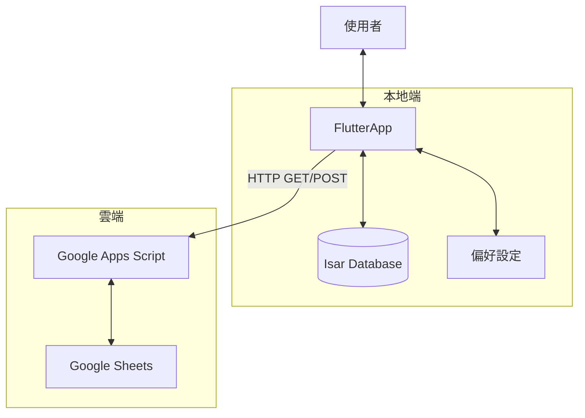

# 系統架構與資料規格 (Architecture & Schema Spec)

## 1. 資料流架構 (Data Flow)



## 2. 本地資料庫設計 (Isar Schema)###Collection: `Settings`用於儲存全域設定。

| Field | Type | Description |
| :--- | :--- | :--- |
| `id` | Id | 固定為 1 |
| `username` | String | 使用者暱稱 (用於留言識別) |
| `lastSyncTime` | DateTime? | 上次同步時間 |

### Collection: `ItineraryItem` (行程節點)*來源：由 Google Sheets 下載覆寫，但 `actualTime` 保留本地紀錄。*

| Field | Type | Description |
| :--- | :--- | :--- |
| `id` | Id | Auto Increment |
| `day` | String | e.g., "D0", "D1" |
| `name` | String | 地標名稱 (e.g., "向陽山屋") |
| `estTime` | String | 預計時間 (HH:mm) |
| `actualTime`| DateTime? | **本地欄位**，實際打卡時間 |
| `altitude` | int | 海拔 (m) |
| `distance` | double | 里程 (K) |
| `note` | String | 備註 |
| `imageAsset`| String? | 對應 assets 圖片檔名 |

### Collection: `Message` (留言)*來源：與 Google Sheets 雙向同步。*

| Field | Type | Description |
| :--- | :--- | :--- |
| `id` | Id | Isar Auto ID |
| `uuid` | String | **Unique ID** (後端識別用) |
| `parentId` | String? | 若為 null 則為主留言，否則為子留言 |
| `user` | String | 發文者暱稱 |
| `category` | String | "Gear", "Plan", "Misc" |
| `content` | String | 留言內容 |
| `timestamp` | DateTime | 發文時間 |

### Collection: `GearItem` (個人裝備)*來源：僅存於本地，不與雲端同步。*

| Field | Type | Description |
| :--- | :--- | :--- |
| `id` | Id | Auto Increment |
| `name` | String | 裝備名稱 |
| `weight` | double | 重量 (g) |
| `category` | String | "Sleep", "Cook", "Wear", "Other" |
| `isChecked` | bool | 打包狀態 |

---

## 3. Google Sheets 資料結構 (Cloud Schema)###Sheet 1: `Messages`

| message_id (A) | parent_id (B) | timestamp (C) | user (D) | category (E) | content (F) |
| --- | --- | --- | --- | --- | --- |
| (UUID) | (UUID or Empty) | ISO8601 String | String | String | String |

### Sheet 2: `Itinerary`

| day (A) | name (B) | est_time (C) | altitude (D) | distance (E) | note (F) | image_asset (G) |
| --- | --- | --- | --- | --- | --- | --- |
| D1 | 向陽山屋 | 11:30 | 2850 | 4.3 | 午餐點 | cabin.jpg |

---

## 4. API 介面 (Google Apps Script)###Endpoint: `doGet(e)`* **Action**: `fetch_all`

* **Response (JSON)**:

```json
{
  "itinerary": [
    { "day": "D1", "name": "...", "est_time": "...", ... }
  ],
  "messages": [
    { "uuid": "...", "parent_id": null, "content": "...", ... }
  ]
}

```


### Endpoint: `doPost(e)`* **Action**: `add_message`

* **Request Payload**:

```json
{
  "action": "add_message",
  "data": {
    "uuid": "generated-uuid-v4",
    "parent_id": null,
    "user": "Alex",
    "category": "Gear",
    "content": "我帶爐頭",
    "timestamp": "2023-10-12T09:00:00Z"
  }
}
```

* **Action**: `delete_message`

* **Request Payload**:

```json
{
  "action": "delete_message",
  "uuid": "target-uuid"
}
```
