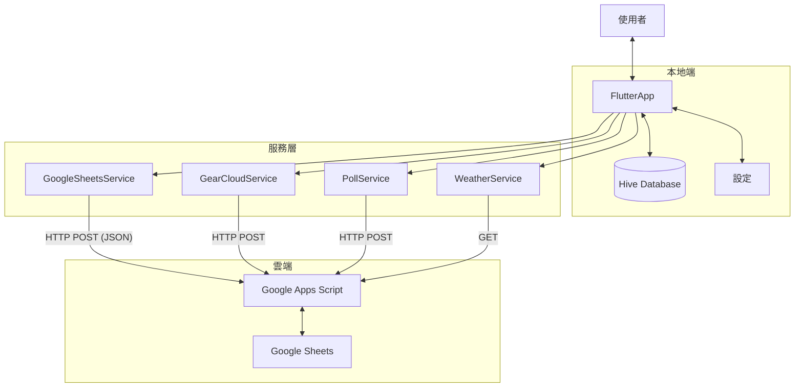
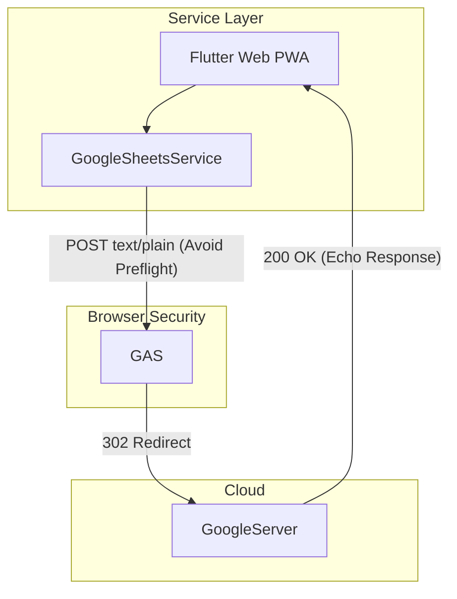
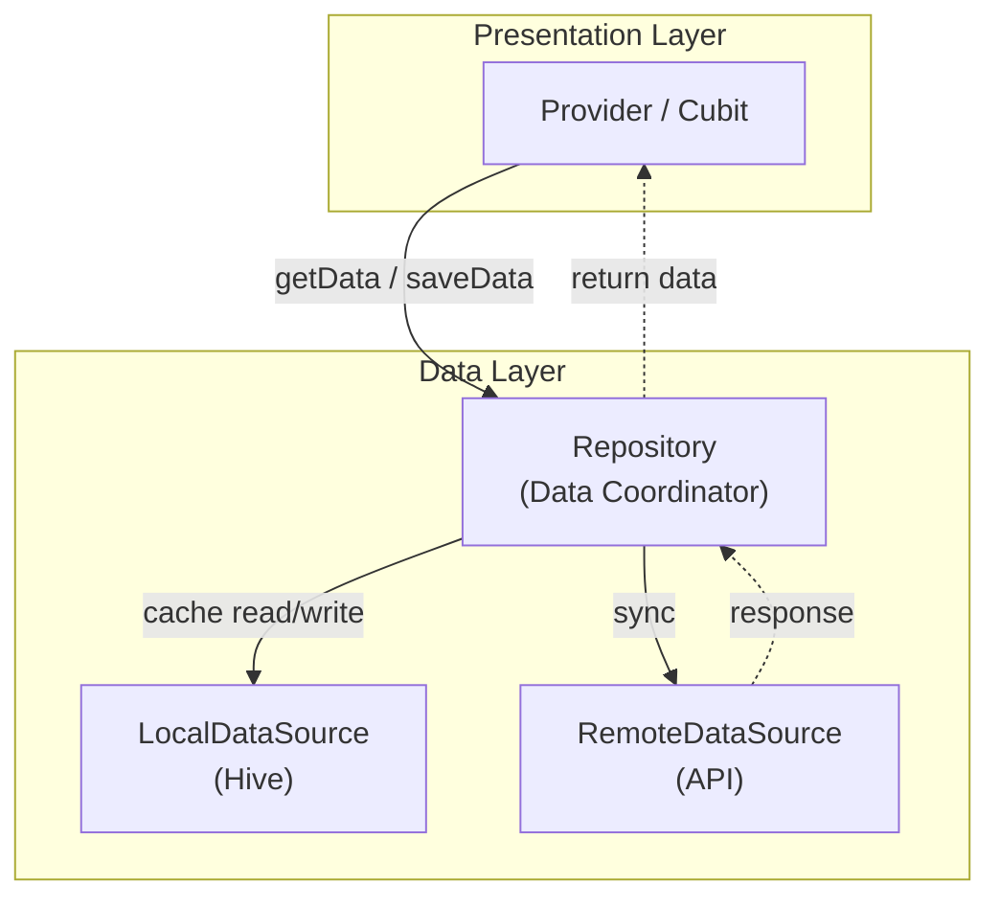
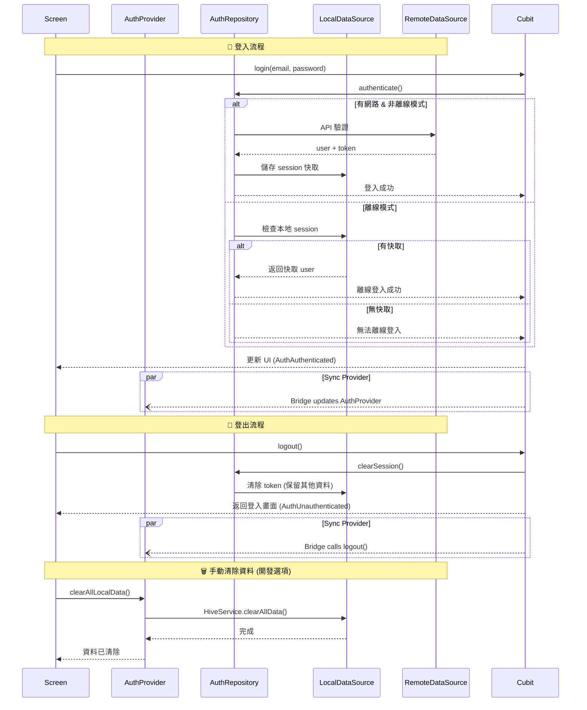
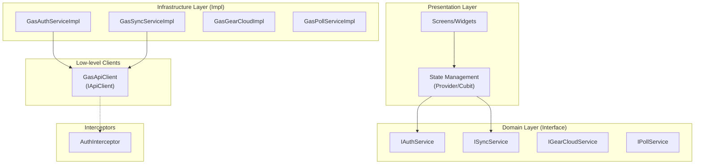

# 系統架構與資料規格 (Architecture & Schema Spec)

## 1. 資料流架構 (Data Flow)

### Mobile Application (iOS/Android)



### Web Application (PWA)

針對瀏覽器 CORS 限制，Web 版採用特殊的 Data Flow:



---

## 2. 專案架構 (Project Structure)

```
lib/
├── app.dart                           # App 根元件 (MaterialApp 設定)
├── main.dart                          # 程式進入點
│
├── core/                              # 核心工具層
│   ├── core.dart                      # Barrel export
│   ├── constants.dart                 # API Actions, Box Names 等常數
│   ├── constants/                     # 常數子目錄
│   │   └── role_constants.dart        # 角色代碼定義 (admin, leader, guide, member)
│   ├── config/                        # 配置
│   │   └── env_config.dart            # 環境變數配置
│   ├── di.dart                        # 依賴注入 (GetIt)
│   ├── error/                         # 錯誤處理
│   │   └── result.dart                # Result<T, E> 型別 (Success/Failure)
│   ├── extensions.dart                # Dart 擴展方法
│   ├── gear_helpers.dart              # 裝備分類工具 (Icon, Name, Color)
│   ├── gpx_utils.dart                 # GPX 解析工具
│   ├── location/                      # 定位相關
│   │   ├── i_location_resolver.dart
│   │   └── township_location_resolver.dart
│   ├── services/                      # 核心服務
│   │   └── permission_service.dart    # 權限判斷邏輯
│   ├── theme/                         # 主題定義
│   │   ├── app_theme.dart             # 主題工廠
│   │   ├── *_theme.dart               # 各主題實作 (Summit, Ocean, Forest, etc.)
│   │   └── theme_provider.dart        # 主題狀態管理
│   └── offline_config.dart            # 離線圖磚配置
│
├── data/                              # 資料層
│   ├── data.dart                      # Barrel export
│   ├── cwa/                           # 氣象局資料結構
│   ├── models/                        # 資料模型 (HiveType)
│   │   ├── enums/                     # 列舉 (SyncStatus, FavoriteType)
│   │   ├── settings.dart              # [TypeId: 0] 全域設定
│   │   ├── itinerary_item.dart        # [TypeId: 1] 行程節點
│   │   ├── message.dart               # [TypeId: 2] 留言
│   │   ├── gear_item.dart             # [TypeId: 3] 個人裝備
│   │   ├── weather_data.dart          # [TypeId: 4,5] 氣象資料
│   │   ├── poll.dart                  # [TypeId: 6,7] 投票
│   │   ├── trip.dart                  # [TypeId: 8] 行程
│   │   ├── user_profile.dart          # [TypeId: 10] 用戶資料
│   │   ├── gear_library_item.dart     # [TypeId: 11] 裝備庫
│   │   ├── group_event.dart           # [TypeId: 12] 揪團
│   │   ├── group_event_application.dart # [TypeId: 13] 報名
│   │   ├── favorite.dart              # [TypeId: 14] 最愛
│   │   ├── gear_set.dart              # 雲端裝備組合 (非 Hive)
│   │   └── meal_item.dart             # 菜單項目 (記憶體)
│   ├── datasources/                   # 資料來源層 (Offline-First)
│   │   ├── interfaces/                # DataSource 介面
│   │   │   ├── i_trip_local_data_source.dart
│   │   │   ├── i_trip_remote_data_source.dart
│   │   │   ├── i_itinerary_*.dart
│   │   │   ├── i_message_*.dart
│   │   │   ├── i_gear_*.dart
│   │   │   ├── i_group_event_*.dart
│   │   │   ├── i_poll_*.dart
│   │   │   ├── i_favorites_*.dart
│   │   │   ├── i_gear_library_local_data_source.dart
│   │   │   ├── i_settings_local_data_source.dart
│   │   │   └── i_auth_session_local_data_source.dart
│   │   ├── local/                     # 本地儲存實作 (Hive)
│   │   │   ├── trip_local_data_source.dart
│   │   │   ├── itinerary_local_data_source.dart
│   │   │   ├── gear_local_data_source.dart
│   │   │   ├── favorites_local_data_source.dart
│   │   │   └── ...
│   │   └── remote/                    # 遠端 API 實作
│   │       ├── trip_remote_data_source.dart
│   │       ├── itinerary_remote_data_source.dart
│   │       ├── favorites_remote_data_source.dart
│   │       └── ...
│   └── repositories/                  # Repository 層 (DataSource 協調)
│       ├── interfaces/                # Repository 介面
│       │   ├── i_trip_repository.dart
│       │   ├── i_itinerary_repository.dart
│       │   ├── i_favorites_repository.dart
│       │   └── ...
│       ├── trip_repository.dart       # 協調 Local + Remote DataSource
│       ├── itinerary_repository.dart
│       ├── favorites_repository.dart
│       └── ...
│
├── domain/                            # 領域層 (業務邏輯介面)
│   ├── domain.dart                    # Barrel export
│   ├── interfaces/                    # 服務介面定義
│   │   ├── i_auth_service.dart
│   │   ├── i_sync_service.dart
│   │   ├── i_data_service.dart
│   │   ├── i_poll_service.dart
│   │   ├── i_weather_service.dart
│   │   ├── i_gear_cloud_service.dart
│   │   ├── i_connectivity_service.dart
│   │   ├── i_geolocator_service.dart
│   │   ├── i_api_client.dart          # API 客戶端介面
│   │   └── i_token_validator.dart
│   ├── dto/                           # Data Transfer Objects
│   │   └── auth_result.dart
│   └── failures/                      # 領域失敗類型
│       └── failures.dart
│
├── infrastructure/                    # 基礎設施層 (外部服務實作)
│   ├── infrastructure.dart            # Barrel export
│   ├── adapters/                      # Hive 型別轉接器
│   │   └── hive_adapters.dart
│   ├── clients/                       # HTTP 客戶端
│   │   ├── gas_api_client.dart        # GAS REST 客戶端
│   │   └── network_aware_client.dart  # 離線攔截裝飾器
│   ├── interceptors/                  # Dio 攔截器
│   │   └── auth_interceptor.dart      # 認證攔截器
│   ├── services/                      # 服務實作
│   │   ├── gas_auth_service.dart      # 會員認證 (IAuthService)
│   │   ├── sync_service.dart          # 雙向同步 (ISyncService)
│   │   ├── google_sheets_service.dart # API Gateway (IDataService)
│   │   ├── gear_cloud_service.dart    # 雲端裝備 (IGearCloudService)
│   │   ├── poll_service.dart          # 投票 API (IPollService)
│   │   ├── weather_service.dart       # 氣象服務 (IWeatherService)
│   │   ├── connectivity_service.dart  # 網路狀態 (IConnectivityService)
│   │   ├── geolocator_service.dart    # 定位服務
│   │   ├── jwt_token_validator.dart   # JWT 驗證
│   │   └── ad_service.dart            # 廣告服務
│   ├── tools/                         # 工具服務
│   │   ├── log_service.dart           # 日誌與上傳
│   │   ├── toast_service.dart         # UI 通知
│   │   ├── tutorial_service.dart      # 教學導覽
│   │   ├── hive_service.dart          # Hive 初始化
│   │   └── usage_tracking_service.dart # Web 使用追蹤
│   ├── mock/                          # 測試用 Mock 實作
│   │   └── mock_*.dart
│   └── observers/                     # Bloc 觀察器
│       └── app_bloc_observer.dart
│
└── presentation/                      # 表現層
    ├── cubits/                        # 狀態管理 (Cubit)
    │   ├── auth/                      # 認證 (AuthCubit)
    │   ├── sync/                      # 同步 (SyncCubit)
    │   ├── trip/                      # 行程 (TripCubit)
    │   ├── itinerary/                 # 行程節點 (ItineraryCubit)
    │   ├── gear/                      # 個人裝備 (GearCubit)
    │   ├── gear_library/              # 裝備庫 (GearLibraryCubit)
    │   ├── message/                   # 留言板 (MessageCubit)
    │   ├── poll/                      # 投票 (PollCubit)
    │   ├── meal/                      # 餐點規劃 (MealCubit)
    │   ├── group_event/               # 揪團 (GroupEventCubit)
    │   ├── favorites/                 # 最愛 (FavoritesCubit)
    │   ├── settings/                  # 設定 (SettingsCubit)
    │   └── map/                       # 地圖 (MapCubit, OfflineMapCubit)
    ├── providers/                     # Provider (簡單狀態，逐步遷移至 Cubit)
    ├── screens/                       # 畫面 (41+ 檔案)
    │   ├── main_navigation_screen.dart
    │   ├── trip_list_screen.dart
    │   ├── trip_cloud_screen.dart
    │   ├── member_management_screen.dart
    │   ├── gear_cloud_screen.dart
    │   ├── poll_list_screen.dart
    │   ├── group_event_list_screen.dart
    │   ├── map_viewer_screen.dart
    │   ├── auth/                      # 認證相關
    │   │   ├── login_screen.dart
    │   │   ├── register_screen.dart
    │   │   └── verification_screen.dart
    │   └── ...
    ├── widgets/                       # 可重用元件
    │   ├── common/                    # 通用元件
    │   │   ├── summit_app_bar.dart    # 統一 AppBar
    │   │   └── modern_sliver_app_bar.dart
    │   ├── gear/                      # 裝備相關
    │   ├── info/                      # 資訊卡片
    │   ├── itinerary/                 # 行程節點
    │   ├── weather/                   # 天氣元件
    │   ├── group_event/               # 揪團元件
    │   ├── settings/                  # 設定元件
    │   ├── app_drawer.dart            # 側邊抽屜
    │   ├── tutorial_overlay.dart      # 教學覆蓋層
    │   └── ...
    └── utils/                         # UI 工具
        └── tutorial_keys.dart         # 教學錨點 Key
```

---

## 2.1 Service 目錄

### 服務分類

| 類別     | 說明                          |
| -------- | ----------------------------- |
| 核心業務 | 主要業務功能，需要介面抽象    |
| 雲端服務 | 與雲端 API 互動，需要介面抽象 |
| 基礎設施 | 底層技術支援                  |
| 工具服務 | 內部輔助工具，不需介面        |

### Service 清單

| Service                   | 類別     | 說明                      | Interface                  |
| ------------------------- | -------- | ------------------------- | -------------------------- |
| `GasAuthService`          | 核心業務 | 會員認證 (登入/註冊/驗證) | `IAuthService`             |
| `SyncService`             | 核心業務 | 資料雙向同步              | `ISyncService`             |
| `PollService`             | 核心業務 | 投票功能                  | `IPollService`             |
| `WeatherService`          | 核心業務 | 氣象資料 (CWA ETL)        | `IWeatherService`          |
| `GearCloudService`        | 雲端服務 | 裝備組合上傳/下載         | `IGearCloudService`        |
| `GearLibraryCloudService` | 雲端服務 | 個人裝備庫同步            | `IGearLibraryCloudService` |
| `TripCloudService`        | 雲端服務 | 行程雲端管理              | `ITripCloudService`        |
| `GoogleSheetsService`     | 雲端服務 | API Gateway (GAS)         | `IDataService`             |
| `ConnectivityService`     | 基礎設施 | 網路/離線狀態判斷         | `IConnectivityService`     |
| `GasApiClient`            | 基礎設施 | GAS HTTP 客戶端 (Impl `IApiClient`) | `IApiClient`               |
| `NetworkAwareClient`      | 基礎設施 | 離線攔截裝飾器            | `IApiClient`               |
| `AuthInterceptor`         | 基礎設施 | 認證攔截器 (Dio)          | -                          |
| `JwtTokenValidator`       | 基礎設施 | Token 驗證                | `ITokenValidator`          |
| `GeolocatorService`       | 基礎設施 | GPS 定位                  | `IGeolocatorService`       |
| `HiveService`             | 工具服務 | Hive 初始化               | -                          |
| `LogService`              | 工具服務 | 日誌記錄                  | -                          |
| `ToastService`            | 工具服務 | UI 通知                   | -                          |
| `TutorialService`         | 工具服務 | 教學導覽                  | -                          |
| `UsageTrackingService`    | 工具服務 | Web 使用追蹤              | -                          |

> **Note**: 上述 Service 已遷移至 `lib/infrastructure/` 目錄。

---

## 2.2 Data Layer 架構 (Offline-First)

本專案採用 **Offline-First Repository Pattern**，資料層分為三個階層：



### 各層職責

| 層級             | 元件                 | 職責                         |
| ---------------- | -------------------- | ---------------------------- |
| **Presentation** | `Provider` / `Cubit` | 管理 UI 狀態、處理使用者互動 |
| **Data**         | `Repository`         | 協調資料來源、決定資料流向   |
| **Data**         | `LocalDataSource`    | 本地儲存 (Hive)              |
| **Data**         | `RemoteDataSource`   | 遠端 API 呼叫                |

### DataSource 清單

| DataSource                   | 類型   | Interface                     | 說明             |
| ---------------------------- | ------ | ----------------------------- | ---------------- |
| `TripLocalDataSource`        | Local  | `ITripLocalDataSource`        | 行程本地儲存     |
| `TripRemoteDataSource`       | Remote | `ITripRemoteDataSource`       | 行程雲端 API     |
| `ItineraryLocalDataSource`   | Local  | `IItineraryLocalDataSource`   | 行程節點本地儲存 |
| `ItineraryRemoteDataSource`  | Remote | `IItineraryRemoteDataSource`  | 行程節點雲端 API |
| `MessageLocalDataSource`     | Local  | `IMessageLocalDataSource`     | 留言本地儲存     |
| `MessageRemoteDataSource`    | Remote | `IMessageRemoteDataSource`    | 留言雲端 API     |
| `GearLocalDataSource`        | Local  | `IGearLocalDataSource`        | 裝備本地儲存     |
| `GearKeyLocalDataSource`     | Local  | `IGearKeyLocalDataSource`     | 裝備 Key 記錄    |
| `GroupEventLocalDataSource`  | Local  | `IGroupEventLocalDataSource`  | 揪團本地儲存     |
| `GroupEventRemoteDataSource` | Remote | `IGroupEventRemoteDataSource` | 揪團雲端 API     |
| `PollLocalDataSource`        | Local  | `IPollLocalDataSource`        | 投票本地儲存     |
| `PollRemoteDataSource`       | Remote | `IPollRemoteDataSource`       | 投票雲端 API     |
| `GearLibraryLocalDataSource` | Local  | `IGearLibraryLocalDataSource` | 裝備庫本地儲存   |
| `SettingsLocalDataSource`    | Local  | `ISettingsLocalDataSource`    | 設定本地儲存     |
| `AuthSessionLocalDataSource` | Local  | `IAuthSessionLocalDataSource` | 認證 Session     |

### Repository 運作模式

```dart
class TripRepository implements ITripRepository {
  final ITripLocalDataSource _localDS;
  final ITripRemoteDataSource _remoteDS;
  final IConnectivityService _connectivity;

  // Read: 優先讀取本地快取
  List<Trip> getAllTrips() => _localDS.getAll();

  // Sync: 有網路時同步
  Future<void> sync() async {
    if (_connectivity.isOffline) return;
    final remote = await _remoteDS.getTrips();
    await _localDS.saveAll(remote);
  }
}
```

---

## 2.3 狀態管理策略 (State Management)

本專案支援 **Provider** 與 **Cubit** 並存，依據功能複雜度選擇適合的方案：

| 方案         | 適用場景                   | 採用狀態             |
| ------------ | -------------------------- | -------------------- |
| **Provider** | 簡單狀態、Legacy Migration | ⚠️ 遷移中 (逐步移除) |
| **Cubit**    | 主要狀態管理               | ✅ 主流採用          |
| **BLoC**     | 複雜事件流                 | ❌ 暫不採用          |
| **Riverpod** | 編譯時安全                 | ❌ 暫不採用          |

### Provider 使用場景 (Legacy)

- 其他 Provider (`Trip`, `Itinerary`, `Message`, `Poll`, `Gear`, `Settings`) 已全數遷移至 Cubit。

### Cubit 使用場景 (Active)

- **AuthCubit**: 認證流程 (Login/Logout/Refresh Token)
- **SyncCubit**: 同步狀態 (Idle → Syncing → Success/Error)
- **TripCubit**: 行程管理 (Load/Add/Import/Delete/ActiveSelection)
- **ItineraryCubit**: 行程節點管理
- **GearCubit / GearLibraryCubit**: 裝備管理
- **MessageCubit**: 留言板
- **PollCubit**: 投票功能
- **SettingsCubit**: 設定與個人資料
- **MapCubit / OfflineMapCubit**: 地圖與離線圖磚

---

## 2.4 登入/登出/資料清除流程



### 各層登出行為

| 層級             | 元件             | 登出時          | 手動清除時  |
| ---------------- | ---------------- | --------------- | ----------- |
| **Presentation** | Provider         | ✅ 清除狀態     | ✅ 清除狀態 |
| **Data**         | Repository       | ❌ 保留         | N/A         |
| **Data**         | LocalDataSource  | 🔹 只清 session | ✅ 全部清除 |
| **Data**         | RemoteDataSource | N/A             | N/A         |

---

## 3. 資料規格 (Data Schema)

這份文件詳細定義了本地資料庫 (Hive) 與雲端資料庫 (Google Sheets) 的資料結構。

> **詳細規格請參閱: [docs/DATA_SCHEMA.md](DATA_SCHEMA.md)**

### 3.1 摘要

- **Local (Hive)**: 使用 TypeId 區分不同 Box，支援 `Settings` (0), `ItineraryItem` (1), `Message` (2), `GearItem` (3), `WeatherData` (4), `DailyForecast` (5), `Poll` (6), `PollOption` (7), `Trip` (10), `GearLibraryItem` (11)。
- **Cloud (Sheets)**: 使用 Google Sheets 模擬資料表，嚴格定義欄位順序 (Column Index)。

---

## 5. API 介面 (Google Apps Script)

Base URL: `macros/s/{DEPLOYMENT_ID}/exec`

### GET Actions

| Action                  | Description     | Response                    |
| ----------------------- | --------------- | --------------------------- |
| `fetch_all`             | 取得行程 + 留言 | `{itinerary[], messages[]}` |
| `fetch_itinerary`       | 僅取得行程      | `{itinerary[]}`             |
| `fetch_messages`        | 僅取得留言      | `{messages[]}`              |
| `fetch_weather`         | 取得氣象資料    | Weather JSON                |
| `poll` (subAction: get) | 取得投票列表    | `{polls[]}`                 |
| `health`                | 健康檢查        | `{status, timestamp}`       |

### POST Actions

#### 會員驗證 (Auth)

| Action              | Payload                                   | Description      |
| ------------------- | ----------------------------------------- | ---------------- |
| `auth_register`     | `{email, password, displayName, avatar?}` | 註冊新會員       |
| `auth_login`        | `{email, password}`                       | 登入             |
| `auth_validate`     | `{accessToken}`                           | 驗證 Token       |
| `auth_delete_user`  | `{accessToken}`                           | 假刪除會員       |
| `auth_verify_email` | `{email, code}`                           | Email 驗證碼確認 |
| `auth_resend_code`  | `{email}`                                 | 重發驗證碼       |

#### 留言相關

| Action               | Payload             | Description  |
| -------------------- | ------------------- | ------------ |
| `add_message`        | `{data: Message}`   | 新增單筆留言 |
| `batch_add_messages` | `{data: Message[]}` | 批次新增留言 |
| `delete_message`     | `{uuid}`            | 刪除留言     |

#### 行程相關

| Action             | Payload                   | Description    |
| ------------------ | ------------------------- | -------------- |
| `update_itinerary` | `{data: ItineraryItem[]}` | 覆寫整個行程表 |

#### 日誌相關

| Action        | Payload                 | Description |
| ------------- | ----------------------- | ----------- |
| `upload_logs` | `{logs[], device_info}` | 上傳日誌    |

#### 雲端裝備庫

| Action                  | Payload                                           | Description             |
| ----------------------- | ------------------------------------------------- | ----------------------- |
| `fetch_gear_sets`       | -                                                 | 取得公開/保護的組合列表 |
| `fetch_gear_set_by_key` | `{key}`                                           | 用 Key 取得私人組合     |
| `download_gear_set`     | `{uuid, key?}`                                    | 下載組合 (含 items)     |
| `upload_gear_set`       | `{title, author, visibility, key?, items[], ...}` | 上傳組合                |
| `delete_gear_set`       | `{uuid, key?}`                                    | 刪除組合                |

#### 投票功能

| Action | SubAction       | Payload                                             | Description           |
| ------ | --------------- | --------------------------------------------------- | --------------------- |
| `poll` | `create`        | `{title, description, initial_options[], config{}}` | 建立投票              |
| `poll` | `get`           | `{user_id}`                                         | 取得列表 (含我的投票) |
| `poll` | `vote`          | `{poll_id, option_ids[], user_id, user_name}`       | 投票                  |
| `poll` | `add_option`    | `{poll_id, text, creator_id}`                       | 新增選項              |
| `poll` | `delete_option` | `{option_id, user_id}`                              | 刪除選項              |
| `poll` | `close`         | `{poll_id, user_id}`                                | 關閉投票              |
| `poll` | `delete`        | `{poll_id, user_id}`                                | 刪除投票              |

#### 其他

| Action      | Payload                                 | Description  |
| ----------- | --------------------------------------- | ------------ |
| `heartbeat` | `{session_id, user_name, page, action}` | Web 使用追蹤 |

---

## 6. 技術決策記錄 (ADR)

### ADR-001: 使用 Hive 取代 Isar

- **背景**: Isar 在 Android/Web 建置上頻繁出現版本相容性問題。
- **決策**: 遷移至 Hive 2.x。
- **優點**: 純 Dart 實作，無原生二進位依賴，Web 支援良好。

### ADR-002: 時間格式策略 (String-First)

- **背景**: Google Sheets 會自動轉換 DateTime 格式，導致時區偏差。
- **決策**: 顯示時間 (HH:mm) 一律視為字串，加上 `'` 前綴存入 Sheets。Timestamp 統一使用 UTC ISO8601 字串交換。

### ADR-003: Web CORS 處理

- **背景**: GAS 不支援 CORS Preflight (OPTIONS)。
- **決策**: Web 端發送 POST 時，Content-Type 設為 `text/plain`。瀏覽器將其視為 Simple Request 直接發送，GAS 解析字串內容為 JSON。

### ADR-004: 雲端裝備庫 Key 機制

- **背景**: 用戶希望分享裝備但保有一定隱私控制。
- **決策**: 三層可見性 (public/protected/private) + 4 位數 Key 驗證。
- **特點**: Key 不重複、本地儲存已知 Keys、支援刪除時驗證。

### ADR-005: 投票資料策略

- **背景**: 投票資料頻繁變動，需快速同步。
- **決策**: 每次進入投票頁面從雲端拉取最新資料，本地僅作快取。
- **優點**: 確保資料一致性，避免版本衝突。

---

## 7. 依賴注入 (DI) 與可測試性

透過 `get_it` 管理依賴注入，所有註冊位於 `lib/core/di.dart`。

### 介面註冊 (可 Mock)

| Interface              | Implementation        | 用途         |
| ---------------------- | --------------------- | ------------ |
| `IGearRepository`      | `GearRepository`      | 裝備資料存取 |
| `ISettingsRepository`  | `SettingsRepository`  | 設定資料存取 |
| `IItineraryRepository` | `ItineraryRepository` | 行程資料存取 |
| `IMessageRepository`   | `MessageRepository`   | 留言資料存取 |
| `IPollRepository`      | `PollRepository`      | 投票資料存取 |
| `IWeatherService`      | `WeatherService`      | 天氣資料服務 |

### 直接註冊 (不需 Mock)

| Service       | 原因                  |
| ------------- | --------------------- |
| `HiveService` | 初始化協調器          |
| `SyncService` | 已依賴 Repo 介面      |
| `PollService` | 已支援 DI (apiClient) |

### API 服務可測試性

所有 API 相關服務皆支援建構子注入：

```dart
// GasApiClient - 可替換 Dio (AuthInterceptor 已注入 Dio)
GasApiClient({Dio? dio, required String baseUrl})

// GoogleSheetsService - 可替換 GasApiClient
GoogleSheetsService({GasApiClient? apiClient})

// PollService - 可替換 GasApiClient
PollService({GasApiClient? apiClient})

// WeatherService - 可替換 ISettingsRepository
WeatherService({ISettingsRepository? settingsRepo})
```

### 測試策略

| 測試類型         | 策略                              |
| ---------------- | --------------------------------- |
| **單元測試**     | 透過 Repository Interface Mock    |
| **Service 測試** | 透過 API Client 建構子注入 Mock   |
| **Widget 測試**  | 使用 `pumpWidget` + Mock Provider |
| **整合測試**     | 使用 Dev 環境 API                 |

---

## 8. Clean Architecture 設計

### 分層架構



### 分層職責

| 層級           | 目錄                     | 職責                           |
| -------------- | ------------------------ | ------------------------------ |
| Presentation   | `lib/presentation/`      | UI、狀態管理、使用者互動       |
| Domain         | `lib/domain/interfaces/` | 業務介面定義 (純抽象)          |
| Infrastructure | `lib/infrastructure/`    | 介面實作、API Client、外部服務 |
| Data           | `lib/data/`              | Model、Repository、本地儲存    |
| Core           | `lib/core/`              | DI、常數、Exception            |

### Domain Interface

#### 命名規範

- **介面**: `I` + 功能名稱 + `Service` (例: `IAuthService`)
- **實作**: 技術名稱 + 功能名稱 + `Impl` (例: `GasAuthServiceImpl`)
- **方法**: 動詞 + 名詞 (例: `getPolls()`, `createPoll()`)

#### 動詞統一

| 動詞        | 用途            | 範例                                        |
| ----------- | --------------- | ------------------------------------------- |
| `get*`      | 取得單筆        | `getUser()`, `getWeather()`                 |
| `get*s`     | 取得多筆 (複數) | `getPolls()`, `getTrips()`, `getGearSets()` |
| `create*`   | 新增            | `createPoll()`, `createMessage()`           |
| `update*`   | 更新            | `updateProfile()`, `updateTrip()`           |
| `delete*`   | 刪除            | `deletePoll()`, `deleteMessage()`           |
| `sync*`     | 同步            | `syncAll()`, `syncItinerary()`              |
| `upload*`   | 上傳            | `uploadGearSet()`                           |
| `download*` | 下載            | `downloadGearSet()`                         |
| `validate*` | 驗證            | `validateSession()`                         |

#### 核心 Interface

| Interface           | 說明     | 主要方法                                                |
| ------------------- | -------- | ------------------------------------------------------- |
| `IAuthService`      | 認證服務 | `login()`, `logout()`, `validateSession()`              |
| `ISyncService`      | 同步服務 | `syncAll()`, `syncItinerary()`, `syncMessages()`        |
| `IGearCloudService` | 裝備雲端 | `uploadGearSet()`, `downloadGearSet()`, `getGearSets()` |
| `IPollService`      | 投票服務 | `getPolls()`, `createPoll()`, `votePoll()`              |
| `IWeatherService`   | 天氣服務 | `getWeather()`, `getForecast()`                         |

### DI 多實作策略

#### ApiProvider Enum

```dart
/// API Provider 類型
enum ApiProvider {
  gas,       // Google Apps Script
  firebase,  // Firebase (未來)
  rest,      // 自建 API (未來)
}
```

#### Named Registration

```dart
// 註冊 (避免打錯字，使用 Enum.name)
getIt.registerSingleton<IAuthService>(
  GasAuthServiceImpl(),
  instanceName: ApiProvider.gas.name,
);

// 取得
final authService = getIt<IAuthService>(instanceName: ApiProvider.gas.name);
```

### 離線處理策略

採用 **Impl 內部處理** 方式，各實作自行決定離線行為：

```dart
class GasSyncServiceImpl implements ISyncService {
  final GasApiClient _client;
  final ConnectivityService _connectivity;

  @override
  Future<SyncResult> syncAll({bool isAuto = false}) async {
    // 清楚的離線檢查，易於理解和除錯
    if (_connectivity.isOffline) {
      return SyncResult.skipped(reason: 'offline');
    }

    return await _doSync();
  }
}
```

### 狀態管理

> 詳見 [2.3 狀態管理策略](#23-狀態管理策略-state-management)

| 方案         | 適用場景                   | 採用狀態    |
| ------------ | -------------------------- | ----------- |
| **Provider** | 簡單狀態、CRUD             | ✅ 使用中   |
| **Cubit**    | 事件驅動、中等複雜、狀態機 | 🚧 規劃中   |
| **BLoC**     | 複雜事件流                 | ❌ 暫不採用 |
| **Riverpod** | 編譯時安全                 | ❌ 暫不採用 |

### 架構演進討論

#### 目前架構 (Clean Architecture)

本專案已完成 **Clean Architecture** 分層遷移 (Phase 6 Completed)。

```
lib/
├── domain/                          # 領域層 (Interface + UseCase)
│   ├── interfaces/
│   │   ├── i_auth_service.dart
│   │   └── ...
│   └── usecases/                    # 業務邏輯 (可選)
├── infrastructure/                  # 基礎設施層 (Impl)
│   ├── clients/
│   │   └── gas_api_client.dart
│   ├── services/
│   │   ├── gas_auth_service.dart
│   │   └── ...
│   ├── mock/
│   └── tools/
├── data/
│   ├── datasources/
│   ├── models/
│   └── repositories/
├── presentation/
│   ├── providers/                   # Legacy (AuthProvider only)
│   ├── cubits/                      # Active State Management
│   ├── screens/
│   └── widgets/
└── main.dart
```

**架構優勢**:

- ✅ 職責分離：Domain 定義 `Interface`，Infrastructure 負責 `Implementation`。
- ✅ 測試性：各層皆可透過 Interface 進行 Mock 測試。
- ✅ 擴展性：未來可輕鬆替換底層實作 (如 GAS -> AWS) 而不影響業務邏輯。

> 目前架構已穩定，後續開發請遵循此分層原則。

## 9. 模組導出規範 (Module Exports / Barrel Files)

為了簡化 Import 路徑並保持架構整潔，本專案在特定層級採用 **Barrel Files (Export Files)** 策略。
為了避免循環依賴 (Circular Dependency) 與編譯效能問題，請嚴格遵守以下規範。

### 9.1 導出策略 (Export Strategy)

| 層級               | Barrel File                              | 內容規範                                 | 禁止事項                               |
| ------------------ | ---------------------------------------- | ---------------------------------------- | -------------------------------------- |
| **Domain**         | `lib/domain/domain.dart`                 | 導出純介面、DTO、Failures                | **嚴禁**導出任何 Widget 或具體實作類別 |
| **Core**           | `lib/core/core.dart`                     | 導出通用工具、常數、擴充方法             | **嚴禁**導出 `di.dart` (避免循環依賴)  |
| **Infrastructure** | `lib/infrastructure/infrastructure.dart` | 導出 Services, Clients, Tools 等具體實作 | -                                      |
| **Presentation**   | **❌ 不建立**                            | UI 層變動頻繁，不建議建立全域 Barrel     | -                                      |

### 9.2 Import 優化原則 (Import Optimization)

- **Consumer-Only Strategy (僅針對消費者優化)**:
  - 僅在 **`lib/presentation/` (Widget/Cubit)** 層級使用 Barrel Files 進行 Import。
  - **原因**: UI 層是依賴樹的末端 (Leaf Node)，引用底層 Barrel 安全無虞。
- **Core Logic Isolation (核心邏輯隔離)**:
  - 在 `lib/domain/`, `lib/data/` 內部，**避免**使用 Barrel Imports，應維持明確的 File-to-File Import。
  - **原因**: 避免因 Barrel 包含未預期的依賴而導致底層邏輯產生循環引用。

### 9.3 範例

**推薦 (Good):**

```dart
// lib/presentation/cubits/auth_cubit.dart
import 'package:summitmate/domain/domain.dart'; // ✅ 引用 Domain Barrel
import 'package:summitmate/core/core.dart';     // ✅ 引用 Core Barrel
```

**禁止 (Bad):**

```dart
// lib/domain/interfaces/i_auth_service.dart
import 'package:summitmate/domain/domain.dart'; // ❌ 禁止自我引用 Barrel (可能造成循環)
```
