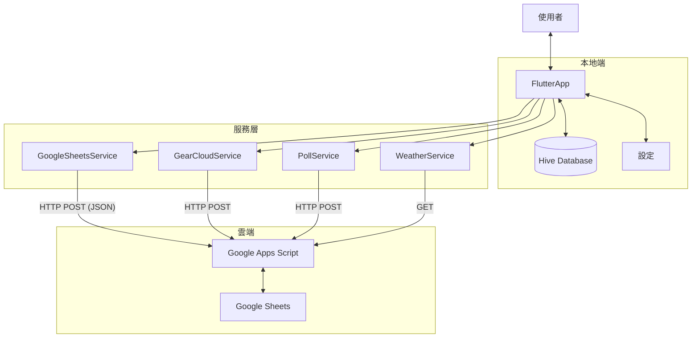
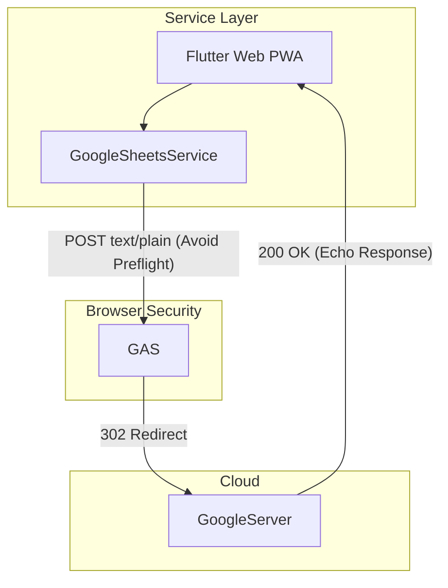
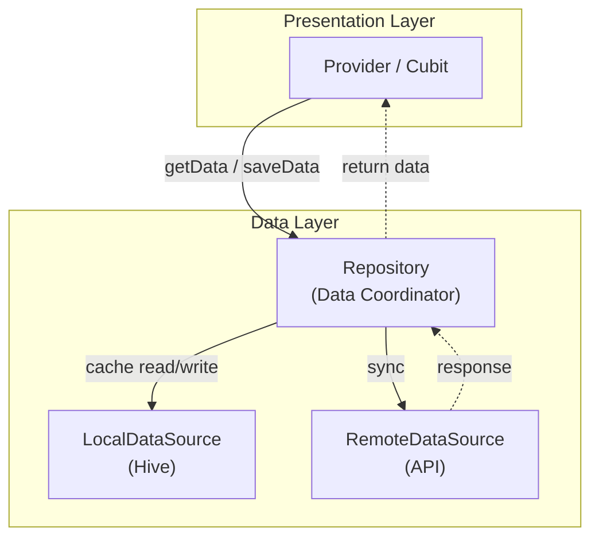
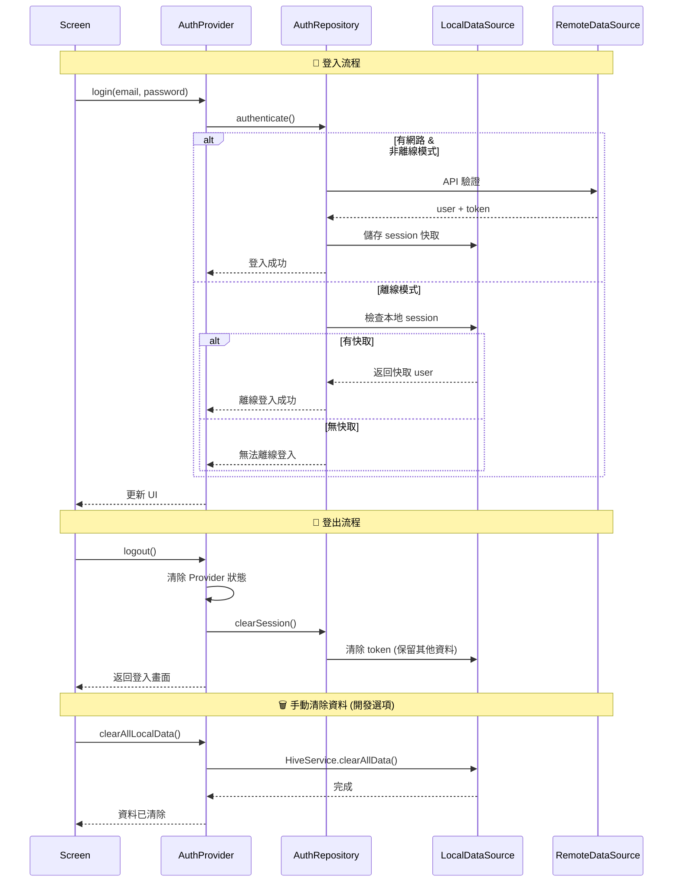
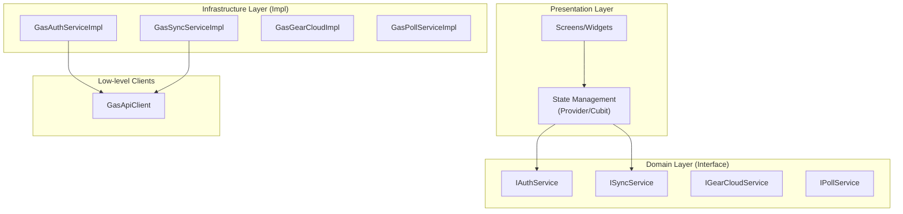

# 系統架構與資料規格 (Architecture & Schema Spec)

## 1. 資料流架構 (Data Flow)

### Mobile Application (iOS/Android)



### Web Application (PWA)

針對瀏覽器 CORS 限制，Web 版採用特殊的 Data Flow:



---

## 2. 專案架構 (Project Structure)

```
lib/
├── core/                              # 核心工具
│   ├── constants.dart                 # 常數定義 (API Actions, Box Names)
│   ├── di.dart                        # 依賴注入 (GetIt)
│   ├── env_config.dart                # 環境配置
│   ├── extensions.dart                # Dart 擴展方法
│   ├── gear_helpers.dart              # 裝備分類工具 (Icon, Name, Color)
│   ├── location/                      # 定位相關
│   │   ├── i_location_resolver.dart
│   │   └── township_location_resolver.dart
│   └── theme.dart                     # 主題配置
├── data/
│   ├── models/                        # 資料模型 (HiveType)
│   │   ├── settings.dart              # [TypeId: 0] 全域設定
│   │   ├── itinerary_item.dart        # [TypeId: 1] 行程節點
│   │   ├── message.dart               # [TypeId: 2] 留言
│   │   ├── gear_item.dart             # [TypeId: 3] 個人裝備
│   │   ├── weather_data.dart          # [TypeId: 4,5] 氣象資料
│   │   ├── poll.dart                  # [TypeId: 6,7] 投票
│   │   ├── trip.dart                  # [TypeId: 10] 行程
│   │   ├── gear_set.dart              # 雲端裝備組合 (非 Hive)
│   │   ├── gear_key_record.dart       # 本地 Key 記錄 (非 Hive)
│   │   ├── meal_item.dart             # 菜單項目 (非 Hive, 記憶體)
│   │   └── user_profile.dart          # 用戶資料 (非 Hive, Secure Storage)
│   ├── datasources/                   # 資料來源層 (Offline-First)
│   │   ├── interfaces/                # DataSource 介面
│   │   │   ├── i_trip_local_data_source.dart
│   │   │   ├── i_trip_remote_data_source.dart
│   │   │   ├── i_itinerary_local_data_source.dart
│   │   │   ├── i_itinerary_remote_data_source.dart
│   │   │   ├── i_message_local_data_source.dart
│   │   │   ├── i_message_remote_data_source.dart
│   │   │   ├── i_gear_local_data_source.dart
│   │   │   └── i_gear_key_local_data_source.dart
│   │   ├── local/                     # 本地儲存 (Hive)
│   │   │   ├── trip_local_data_source.dart
│   │   │   ├── itinerary_local_data_source.dart
│   │   │   ├── message_local_data_source.dart
│   │   │   ├── gear_local_data_source.dart
│   │   │   └── gear_key_local_data_source.dart
│   │   └── remote/                    # 遠端 API
│   │       ├── trip_remote_data_source.dart
│   │       ├── itinerary_remote_data_source.dart
│   │       └── message_remote_data_source.dart
│   └── repositories/                  # Repository 層 (DataSource Coordinator)
│       ├── interfaces/                # Repository 介面
│       │   ├── i_trip_repository.dart
│       │   ├── i_itinerary_repository.dart
│       │   ├── i_message_repository.dart
│       │   ├── i_gear_repository.dart
│       │   ├── i_gear_library_repository.dart
│       │   ├── i_gear_set_repository.dart
│       │   ├── i_poll_repository.dart
│       │   ├── i_settings_repository.dart
│       │   └── i_auth_session_repository.dart
│       ├── mock/                      # 測試用 Mock 實作
│       │   └── mock_*_repository.dart
│       ├── trip_repository.dart       # 協調 Local + Remote DataSource
│       ├── itinerary_repository.dart
│       ├── message_repository.dart
│       ├── gear_repository.dart
│       ├── gear_library_repository.dart
│       ├── gear_set_repository.dart   # 雲端裝備組合
│       ├── poll_repository.dart
│       ├── settings_repository.dart
│       └── auth_session_repository.dart
├── services/                          # 服務層
│   ├── interfaces/                    # Service 介面
│   │   ├── i_auth_service.dart
│   │   ├── i_sync_service.dart
│   │   ├── i_data_service.dart
│   │   ├── i_poll_service.dart
│   │   ├── i_weather_service.dart
│   │   ├── i_gear_cloud_service.dart
│   │   ├── i_connectivity_service.dart
│   │   ├── i_geolocator_service.dart
│   │   └── i_token_validator.dart
│   ├── hive_service.dart              # Hive 資料庫初始化
│   ├── google_sheets_service.dart     # 主 API Gateway (IDataService)
│   ├── gas_api_client.dart            # GAS REST 客戶端
│   ├── gas_auth_service.dart          # 會員認證 (IAuthService)
│   ├── gear_cloud_service.dart        # 雲端裝備庫 (IGearCloudService)
│   ├── poll_service.dart              # 投票 API (IPollService)
│   ├── weather_service.dart           # 氣象服務 (IWeatherService)
│   ├── sync_service.dart              # 雙向同步 (ISyncService)
│   ├── connectivity_service.dart      # 網路狀態 (IConnectivityService)
│   ├── network_aware_client.dart      # 離線攔截裝飾器
│   ├── log_service.dart               # 日誌與上傳
│   ├── toast_service.dart             # UI 通知
│   ├── tutorial_service.dart          # 教學導覽
│   └── usage_tracking_service.dart    # Web 使用追蹤
├── presentation/
│   ├── providers/                     # 狀態管理 (簡單狀態)
│   │   ├── settings_provider.dart
│   │   ├── trip_provider.dart
│   │   ├── itinerary_provider.dart
│   │   ├── message_provider.dart
│   │   ├── gear_provider.dart
│   │   ├── gear_library_provider.dart
│   │   ├── meal_provider.dart
│   │   ├── poll_provider.dart
│   │   └── auth_provider.dart
│   ├── cubits/                        # Cubit (事件驅動/中等複雜狀態)
│   │   └── (規劃中)
│   ├── screens/                       # 畫面
│   │   ├── main_navigation_screen.dart
│   │   ├── trip_cloud_screen.dart
│   │   ├── gear_cloud_screen.dart
│   │   ├── poll_list_screen.dart
│   │   ├── meal_planner_screen.dart
│   │   ├── map_viewer_screen.dart
│   │   └── auth/
│   │       ├── login_screen.dart
│   │       ├── register_screen.dart
│   │       └── verification_screen.dart
│   └── widgets/                       # 可重用元件
│       ├── gear_preview_dialog.dart
│       ├── gear_upload_dialog.dart
│       ├── gear_key_dialog.dart
│       ├── itinerary_edit_dialog.dart
│       ├── tutorial_overlay.dart
│       └── app_drawer.dart
└── main.dart
```

---

## 2.1 Service 目錄

### 服務分類

| 類別 | 說明 |
|------|------|
| 核心業務 | 主要業務功能，需要介面抽象 |
| 雲端服務 | 與雲端 API 互動，需要介面抽象 |
| 基礎設施 | 底層技術支援 |
| 工具服務 | 內部輔助工具，不需介面 |

### Service 清單

| Service | 類別 | 說明 | Interface |
|---------|------|------|-----------|
| `GasAuthService` | 核心業務 | 會員認證 (登入/註冊/驗證) | `IAuthService` |
| `SyncService` | 核心業務 | 資料雙向同步 | `ISyncService` |
| `PollService` | 核心業務 | 投票功能 | `IPollService` |
| `WeatherService` | 核心業務 | 氣象資料 (CWA ETL) | `IWeatherService` |
| `GearCloudService` | 雲端服務 | 裝備組合上傳/下載 | `IGearCloudService` |
| `GearLibraryCloudService` | 雲端服務 | 個人裝備庫同步 | `IGearLibraryCloudService` |
| `TripCloudService` | 雲端服務 | 行程雲端管理 | `ITripCloudService` |
| `GoogleSheetsService` | 雲端服務 | API Gateway (GAS) | `IDataService` |
| `ConnectivityService` | 基礎設施 | 網路/離線狀態判斷 | `IConnectivityService` |
| `GasApiClient` | 基礎設施 | GAS HTTP 客戶端 | - |
| `NetworkAwareClient` | 基礎設施 | 離線攔截裝飾器 | - |
| `JwtTokenValidator` | 基礎設施 | Token 驗證 | `ITokenValidator` |
| `GeolocatorService` | 基礎設施 | GPS 定位 | `IGeolocatorService` |
| `HiveService` | 工具服務 | Hive 初始化 | - |
| `LogService` | 工具服務 | 日誌記錄 | - |
| `ToastService` | 工具服務 | UI 通知 | - |
| `TutorialService` | 工具服務 | 教學導覽 | - |
| `UsageTrackingService` | 工具服務 | Web 使用追蹤 | - |

---

## 2.2 Data Layer 架構 (Offline-First)

本專案採用 **Offline-First Repository Pattern**，資料層分為三個階層：



### 各層職責

| 層級 | 元件 | 職責 |
|------|------|------|
| **Presentation** | `Provider` / `Cubit` | 管理 UI 狀態、處理使用者互動 |
| **Data** | `Repository` | 協調資料來源、決定資料流向 |
| **Data** | `LocalDataSource` | 本地儲存 (Hive) |
| **Data** | `RemoteDataSource` | 遠端 API 呼叫 |

### DataSource 清單

| DataSource | 類型 | Interface | 說明 |
|------------|------|-----------|------|
| `TripLocalDataSource` | Local | `ITripLocalDataSource` | 行程本地儲存 |
| `TripRemoteDataSource` | Remote | `ITripRemoteDataSource` | 行程雲端 API |
| `ItineraryLocalDataSource` | Local | `IItineraryLocalDataSource` | 行程節點本地儲存 |
| `ItineraryRemoteDataSource` | Remote | `IItineraryRemoteDataSource` | 行程節點雲端 API |
| `MessageLocalDataSource` | Local | `IMessageLocalDataSource` | 留言本地儲存 |
| `MessageRemoteDataSource` | Remote | `IMessageRemoteDataSource` | 留言雲端 API |
| `GearLocalDataSource` | Local | `IGearLocalDataSource` | 裝備本地儲存 |
| `GearKeyLocalDataSource` | Local | `IGearKeyLocalDataSource` | 裝備 Key 記錄 |

### Repository 運作模式

```dart
class TripRepository implements ITripRepository {
  final ITripLocalDataSource _localDS;
  final ITripRemoteDataSource _remoteDS;
  final IConnectivityService _connectivity;
  
  // Read: 優先讀取本地快取
  List<Trip> getAllTrips() => _localDS.getAll();
  
  // Sync: 有網路時同步
  Future<void> sync() async {
    if (_connectivity.isOffline) return;
    final remote = await _remoteDS.getTrips();
    await _localDS.saveAll(remote);
  }
}
```

---

## 2.3 狀態管理策略 (State Management)

本專案支援 **Provider** 與 **Cubit** 並存，依據功能複雜度選擇適合的方案：

| 方案         | 適用場景           | 採用狀態    |
| ------------ | ------------------ | ----------- |
| **Provider** | 簡單狀態、CRUD | ✅ 使用中 |
| **Cubit**    | 事件驅動、中等複雜、需要狀態機 | 🚧 規劃中 |
| **BLoC**     | 複雜事件流         | ❌ 暫不採用 |
| **Riverpod** | 編譯時安全         | ❌ 暫不採用 |

### Provider 使用場景

- 簡單的 CRUD 操作 (Settings, Gear, Meal)
- 單一資料流 (Trip, Itinerary, Message)
- 不需複雜狀態轉換

### Cubit 使用場景 (規劃中)

- 複雜的認證流程 (Login/Logout/Refresh Token)
- 需要狀態機管理的功能 (同步狀態: Idle → Syncing → Success/Error)
- 多步驟表單或嚮導

---

## 2.4 登入/登出/資料清除流程



### 各層登出行為

| 層級 | 元件 | 登出時 | 手動清除時 |
|------|------|--------|-----------|
| **Presentation** | Provider | ✅ 清除狀態 | ✅ 清除狀態 |
| **Data** | Repository | ❌ 保留 | N/A |
| **Data** | LocalDataSource | 🔹 只清 session | ✅ 全部清除 |
| **Data** | RemoteDataSource | N/A | N/A |

---

## 3. 本地資料庫設計 (Hive Schema)

### Box: `settings` (TypeId: 0)

全域設定，單例存儲。

| Field         | Type      | Default | Description           |
| ------------- | --------- | ------- | --------------------- |
| username      | String    | ''      | 使用者暱稱 (留言識別) |
| lastSyncTime  | DateTime? | null    | 上次同步時間          |
| avatar        | String    | '🐻'    | 使用者頭像 (Emoji)    |
| isOfflineMode | bool      | false   | 離線模式開關          |

### Box: `itinerary` (TypeId: 1)

行程節點，支援雲端下載與本地修改。

| Field       | Type      | Description                         |
| ----------- | --------- | ----------------------------------- |
| uuid        | String    | 唯一識別碼 (PK)                     |
| tripId      | String    | 關聯行程 ID (FK)                    |
| day         | String    | 行程天數 (D0, D1, D2)               |
| name        | String    | 地標名稱                            |
| estTime     | String    | 預計時間 (HH:mm) - **Display Time** |
| actualTime  | DateTime? | 實際打卡時間 - **Timestamp**        |
| altitude    | int       | 海拔 (m)                            |
| distance    | double    | 里程 (K)                            |
| note        | String    | 備註                                |
| imageAsset  | String?   | 對應 assets 圖片檔名                |
| isCheckedIn | bool      | 是否已打卡                          |
| checkedInAt | DateTime? | 打卡時間                            |

### Box: `trips` (TypeId: 10)

行程管理，支援多行程。

| Field       | Type      | Description         |
| ----------- | --------- | ------------------- |
| id          | String    | 行程唯一識別碼 (PK) |
| name        | String    | 行程名稱            |
| startDate   | DateTime  | 開始日期            |
| endDate     | DateTime? | 結束日期            |
| description | String?   | 行程描述            |
| coverImage  | String?   | 封面圖片            |
| isActive    | bool      | 是否為當前行程      |
| createdAt   | DateTime  | 建立時間            |

### Box: `messages` (TypeId: 2)

留言，來源：雙向同步。

| Field     | Type     | Default | Description                 |
| --------- | -------- | ------- | --------------------------- |
| uuid      | String   | -       | **Unique ID** (Primary Key) |
| parentId  | String?  | null    | 父留言 ID (Thread)          |
| user      | String   | ''      | 發文者暱稱                  |
| category  | String   | ''      | Gear / Plan / Misc          |
| content   | String   | ''      | 內容                        |
| timestamp | DateTime | now     | 發文時間 (UTC ISO8601)      |
| avatar    | String   | '🐻'    | 使用者頭像                  |

### Box: `gear` (TypeId: 3)

個人裝備清單。

| Field     | Type   | Default | Description                 |
| --------- | ------ | ------- | --------------------------- |
| name      | String | ''      | 裝備名稱                    |
| weight    | double | 0       | 重量 (g)                    |
| category  | String | ''      | Sleep / Cook / Wear / Other |
| isChecked | bool   | false   | 打包狀態                    |

### Box: `weather` (TypeId: 4)

氣象資料快取。

| Field               | Type                      | Description           |
| ------------------- | ------------------------- | --------------------- |
| temperature         | double                    | 目前氣溫 (°C)         |
| humidity            | double                    | 相對濕度 (%)          |
| rainProbability     | int                       | 降雨機率 (%)          |
| windSpeed           | double                    | 風速 (m/s)            |
| condition           | String                    | 天氣現象描述          |
| sunrise             | DateTime                  | 日出時間              |
| sunset              | DateTime                  | 日沒時間              |
| timestamp           | DateTime                  | 資料更新時間          |
| locationName        | String                    | 地點名稱 (如: 向陽山) |
| dailyForecasts      | List&lt;DailyForecast&gt; | 未來 7 天預報         |
| apparentTemperature | double?                   | 體感溫度              |
| issueTime           | DateTime?                 | CWA 發布時間          |

### DailyForecast (TypeId: 5)

7 日預報子結構。

| Field           | Type     | Description  |
| --------------- | -------- | ------------ |
| date            | DateTime | 日期         |
| dayCondition    | String   | 白天天氣現象 |
| nightCondition  | String   | 晚上天氣現象 |
| maxTemp         | double   | 最高溫       |
| minTemp         | double   | 最低溫       |
| rainProbability | int      | 降雨機率     |
| maxApparentTemp | double?  | 最高體感溫度 |
| minApparentTemp | double?  | 最低體感溫度 |

### Box: `polls` (TypeId: 6)

投票資料快取。

| Field              | Type                   | Description      |
| ------------------ | ---------------------- | ---------------- |
| id                 | String                 | 投票 ID          |
| title              | String                 | 標題             |
| description        | String                 | 說明             |
| creatorId          | String                 | 發起人 ID        |
| createdAt          | DateTime               | 建立時間         |
| deadline           | DateTime?              | 截止時間         |
| isAllowAddOption   | bool                   | 允許新增選項     |
| maxOptionLimit     | int                    | 選項數量上限     |
| allowMultipleVotes | bool                   | 允許多選         |
| resultDisplayType  | String                 | realtime / blind |
| status             | String                 | active / ended   |
| options            | List&lt;PollOption&gt; | 選項列表         |
| myVotes            | List&lt;String&gt;     | 我投過的選項 ID  |
| totalVotes         | int                    | 總票數           |

### PollOption (TypeId: 7)

投票選項子結構。

| Field     | Type            | Description |
| --------- | --------------- | ----------- |
| id        | String          | 選項 ID     |
| pollId    | String          | 所屬投票 ID |
| text      | String          | 選項文字    |
| creatorId | String          | 新增者 ID   |
| voteCount | int             | 票數        |
| voters    | List&lt;Map&gt; | 投票者列表  |

### Box: `app_logs`

應用日誌，用於除錯與問題追蹤。存儲為 JSON 字串。

| Field     | Type     | Description                    |
| --------- | -------- | ------------------------------ |
| timestamp | DateTime | 日誌時間                       |
| level     | String   | debug / info / warning / error |
| message   | String   | 內容                           |
| source    | String?  | 來源模組                       |

---

## 4. Google Sheets 資料結構 (Cloud Schema)

> **欄位順序原則**: PK (主鍵) → FK (外鍵) → 其他欄位

### Sheet: `Users`

會員資料表。

| uuid | email           | password_hash | display_name | avatar | role   | is_active | is_verified | verification_code | verification_expiry | created_at | updated_at | last_login_at |
| ---- | --------------- | ------------- | ------------ | ------ | ------ | --------- | ----------- | ----------------- | ------------------- | ---------- | ---------- | ------------- |
| uuid | alice@email.com | sha256...     | Alice        | 🐻     | member | TRUE      | TRUE        |                   |                     | ISO8601    | ISO8601    | ISO8601       |

- `role`: `member` / `leader` / `admin`
- `is_verified`: Email 驗證狀態
- `verification_code`: 6 位數驗證碼 (30 分鐘有效)

### Sheet: `Trips`

行程管理（多行程支援）。

| id   | name       | start_date | end_date   | description  | cover_image | is_active | created_at |
| ---- | ---------- | ---------- | ---------- | ------------ | ----------- | --------- | ---------- |
| uuid | 嘉明湖三日 | 2024-01-15 | 2024-01-17 | 向陽山屋出發 | ...         | TRUE      | ISO8601    |

### Sheet: `Itinerary`

行程節點表（下載至本地）。

| uuid | trip_id   | day | name     | est_time | altitude | distance | note | image_asset | is_checked_in | checked_in_at |
| ---- | --------- | --- | -------- | -------- | -------- | -------- | ---- | ----------- | ------------- | ------------- |
| uuid | trip-uuid | D1  | 向陽山屋 | '11:30   | 2850     | 4.3      | ...  | ...         | TRUE          | ISO8601       |

_(注意: `est_time` 在 GAS 寫入時強制加 `'` 前綴以保持字串格式)_

### Sheet: `Messages`

留言（雙向同步）。

| uuid | trip_id   | parent_id | user  | category | content | timestamp | avatar |
| ---- | --------- | --------- | ----- | -------- | ------- | --------- | ------ |
| uuid | trip-uuid | ...       | Alice | Gear     | ...     | ISO8601   | 🐻     |

### Sheet: `Logs`

應用日誌上傳。

| upload_time | device_id | device_name | timestamp | level | source | message |
| ----------- | --------- | ----------- | --------- | ----- | ------ | ------- |
| ISO8601     | ...       | ...         | 'ISO8601  | info  | Sync   | ...     |

### Sheet: `Weather_Hiking_App`

ETL 處理後的應用端氣象資料。

| Location | StartTime | EndTime | PoP | T   | RH  | WS  | Wx  | MaxT | MinT |
| -------- | --------- | ------- | --- | --- | --- | --- | --- | ---- | ---- |
| 向陽山   | ISO8601   | ISO8601 | 20  | 5.0 | 80  | 2.5 | 陰  | 10.0 | 2.0  |

### Sheet: `GearSets`

雲端裝備組合庫。

| uuid | trip_id   | title    | author | visibility | key | total_weight | item_count | uploaded_at | items_json | meals_json |
| ---- | --------- | -------- | ------ | ---------- | --- | ------------ | ---------- | ----------- | ---------- | ---------- |
| uuid | trip-uuid | 輕量組合 | Alice  | public     |     | 5000         | 15         | ISO8601     | [...]      | [...]      |

- `visibility`: `public` / `protected` / `private`
- `key`: 4 位數密碼 (protected/private 專用)
- `items_json`: JSON 序列化的 GearItem 陣列
- `meals_json`: JSON 序列化的 MealItem 陣列

### Sheet: `TripGear`

行程裝備清單（每筆裝備為一列）。

| uuid | trip_id   | name | weight | category | is_checked | quantity |
| ---- | --------- | ---- | ------ | -------- | ---------- | -------- |
| uuid | trip-uuid | 睡袋 | 800    | Sleep    | TRUE       | 1        |

### Sheet: `GearLibrary`

個人裝備庫（每筆裝備為一列）。

| uuid | owner_key | name | weight | category | notes | created_at | updated_at |
| ---- | --------- | ---- | ------ | -------- | ----- | ---------- | ---------- |
| uuid | user-key  | 睡袋 | 800    | Sleep    | ...   | ISO8601    | ISO8601    |

- `owner_key`: 用戶識別碼 (未來改為 user_id)

### Sheet: `Polls`

投票主表。

| poll_id | title    | description | creator_id | created_at | deadline | is_allow_add_option | max_option_limit | allow_multiple_votes | result_display_type | status |
| ------- | -------- | ----------- | ---------- | ---------- | -------- | ------------------- | ---------------- | -------------------- | ------------------- | ------ |
| ...     | 午餐選擇 | ...         | user123    | 'ISO8601   | 'ISO8601 | TRUE                | 20               | FALSE                | realtime            | active |

### Sheet: `PollOptions`

投票選項表。

| option_id | poll_id | text | creator_id | created_at | image_url |
| --------- | ------- | ---- | ---------- | ---------- | --------- |
| ...       | ...     | 便當 | user123    | 'ISO8601   |           |

### Sheet: `PollVotes`

投票紀錄表。

| vote_id | poll_id | option_id | user_id | user_name | created_at |
| ------- | ------- | --------- | ------- | --------- | ---------- |
| ...     | ...     | ...       | user123 | Alice     | 'ISO8601   |

### Sheet: `Heartbeat`

Web 使用追蹤（自動建立）。

| timestamp | session_id | user_name | page      | action   |
| --------- | ---------- | --------- | --------- | -------- |
| ISO8601   | ...        | Alice     | itinerary | pageview |

---

## 5. API 介面 (Google Apps Script)

Base URL: `macros/s/{DEPLOYMENT_ID}/exec`

### GET Actions

| Action                  | Description     | Response                    |
| ----------------------- | --------------- | --------------------------- |
| `fetch_all`             | 取得行程 + 留言 | `{itinerary[], messages[]}` |
| `fetch_itinerary`       | 僅取得行程      | `{itinerary[]}`             |
| `fetch_messages`        | 僅取得留言      | `{messages[]}`              |
| `fetch_weather`         | 取得氣象資料    | Weather JSON                |
| `poll` (subAction: get) | 取得投票列表    | `{polls[]}`                 |
| `health`                | 健康檢查        | `{status, timestamp}`       |

### POST Actions

#### 會員驗證 (Auth)

| Action              | Payload                                   | Description      |
| ------------------- | ----------------------------------------- | ---------------- |
| `auth_register`     | `{email, password, displayName, avatar?}` | 註冊新會員       |
| `auth_login`        | `{email, password}`                       | 登入             |
| `auth_validate`     | `{accessToken}`                           | 驗證 Token       |
| `auth_delete_user`  | `{accessToken}`                           | 假刪除會員       |
| `auth_verify_email` | `{email, code}`                           | Email 驗證碼確認 |
| `auth_resend_code`  | `{email}`                                 | 重發驗證碼       |

#### 留言相關

| Action               | Payload             | Description  |
| -------------------- | ------------------- | ------------ |
| `add_message`        | `{data: Message}`   | 新增單筆留言 |
| `batch_add_messages` | `{data: Message[]}` | 批次新增留言 |
| `delete_message`     | `{uuid}`            | 刪除留言     |

#### 行程相關

| Action             | Payload                   | Description    |
| ------------------ | ------------------------- | -------------- |
| `update_itinerary` | `{data: ItineraryItem[]}` | 覆寫整個行程表 |

#### 日誌相關

| Action        | Payload                 | Description |
| ------------- | ----------------------- | ----------- |
| `upload_logs` | `{logs[], device_info}` | 上傳日誌    |

#### 雲端裝備庫

| Action                  | Payload                                           | Description             |
| ----------------------- | ------------------------------------------------- | ----------------------- |
| `fetch_gear_sets`       | -                                                 | 取得公開/保護的組合列表 |
| `fetch_gear_set_by_key` | `{key}`                                           | 用 Key 取得私人組合     |
| `download_gear_set`     | `{uuid, key?}`                                    | 下載組合 (含 items)     |
| `upload_gear_set`       | `{title, author, visibility, key?, items[], ...}` | 上傳組合                |
| `delete_gear_set`       | `{uuid, key?}`                                    | 刪除組合                |

#### 投票功能

| Action | SubAction       | Payload                                             | Description           |
| ------ | --------------- | --------------------------------------------------- | --------------------- |
| `poll` | `create`        | `{title, description, initial_options[], config{}}` | 建立投票              |
| `poll` | `get`           | `{user_id}`                                         | 取得列表 (含我的投票) |
| `poll` | `vote`          | `{poll_id, option_ids[], user_id, user_name}`       | 投票                  |
| `poll` | `add_option`    | `{poll_id, text, creator_id}`                       | 新增選項              |
| `poll` | `delete_option` | `{option_id, user_id}`                              | 刪除選項              |
| `poll` | `close`         | `{poll_id, user_id}`                                | 關閉投票              |
| `poll` | `delete`        | `{poll_id, user_id}`                                | 刪除投票              |

#### 其他

| Action      | Payload                                 | Description  |
| ----------- | --------------------------------------- | ------------ |
| `heartbeat` | `{session_id, user_name, page, action}` | Web 使用追蹤 |

---

## 6. 技術決策記錄 (ADR)

### ADR-001: 使用 Hive 取代 Isar

- **背景**: Isar 在 Android/Web 建置上頻繁出現版本相容性問題。
- **決策**: 遷移至 Hive 2.x。
- **優點**: 純 Dart 實作，無原生二進位依賴，Web 支援良好。

### ADR-002: 時間格式策略 (String-First)

- **背景**: Google Sheets 會自動轉換 DateTime 格式，導致時區偏差。
- **決策**: 顯示時間 (HH:mm) 一律視為字串，加上 `'` 前綴存入 Sheets。Timestamp 統一使用 UTC ISO8601 字串交換。

### ADR-003: Web CORS 處理

- **背景**: GAS 不支援 CORS Preflight (OPTIONS)。
- **決策**: Web 端發送 POST 時，Content-Type 設為 `text/plain`。瀏覽器將其視為 Simple Request 直接發送，GAS 解析字串內容為 JSON。

### ADR-004: 雲端裝備庫 Key 機制

- **背景**: 用戶希望分享裝備但保有一定隱私控制。
- **決策**: 三層可見性 (public/protected/private) + 4 位數 Key 驗證。
- **特點**: Key 不重複、本地儲存已知 Keys、支援刪除時驗證。

### ADR-005: 投票資料策略

- **背景**: 投票資料頻繁變動，需快速同步。
- **決策**: 每次進入投票頁面從雲端拉取最新資料，本地僅作快取。
- **優點**: 確保資料一致性，避免版本衝突。

---

## 7. 依賴注入 (DI) 與可測試性

透過 `get_it` 管理依賴注入，所有註冊位於 `lib/core/di.dart`。

### 介面註冊 (可 Mock)

| Interface              | Implementation        | 用途         |
| ---------------------- | --------------------- | ------------ |
| `IGearRepository`      | `GearRepository`      | 裝備資料存取 |
| `ISettingsRepository`  | `SettingsRepository`  | 設定資料存取 |
| `IItineraryRepository` | `ItineraryRepository` | 行程資料存取 |
| `IMessageRepository`   | `MessageRepository`   | 留言資料存取 |
| `IPollRepository`      | `PollRepository`      | 投票資料存取 |
| `IWeatherService`      | `WeatherService`      | 天氣資料服務 |

### 直接註冊 (不需 Mock)

| Service       | 原因                  |
| ------------- | --------------------- |
| `HiveService` | 初始化協調器          |
| `SyncService` | 已依賴 Repo 介面      |
| `PollService` | 已支援 DI (apiClient) |

### API 服務可測試性

所有 API 相關服務皆支援建構子注入：

```dart
// GasApiClient - 可替換 Dio
GasApiClient({Dio? dio, required String baseUrl})

// GoogleSheetsService - 可替換 GasApiClient
GoogleSheetsService({GasApiClient? apiClient})

// PollService - 可替換 GasApiClient
PollService({GasApiClient? apiClient})

// WeatherService - 可替換 ISettingsRepository
WeatherService({ISettingsRepository? settingsRepo})
```

### 測試策略

| 測試類型         | 策略                              |
| ---------------- | --------------------------------- |
| **單元測試**     | 透過 Repository Interface Mock    |
| **Service 測試** | 透過 API Client 建構子注入 Mock   |
| **Widget 測試**  | 使用 `pumpWidget` + Mock Provider |
| **整合測試**     | 使用 Dev 環境 API                 |

---

## 8. Clean Architecture 設計

### 分層架構



### 分層職責

| 層級           | 目錄                     | 職責                           |
| -------------- | ------------------------ | ------------------------------ |
| Presentation   | `lib/presentation/`      | UI、狀態管理、使用者互動       |
| Domain         | `lib/domain/interfaces/` | 業務介面定義 (純抽象)          |
| Infrastructure | `lib/infrastructure/`    | 介面實作、API Client、外部服務 |
| Data           | `lib/data/`              | Model、Repository、本地儲存    |
| Core           | `lib/core/`              | DI、常數、Exception            |

### Domain Interface

#### 命名規範

- **介面**: `I` + 功能名稱 + `Service` (例: `IAuthService`)
- **實作**: 技術名稱 + 功能名稱 + `Impl` (例: `GasAuthServiceImpl`)
- **方法**: 動詞 + 名詞 (例: `getPolls()`, `createPoll()`)

#### 動詞統一

| 動詞        | 用途           | 範例                              |
| ----------- | -------------- | --------------------------------- |
| `get*`      | 取得單筆       | `getUser()`, `getWeather()`       |
| `get*s`     | 取得多筆 (複數) | `getPolls()`, `getTrips()`, `getGearSets()` |
| `create*`   | 新增           | `createPoll()`, `createMessage()` |
| `update*`   | 更新           | `updateProfile()`, `updateTrip()` |
| `delete*`   | 刪除           | `deletePoll()`, `deleteMessage()` |
| `sync*`     | 同步           | `syncAll()`, `syncItinerary()`    |
| `upload*`   | 上傳           | `uploadGearSet()`                 |
| `download*` | 下載           | `downloadGearSet()`               |
| `validate*` | 驗證           | `validateSession()`               |

#### 核心 Interface

| Interface           | 說明     | 主要方法                                              |
| ------------------- | -------- | ----------------------------------------------------- |
| `IAuthService`      | 認證服務 | `login()`, `logout()`, `validateSession()`            |
| `ISyncService`      | 同步服務 | `syncAll()`, `syncItinerary()`, `syncMessages()`      |
| `IGearCloudService` | 裝備雲端 | `uploadGearSet()`, `downloadGearSet()`, `getGearSets()` |
| `IPollService`      | 投票服務 | `getPolls()`, `createPoll()`, `votePoll()`            |
| `IWeatherService`   | 天氣服務 | `getWeather()`, `getForecast()`                       |

### DI 多實作策略

#### ApiProvider Enum

```dart
/// API Provider 類型
enum ApiProvider {
  gas,       // Google Apps Script
  firebase,  // Firebase (未來)
  rest,      // 自建 API (未來)
}
```

#### Named Registration

```dart
// 註冊 (避免打錯字，使用 Enum.name)
getIt.registerSingleton<IAuthService>(
  GasAuthServiceImpl(),
  instanceName: ApiProvider.gas.name,
);

// 取得
final authService = getIt<IAuthService>(instanceName: ApiProvider.gas.name);
```

### 離線處理策略

採用 **Impl 內部處理** 方式，各實作自行決定離線行為：

```dart
class GasSyncServiceImpl implements ISyncService {
  final GasApiClient _client;
  final ConnectivityService _connectivity;

  @override
  Future<SyncResult> syncAll({bool isAuto = false}) async {
    // 清楚的離線檢查，易於理解和除錯
    if (_connectivity.isOffline) {
      return SyncResult.skipped(reason: 'offline');
    }

    return await _doSync();
  }
}
```

### 狀態管理

> 詳見 [2.3 狀態管理策略](#23-狀態管理策略-state-management)

| 方案         | 適用場景           | 採用狀態    |
| ------------ | ------------------ | ----------- |
| **Provider** | 簡單狀態、CRUD | ✅ 使用中 |
| **Cubit**    | 事件驅動、中等複雜、狀態機 | 🚧 規劃中 |
| **BLoC**     | 複雜事件流         | ❌ 暫不採用 |
| **Riverpod** | 編譯時安全         | ❌ 暫不採用 |

### 架構演進討論

#### 目前架構

本專案目前採用 **簡化版 Clean Architecture**，將 `domain/` 與 `infrastructure/` 的概念平鋪至 `services/interfaces/` 與 `services/` 下。

#### 潛在演進方向

若專案規模持續成長，可考慮演進至完整分層：

```
lib/
├── domain/                          # 領域層 (Interface + UseCase)
│   ├── interfaces/
│   │   ├── i_auth_service.dart
│   │   └── ...
│   └── usecases/                    # 業務邏輯 (可選)
│       └── sync_trip_usecase.dart
├── infrastructure/                  # 基礎設施層 (Impl)
│   ├── clients/
│   │   └── gas_api_client.dart
│   └── services/
│       ├── gas_auth_service.dart
│       └── ...
├── data/
│   ├── datasources/
│   ├── models/
│   └── repositories/
├── presentation/
│   ├── providers/
│   ├── cubits/
│   ├── screens/
│   └── widgets/
└── main.dart
```

**考量因素**:
- ✅ 優點：更清晰的職責分離、更好的測試性
- ⚠️ 缺點：增加檔案數量、可能過度設計
- 📌 建議：當 `services/` 超過 20 個檔案時再考慮

> 目前維持現有結構，待需求成長再評估。

