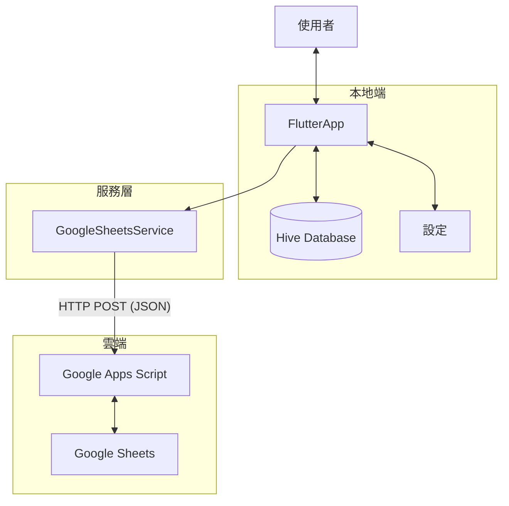

# 系統架構與資料規格 (Architecture & Schema Spec)

## 1. 資料流架構 (Data Flow)

### Mobile Application (iOS/Android)


### Web Application (PWA)
針對瀏覽器 CORS 限制，Web 版採用特殊的 Data Flow:


---

## 2. 專案架構 (Project Structure)

```
lib/
├── core/
│   ├── constants.dart      # 常數定義 (API Actions)
│   ├── di.dart             # 依賴注入 (GetIt)
│   ├── env_config.dart     # 環境配置
│   └── theme.dart          # 主題配置
├── data/
│   ├── models/             # 資料模型 (HiveType)
│   │   ├── settings.dart
│   │   ├── itinerary_item.dart
│   │   ├── message.dart
│   │   └── gear_item.dart
│   └── repositories/       # 資料存取層
│       ├── settings_repository.dart
│       ├── itinerary_repository.dart
│       ├── message_repository.dart
│       └── gear_repository.dart
├── services/
│   ├── hive_service.dart   # Hive 資料庫服務
│   ├── google_sheets_service.dart # API Gateway (含多平台適配)
│   ├── sync_service.dart   # 雙向同步邏輯
│   ├── log_service.dart    # 日誌與上傳
│   └── toast_service.dart  # UI 通知
├── presentation/
│   └── providers/          # 狀態管理 (MVVM)
│       ├── settings_provider.dart
│       ├── itinerary_provider.dart
│       ├── message_provider.dart
│       └── gear_provider.dart
└── main.dart
```

---

## 3. 本地資料庫設計 (Hive Schema)

### Box: `itinerary`
行程節點，支援雲端下載與本地修改。

| Field | Type | Description |
| :--- | :--- | :--- |
| `day` | String | e.g., "D0", "D1" |
| `name` | String | 地標名稱 |
| `estTime` | String | 預計時間 (HH:mm) - **Display Time** |
| `actualTime`| DateTime? | 實際打卡時間 - **Timestamp** |
| `altitude` | int | 海拔 (m) |
| `distance` | double | 里程 (K) |
| `note` | String | 備註 |
| `imageAsset`| String? | 對應 assets 圖片檔名 |

### Box: `messages`
留言，來源：雙向同步。

| Field | Type | Description |
| :--- | :--- | :--- |
| `uuid` | String | **Unique ID** (Primary Key) |
| `parentId` | String? | 父留言 ID (Thread) |
| `user` | String | 發文者暱稱 |
| `category` | String | "Gear", "Plan", "Misc" |
| `content` | String | 內容 |
| `timestamp` | DateTime | 發文時間 (UTC ISO8601) |

### Box: `app_logs`
應用日誌，用於除錯與問題追蹤。

| Field | Type | Description |
| :--- | :--- | :--- |
| `timestamp` | DateTime | 日誌時間 |
| `level` | String | Debug, Info, Warning, Error |
| `message` | String | 內容 |
| `source` | String? | 來源模組 |

---

## 4. Google Sheets 資料結構 (Cloud Schema)

### Sheet: `Itinerary`
| day | name | est_time | altitude | distance | note | image_asset |
| --- | --- | --- | --- | --- | --- | --- |
| D1 | 向陽山屋 | '11:30 | 2850 | 4.3 | ... | ... |

*(注意: `est_time` 在 GAS 寫入時強制加 `'` 前綴以保持字串格式)*

### Sheet: `Messages`
| uuid | parent_id | user | category | content | timestamp |
| --- | --- | --- | --- | --- | --- |
| ... | ... | ... | ... | ... | 2024-12-18T...Z |

### Sheet: `Logs`
| upload_time | device_id | device_name | timestamp | level | source | message |
| --- | --- | --- | --- | --- | --- | --- |
| ISO8601 | ... | ... | 'ISO8601 | ... | ... | ... |

### Sheet: `Weather_Hiking_App`
ETL 處理後的應用端檢視 (Simplified View)。
| Location | StartTime | EndTime | PoP | T | RH | WS | Wx | MaxT | MinT |
| --- | --- | --- | --- | --- | --- | --- | --- | --- | --- |
| 向陽山 | ISO8601 | ISO8601 | 20 | 5.0 | 80 | 2.5 | 陰 | 10.0 | 2.0 |

---

## 5. API 介面 (Google Apps Script)

Base URL: `macros/s/{DEPLOYMENT_ID}/exec`

### Actions

#### 1. `fetch_all` (GET)
取得包含 `itinerary` 與 `messages` 的初始資料。

#### 2. `add_message` (POST)
新增單筆留言。

#### 3. `batch_add_messages` (POST)
批次新增多筆留言 (效能優化)。
Payload: `{ "action": "batch_add_messages", "data": [ ...messages ] }`

#### 4. `update_itinerary` (POST)
覆寫整個行程表 (Admin 功能)。
Payload: `{ "action": "update_itinerary", "data": [ ...items ] }`

#### 5. `upload_logs` (POST)
上傳日誌。
Payload: `{ "action": "upload_logs", "logs": [ ... ], "device_info": { ... } }`

#### 6. `fetch_weather` (GET)
取得登山氣象資料 (讀取 `Weather_Hiking_App` Sheet)。
Response: JSON Array of Weather objects.

---

## 6. 技術決策記錄 (ADR)

### ADR-001: 使用 Hive 取代 Isar
*   **背景**: Isar 在 Android/Web 建置上頻繁出現版本相容性問題。
*   **決策**: 遷移至 Hive 2.x。
*   **優點**: 純 Dart 實作，無原生二進位依賴，Web 支援良好。

### ADR-002: 時間格式策略 (String-First)
*   **背景**: Google Sheets 會自動轉換 DateTime 格式，導致時區偏差。
*   **決策**: 顯示時間 (HH:mm) 一律視為字串，加上 `'` 前綴存入 Sheets。Timestamp 統一使用 UTC ISO8601 字串交換。

### ADR-003: Web CORS 處理
*   **背景**: GAS 不支援 CORS Preflight (OPTIONS)。
*   **決策**: Web 端發送 POST 時，Content-Type 設為 `text/plain`。瀏覽器將其視為 Simple Request 直接發送，GAS 解析字串內容為 JSON。
