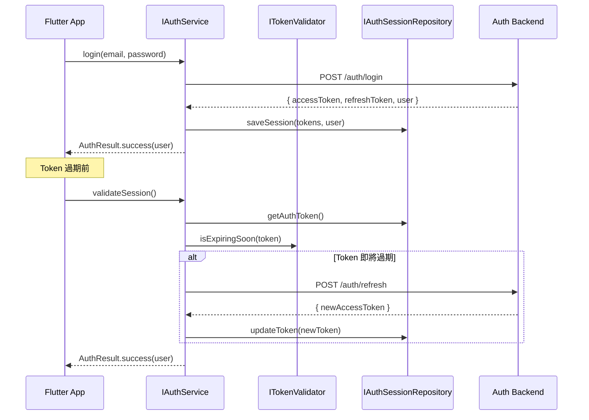

# Authentication Architecture

> **版本**: 1.0  
> **更新日期**: 2026-01-07  
> **狀態**: 規劃中

## 概述

SummitMate 採用可抽換的身份驗證架構，支援未來遷移至不同認證後端：

- 當前：Google Apps Script 自製 JWT
- 未來：Firebase Auth / AWS Cognito / Azure AD / OAuth SSO

---

## 架構圖

### 整體架構


### 認證流程



### 離線認證流程


---

## 核心介面

### IAuthService

```dart
/// 抽象認證服務介面
/// 所有認證後端實作此介面
abstract class IAuthService {
  /// 註冊新用戶
  Future<AuthResult> register({
    required String email,
    required String password,
    required String displayName,
    String? avatar,
  });

  /// 密碼登入
  Future<AuthResult> login({
    required String email,
    required String password,
  });

  /// 第三方登入 (OAuth SSO)
  Future<AuthResult> loginWithProvider(AuthProvider provider);

  /// 驗證目前 Session
  Future<AuthResult> validateSession();

  /// 刷新 Token
  Future<AuthResult> refreshToken();

  /// 登出
  Future<void> logout();

  /// 刪除帳號
  Future<AuthResult> deleteAccount();

  /// 取得目前 Token
  Future<String?> getAuthToken();

  /// 取得快取的用戶資料
  Future<UserProfile?> getCachedUserProfile();

  /// 檢查是否已登入
  Future<bool> isLoggedIn();
}

/// 第三方登入提供者
enum AuthProvider { google, facebook, apple, line }
```

### ITokenValidator

```dart
/// JWT Token 驗證介面
abstract class ITokenValidator {
  /// 驗證 Token 有效性
  TokenValidationResult validate(String token);

  /// 解析 Token 內容 (不驗證簽章)
  TokenPayload? decode(String token);

  /// 檢查是否即將過期
  bool isExpiringSoon(String token, {Duration threshold});
}
```

---

## Token 設計

### JWT 結構

```
Header.Payload.Signature
```

| 欄位   | 說明                              |
| ------ | --------------------------------- |
| `uid`  | 用戶 UUID                         |
| `iat`  | 簽發時間 (Unix timestamp)         |
| `exp`  | 過期時間 (Unix timestamp)         |
| `type` | Token 類型 (`access` / `refresh`) |

### Token 生命週期

| Token 類型    | 有效期 | 用途                |
| ------------- | ------ | ------------------- |
| Access Token  | 1 小時 | API 請求授權        |
| Refresh Token | 30 天  | 換取新 Access Token |

### 離線寬限期

| 場景             | 寬限期 | 行為                     |
| ---------------- | ------ | ------------------------ |
| Token 過期但離線 | 7 天   | 允許離線存取，上線後刷新 |
| 超過寬限期       | -      | 強制重新登入             |

---

## 實作對照表

| 介面                     | 當前實作                | 未來實作                 |
| ------------------------ | ----------------------- | ------------------------ |
| `IAuthService`           | `GasAuthService`        | `FirebaseAuthService`    |
| `ITokenValidator`        | `JwtTokenValidator`     | `FirebaseTokenValidator` |
| `IAuthSessionRepository` | `AuthSessionRepository` | (不變)                   |

---

## 遷移指南

### 切換至 Firebase Auth

1. 安裝 `firebase_auth` package
2. 建立 `FirebaseAuthService` 實作 `IAuthService`
3. 更新 DI 註冊：

```dart
// lib/core/di.dart
getIt.registerLazySingleton<IAuthService>(
  () => FirebaseAuthService(), // 改這行即可
);
```

### 新增 OAuth SSO 提供者

1. 實作 `loginWithProvider(AuthProvider.google)` 方法
2. 整合對應 SDK (google_sign_in, sign_in_with_apple, etc.)
3. 後端新增 OAuth 驗證邏輯

---

## 相關文件

- [ARCHITECTURE_AND_SCHEMA.md](./ARCHITECTURE_AND_SCHEMA.md) - 整體架構
- [TECHNICAL_DESIGN.md](./TECHNICAL_DESIGN.md) - 技術設計
