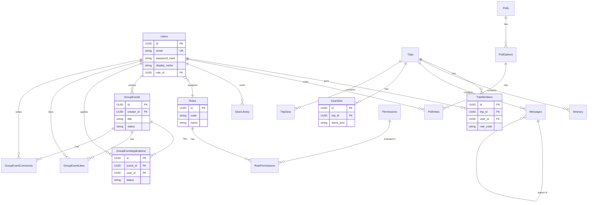

# Database Schema

## 1. 概述 (Overview)

本專案採用 **Google Sheets** 作為 Backend Relational Database，前端 App 則使用 **Hive** 作為本地快取庫。
本文件定義後端資料儲存結構，以及表格間的關聯關係。

## 2. 實體關聯圖 (ER Diagram)

---

## 3. Backend Schema (Google Sheets)

所有資料表皆包含標準稽核欄位：`created_at`, `created_by`, `updated_at`, `updated_by`。

### 3.1 核心模組 (Core)

#### Table: `Trips` (行程主表)

| Column      | Type    | Constraints    | Description                        |
| :---------- | :------ | :------------- | :--------------------------------- |
| **id**      | UUID    | **PK**         |                                    |
| name        | Text    | Not Null       | 行程名稱                           |
| start_date  | Date    |                |                                    |
| end_date    | Date    |                |                                    |
| description | Text    |                |                                    |
| cover_image | Text    |                | URL                                |
| is_active   | Boolean | Default: false |                                    |
| day_names   | JSON    |                | 天數名稱列表 (e.g. `["D1", "D2"]`) |
| created_at  | Date    |                | 建立時間                           |
| created_by  | Text    |                | 建立者 ID                          |
| updated_at  | Date    |                | 更新時間                           |
| updated_by  | Text    |                | 更新者 ID                          |

#### Table: `TripMembers` (行程成員)

| Column      | Type | Constraints | Description            |
| :---------- | :--- | :---------- | :--------------------- |
| **id**      | UUID | **PK**      |                        |
| **trip_id** | UUID | **FK**      | Ref: Trips.id          |
| **user_id** | UUID | **FK**      | Ref: Users.id          |
| role_code   | Text |             | e.g. `leader`, `guide` |
| created_at  | Date |             | 建立時間               |
| created_by  | Text |             | 建立者 ID              |
| updated_at  | Date |             | 更新時間               |
| updated_by  | Text |             | 更新者 ID              |

#### Table: `Itinerary` (行程節點)

| Column        | Type    | Constraints | Description         |
| :------------ | :------ | :---------- | :------------------ |
| **id**        | UUID    | **PK**      |                     |
| **trip_id**   | UUID    | **FK**      | Ref: Trips.id       |
| day           | Text    |             | 天數代號 (e.g. "1") |
| name          | Text    |             | 節點名稱            |
| est_time      | Text    |             | 預估時間            |
| altitude      | Number  |             | 海拔 (m)            |
| distance      | Number  |             | 距離 (km)           |
| note          | Text    |             |                     |
| image_asset   | Text    |             | 圖片路徑            |
| is_checked_in | Boolean |             |                     |
| checked_in_at | Date    |             |                     |
| created_at    | Date    |             | 建立時間            |
| created_by    | Text    |             | 建立者 ID           |
| updated_at    | Date    |             | 更新時間            |
| updated_by    | Text    |             | 更新者 ID           |

#### Table: `Messages` (留言板)

| Column        | Type | Constraints | Description                 |
| :------------ | :--- | :---------- | :-------------------------- |
| **id**        | UUID | **PK**      |                             |
| **trip_id**   | UUID | **FK**      | Ref: Trips.id               |
| **parent_id** | UUID | **FK**      | Ref: Messages.id (Nullable) |
| user          | Text |             | 使用者名稱快照 (Snapshot)   |
| category      | Text |             | 類別                        |
| content       | Text |             |                             |
| timestamp     | Date |             | 留言時間                    |
| avatar        | Text |             | 頭像快照 (Snapshot)         |
| created_at    | Date |             | 建立時間                    |
| created_by    | Text |             | 建立者 ID                   |
| updated_at    | Date |             | 更新時間                    |
| updated_by    | Text |             | 更新者 ID                   |

### 3.2 裝備模組 (Gear)

#### Table: `GearSets` (裝備組合)

| Column       | Type   | Constraints | Description                      |
| :----------- | :----- | :---------- | :------------------------------- |
| **id**       | UUID   | **PK**      |                                  |
| **trip_id**  | UUID   | **FK**      | Ref: Trips.id                    |
| title        | Text   |             | 組合名稱                         |
| author       | Text   |             | 建立者名稱                       |
| visibility   | Text   |             | `public`, `protected`, `private` |
| key          | Text   |             | 4 碼分享碼                       |
| total_weight | Number |             | 總重 (g)                         |
| item_count   | Number |             | 物品數量                         |
| items_json   | JSON   |             | 裝備細項 JSON                    |
| meals_json   | JSON   |             | 餐點細項 JSON                    |
| uploaded_at  | Date   |             | 建立時間                         |
| updated_at   | Date   |             | 更新時間                         |
| updated_by   | Text   |             | 更新者 ID                        |

#### Table: `TripGear` (行程裝備清單 - Relational)

| Column      | Type    | Constraints | Description   |
| :---------- | :------ | :---------- | :------------ |
| **id**      | UUID    | **PK**      |               |
| **trip_id** | UUID    | **FK**      | Ref: Trips.id |
| name        | Text    |             | 裝備名稱      |
| weight      | Number  |             | 重量          |
| category    | Text    |             | 分類          |
| is_checked  | Boolean |             | 是否已攜帶    |
| quantity    | Number  |             | 數量          |
| created_at  | Date    |             | 建立時間      |
| created_by  | Text    |             | 建立者 ID     |
| updated_at  | Date    |             | 更新時間      |
| updated_by  | Text    |             | 更新者 ID     |

#### Table: `GearLibrary` (個人裝備庫)

| Column      | Type   | Constraints | Description   |
| :---------- | :----- | :---------- | :------------ |
| **id**      | UUID   | **PK**      |               |
| **user_id** | UUID   | **FK**      | Ref: Users.id |
| name        | Text   |             | 裝備名稱      |
| weight      | Number |             | 重量          |
| category    | Text   |             | 分類          |
| notes       | Text   |             | 備註          |
| created_at  | Date   |             | 建立時間      |
| created_by  | Text   |             | 建立者 ID     |
| updated_at  | Date   |             | 更新時間      |
| updated_by  | Text   |             | 更新者 ID     |

### 3.3 互動模組 (Interaction)

#### Table: `Polls` (投票主表)

| Column               | Type    | Constraints | Description        |
| :------------------- | :------ | :---------- | :----------------- |
| **id**               | UUID    | **PK**      |                    |
| title                | Text    |             |                    |
| description          | Text    |             |                    |
| **creator_id**       | UUID    | **FK**      | Ref: Users.id      |
| deadline             | Date    |             |                    |
| is_allow_add_option  | Boolean |             | 是否允許新增選項   |
| max_option_limit     | Number  |             | 選項上限           |
| allow_multiple_votes | Boolean |             | 是否允許多選       |
| result_display_type  | Text    |             | 結果顯示方式       |
| status               | Text    |             | `active`, `closed` |
| created_at           | Date    |             | 建立時間           |
| created_by           | Text    |             | 建立者 ID          |
| updated_at           | Date    |             | 更新時間           |
| updated_by           | Text    |             | 更新者 ID          |

#### Table: `PollOptions` (選項)

| Column         | Type | Constraints | Description   |
| :------------- | :--- | :---------- | :------------ |
| **id**         | UUID | **PK**      |               |
| **poll_id**    | UUID | **FK**      | Ref: Polls.id |
| text           | Text |             |               |
| **creator_id** | UUID | **FK**      | Ref: Users.id |
| created_at     | Date |             | 建立時間      |
| created_by     | Text |             | 建立者 ID     |
| updated_at     | Date |             | 更新時間      |
| updated_by     | Text |             | 更新者 ID     |

#### Table: `PollVotes` (投票紀錄)

| Column        | Type | Constraints | Description         |
| :------------ | :--- | :---------- | :------------------ |
| **id**        | UUID | **PK**      |                     |
| **poll_id**   | UUID | **FK**      | Ref: Polls.id       |
| **option_id** | UUID | **FK**      | Ref: PollOptions.id |
| **user_id**   | UUID | **FK**      | Ref: Users.id       |
| user_name     | Text |             | 使用者名稱快照      |
| created_at    | Date |             | 建立時間            |
| created_by    | Text |             | 建立者 ID           |
| updated_at    | Date |             | 更新時間            |
| updated_by    | Text |             | 更新者 ID           |

### 3.4 揪團模組 (Group Events)

#### Table: `GroupEvents` (揪團活動)

| Column            | Type    | Constraints    | Description                    |
| :---------------- | :------ | :------------- | :----------------------------- |
| **id**            | UUID    | **PK**         |                                |
| **creator_id**    | UUID    | **FK**         | Ref: Users.id                  |
| title             | Text    | Not Null       | 活動名稱                       |
| description       | Text    |                | 活動說明                       |
| location          | Text    |                | 地點                           |
| start_date        | Date    |                | 開始日期                       |
| end_date          | Date    |                | 結束日期                       |
| max_members       | Number  |                | 招募人數上限                   |
| status            | Text    | Default: open  | `open`, `closed`, `cancelled`  |
| approval_required | Boolean | Default: false | 是否需審核                     |
| private_message   | Text    |                | 報名成功訊息 (審核通過後顯示)  |
| linked_trip_id    | UUID    | **FK**         | Ref: Trips.id (TODO: 整合行程) |
| like_count        | Number  | Default: 0     | 快取 (TODO)                    |
| comment_count     | Number  | Default: 0     | 快取 (TODO)                    |
| created_at        | Date    |                | 建立時間                       |
| created_by        | Text    |                | 建立者 ID                      |
| updated_at        | Date    |                | 更新時間                       |
| updated_by        | Text    |                | 更新者 ID                      |

#### Table: `GroupEventApplications` (報名紀錄)

| Column       | Type | Constraints      | Description                                    |
| :----------- | :--- | :--------------- | :--------------------------------------------- |
| **id**       | UUID | **PK**           |                                                |
| **event_id** | UUID | **FK**           | Ref: GroupEvents.id                            |
| **user_id**  | UUID | **FK**           | Ref: Users.id                                  |
| status       | Text | Default: pending | `pending`, `approved`, `rejected`, `cancelled` |
| message      | Text |                  | 報名留言                                       |
| created_at   | Date |                  | 報名時間                                       |
| created_by   | Text |                  | 建立者 ID                                      |
| updated_at   | Date |                  | 更新時間                                       |
| updated_by   | Text |                  | 更新者 ID                                      |

#### Table: `GroupEventLikes` (喜歡紀錄) - TODO

| Column       | Type | Constraints | Description         |
| :----------- | :--- | :---------- | :------------------ |
| **id**       | UUID | **PK**      |                     |
| **event_id** | UUID | **FK**      | Ref: GroupEvents.id |
| **user_id**  | UUID | **FK**      | Ref: Users.id       |
| created_at   | Date |             | 建立時間            |

#### Table: `GroupEventComments` (留言紀錄) - TODO

| Column        | Type | Constraints | Description                |
| :------------ | :--- | :---------- | :------------------------- |
| **id**        | UUID | **PK**      |                            |
| **event_id**  | UUID | **FK**      | Ref: GroupEvents.id        |
| **parent_id** | UUID | **FK**      | Ref: GroupEventComments.id |
| **user_id**   | UUID | **FK**      | Ref: Users.id              |
| content       | Text |             |                            |
| created_at    | Date |             | 建立時間                   |
| created_by    | Text |             | 建立者 ID                  |
| updated_at    | Date |             | 更新時間                   |
| updated_by    | Text |             | 更新者 ID                  |

### 3.5 會員與權限模組 (Auth & RBAC)

#### Table: `Users` (會員)

| Column              | Type    | Constraints | Description   |
| :------------------ | :------ | :---------- | :------------ |
| **id**              | UUID    | **PK**      |               |
| email               | Text    | **UK**      | 登入帳號      |
| password_hash       | Text    |             | SHA-256       |
| display_name        | Text    |             |               |
| avatar              | Text    |             |               |
| **role_id**         | UUID    | **FK**      | Ref: Roles.id |
| is_active           | Boolean |             |               |
| is_verified         | Boolean |             |               |
| verification_code   | Text    |             |               |
| verification_expiry | Date    |             |               |
| last_login_at       | Date    |             |               |

#### Table: `Roles` (角色)

| Column      | Type | Constraints | Description            |
| :---------- | :--- | :---------- | :--------------------- |
| **id**      | UUID | **PK**      |                        |
| code        | Text | **UK**      | e.g. `ADMIN`, `LEADER` |
| name        | Text |             | 顯示名稱               |
| description | Text |             |                        |

#### Table: `Permissions` (權限)

| Column      | Type | Constraints | Description      |
| :---------- | :--- | :---------- | :--------------- |
| **id**      | UUID | **PK**      |                  |
| code        | Text | **UK**      | e.g. `trip.edit` |
| category    | Text |             |                  |
| description | Text |             |                  |

#### Table: `RolePermissions` (角色權限關聯)

| Column            | Type | Constraints | Description         |
| :---------------- | :--- | :---------- | :------------------ |
| **id**            | UUID | **PK**      |                     |
| **role_id**       | UUID | **FK**      | Ref: Roles.id       |
| **permission_id** | UUID | **FK**      | Ref: Permissions.id |

### 3.6 系統監控 (System)

#### Table: `Logs` (日誌)

| Column      | Type | Constraints | Description             |
| :---------- | :--- | :---------- | :---------------------- |
| upload_time | Date |             |                         |
| device_id   | Text |             |                         |
| device_name | Text |             |                         |
| timestamp   | Date |             | 事件發生時間            |
| level       | Text |             | `INFO`, `ERROR`, `WARN` |
| source      | Text |             |                         |
| message     | Text |             |                         |

#### Table: `Heartbeat` (心跳檢測)

| Column      | Type | Constraints | Description  |
| :---------- | :--- | :---------- | :----------- |
| **user_id** | Text | **PK**      | (Logical PK) |
| user_type   | Text |             |              |
| user_name   | Text |             |              |
| avatar      | Text |             |              |
| last_seen   | Date |             |              |
| view        | Text |             | 當前頁面     |
| platform    | Text |             | App/Web      |

---

## 4. App Local Cache Schema (Hive)

Hive Box 結構應盡量與上述 Backend Schema 對應，但可包含本地專用欄位 (e.g. `syncStatus`).

- **Box: `trips`**
- **Box: `itinerary`**
- **Box: `messages`**
- **Box: `user_profile`**
- **Box: `settings`** (Local Only)
