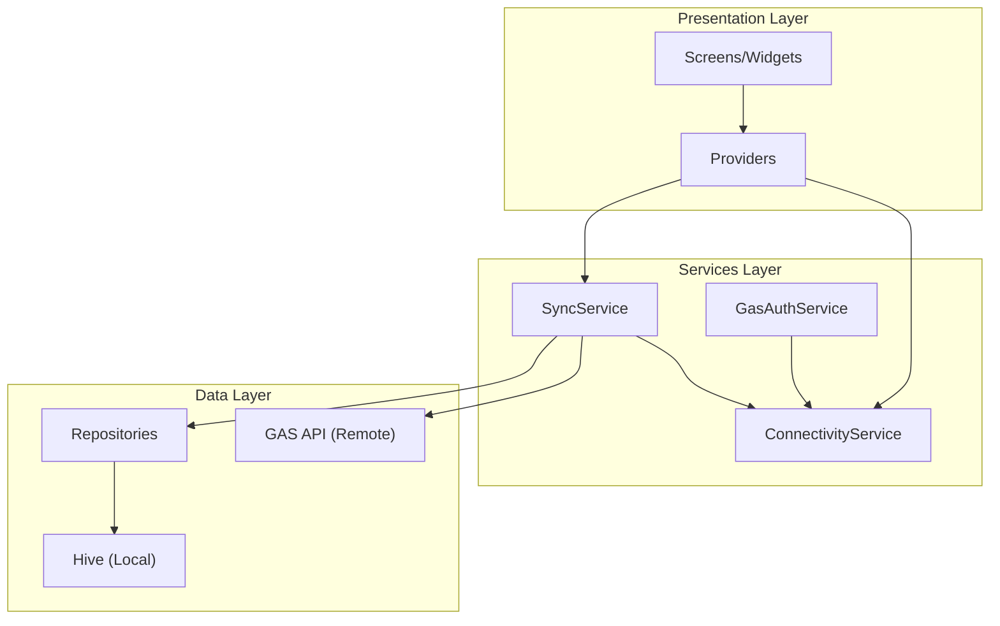
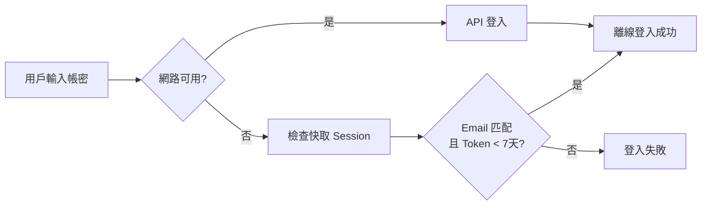

# 離線優先架構 (Offline-First Architecture)

本文件說明 SummitMate 的離線優先架構設計與實作細節。

---

## 架構概覽



---

## 離線模式判斷

### ConnectivityService

統一的離線判斷服務，整合：

- **網路狀態**: `InternetConnectionChecker`
- **App 離線設定**: `settings.isOfflineMode`

```dart
// lib/services/connectivity_service.dart
bool get isOffline => !_hasConnection || isOfflineModeEnabled;
```

使用方式：

```dart
if (getIt<ConnectivityService>().isOffline) {
  // 執行離線邏輯
}
```

---

## 登出資料策略

### 登出時

| 資料類型            | 行為                      |
| ------------------- | ------------------------- |
| Provider 記憶體狀態 | **清除** (呼叫 `reset()`) |
| Session Token       | **清除**                  |
| Hive 本地資料       | **保留** (供離線登入使用) |

### 手動清除

透過開發選項的「清除本地資料」功能，完整清除所有 Hive 資料。

---

## 離線登入

### 流程



### 7 天寬限期

離線登入時，Token 必須在發行後 7 天內才有效。此常數定義於 `OfflineConfig`：

```dart
// lib/core/offline_config.dart
class OfflineConfig {
  static const int offlineGracePeriodDays = 7;
  static const Duration offlineGracePeriod = Duration(days: offlineGracePeriodDays);
}
```

判斷邏輯：

```dart
final tokenAge = DateTime.now().difference(validationResult.payload!.issuedAt);
if (tokenAge < OfflineConfig.offlineGracePeriod) {
  // 離線登入成功
}
```

---

## 資料同步策略

| 情境     | 策略                         |
| -------- | ---------------------------- |
| 線上模式 | 先讀本地快取，背景同步遠端   |
| 離線模式 | 只讀本地 Hive，禁用寫入操作  |
| 恢復連線 | 自動觸發同步 (有 5 分鐘節流) |

### 同步節流

同步節流間隔也定義於 `OfflineConfig`：

```dart
static const int syncThrottleMinutes = 5;
static const Duration syncThrottleDuration = Duration(minutes: syncThrottleMinutes);
```

---

## 離線處理策略 (Clean Architecture)

採用 **Infrastructure 層內部處理** 方式，各 Service Impl 自行決定離線行為：

```dart
class GasSyncServiceImpl implements ISyncService {
  final ConnectivityService _connectivity;

  @override
  Future<SyncResult> syncAll({bool isAuto = false}) async {
    // 清楚的離線檢查，易於理解和除錯
    if (_connectivity.isOffline) {
      return SyncResult.skipped(reason: 'offline');
    }

    return await _doSync();
  }
}
```

**優點**：

- 不同 API 可有不同離線策略
- 邏輯清晰，易於除錯
- 避免 Mixin 隱含邏輯

---

## 相關檔案

| 功能           | 檔案                                         |
| -------------- | -------------------------------------------- |
| 離線常數       | `lib/core/offline_config.dart`               |
| 離線判斷       | `lib/services/connectivity_service.dart`     |
| 離線例外       | `lib/core/exceptions/offline_exception.dart` |
| 離線登入       | `lib/services/gas_auth_service.dart`         |
| 同步服務       | `lib/services/sync_service.dart`             |
| Provider Reset | `lib/presentation/providers/*.dart`          |
| DI 註冊        | `lib/core/di.dart`                           |
