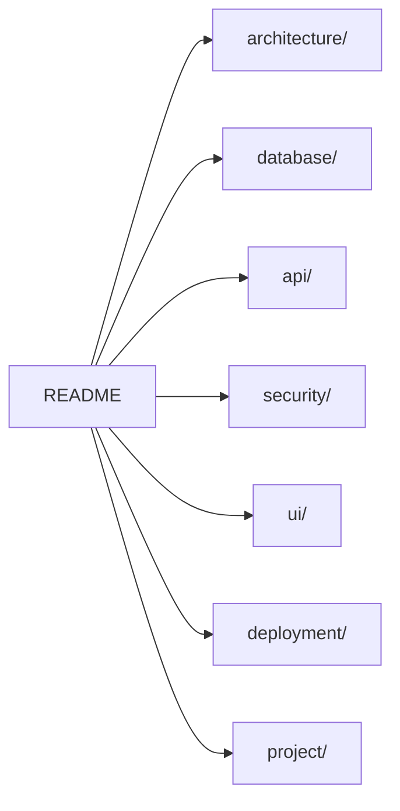

# SummitMate 文件索引 (Documentation Index)

## 架構 (Architecture)

| 文件                                            | 說明                |
| :---------------------------------------------- | :------------------ |
| [系統概覽](./architecture/OVERVIEW.md)          | 資料流、技術堆疊    |
| [專案結構](./architecture/PROJECT_STRUCTURE.md) | `lib/` 目錄結構     |
| [模組關聯圖](./architecture/MODULE_DIAGRAM.md)  | 分層架構圖          |
| [離線架構](./architecture/OFFLINE.md)           | Offline-First 設計  |
| [認證架構](./architecture/AUTH.md)              | JWT、RBAC、登入流程 |

---

## 資料庫 (Database)

| 文件                           | 說明             |
| :----------------------------- | :--------------- |
| [Schema](./database/SCHEMA.md) | 資料表定義       |
| [同步機制](./database/SYNC.md) | 同步流程、狀態機 |

---

## API

| 文件                          | 說明              |
| :---------------------------- | :---------------- |
| [API 合約](./api/CONTRACT.md) | 所有 API 端點規格 |

---

## 安全與權限 (Security)

| 文件                                     | 說明               |
| :--------------------------------------- | :----------------- |
| [權限規格](./security/PERMISSIONS.md)    | RBAC、行程成員角色 |
| [隱私政策](./security/PRIVACY_POLICY.md) | 隱私權聲明         |

---

## UI 設計 (UI Design)

| 文件                                  | 說明               |
| :------------------------------------ | :----------------- |
| [導航流程](./ui/NAVIGATION.md)        | 畫面導航圖         |
| [畫面設計](./ui/SCREENS.md)           | 關鍵畫面 Wireframe |
| [設計準則](./ui/DESIGN_GUIDELINES.md) | 色彩、間距、元件   |

---

## 部署 (Deployment)

| 文件                                       | 說明         |
| :----------------------------------------- | :----------- |
| [部署指南](./deployment/GUIDE.md)          | GAS 部署步驟 |
| [廣告整合](./deployment/AD_INTEGRATION.md) | AdMob 設定   |

---

## 專案管理 (Project)

| 文件                               | 說明           |
| :--------------------------------- | :------------- |
| [開發路線圖](./project/ROADMAP.md) | 開發進度與規劃 |

---

## 快速連結

