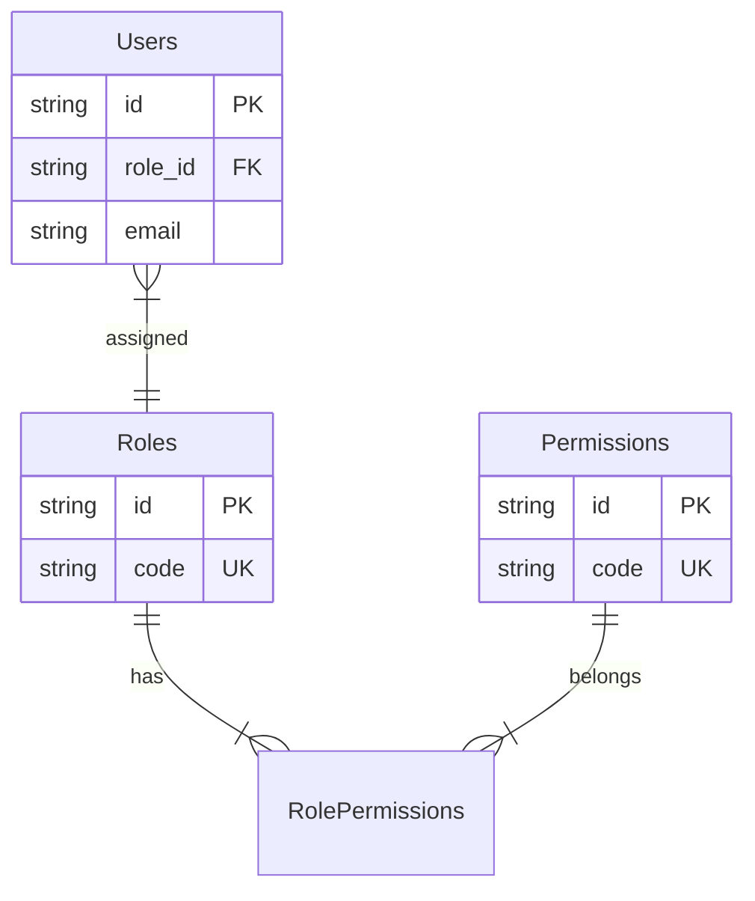
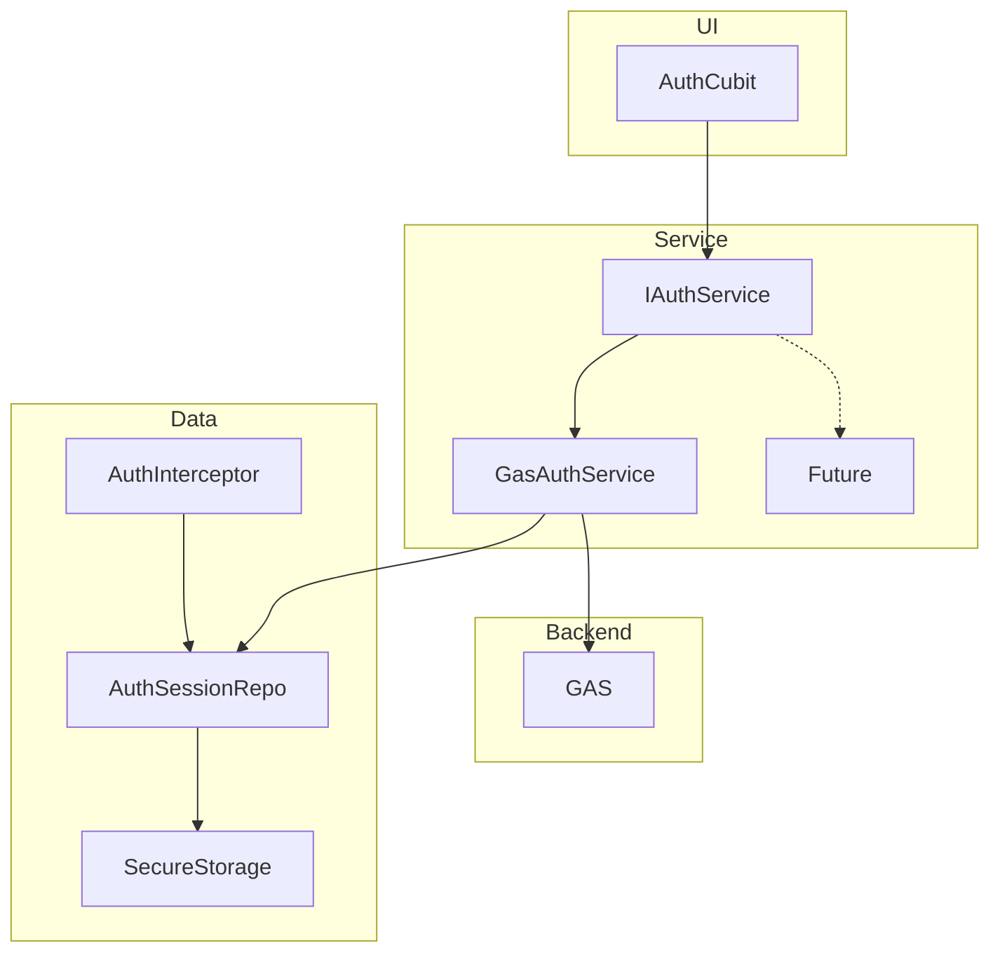
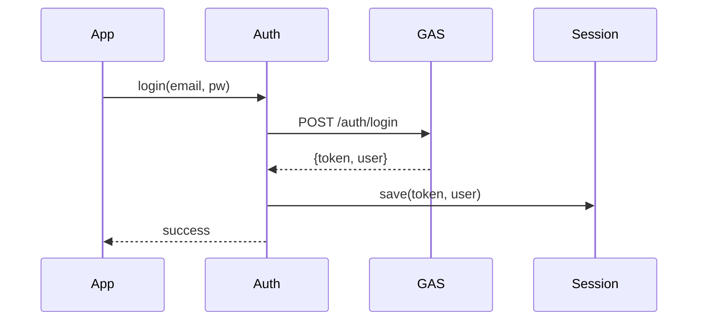
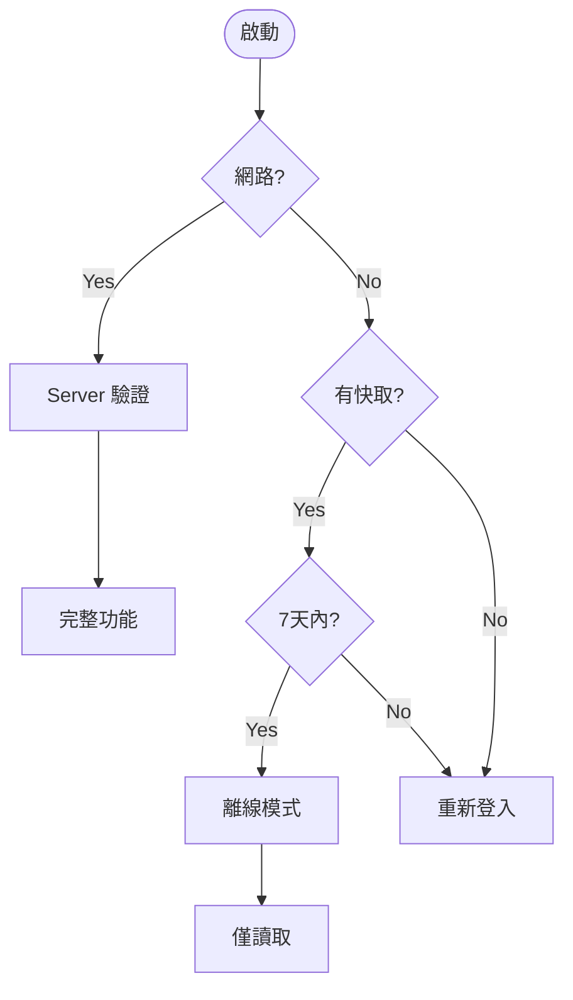

# 認證架構 (Authentication Architecture)

SummitMate 採用可抽換的身份驗證架構，支援未來遷移至不同認證後端。

---

## 技術限制

> [!IMPORTANT]
> **限制**：Auth Token 必須注入到 **Request Body** 中，而非 Header。

**原因**：GAS 會剝離自定義 Header，且無法正確處理 CORS 預檢請求。

**解決方案 (`AuthInterceptor`)**：

```dart
if (options.method == 'POST' && options.data is Map<String, dynamic>) {
  (options.data as Map<String, dynamic>)['accessToken'] = token;
}
```

---

## 角色權限系統 (RBAC)

### `roleId` vs `roleCode`

| 欄位                  | 用途      | 範例                       |
| :-------------------- | :-------- | :------------------------- |
| `roleId` (UUID)       | 資料庫 FK | `d290f1ee-6c54-...`        |
| `roleCode` (Constant) | 程式判斷  | `ADMIN`, `LEADER`, `GUIDE` |

### ERD



### 扁平化策略

GAS 端 Join 查詢後，回傳 `permissions` 陣列給 App 快取，支援離線權限檢查。

---

## 架構圖



---

## 認證流程



---

## 離線認證



---

## Email 驗證流程

1. 註冊 → GAS 生成 6 位數驗證碼 (30分鐘有效)
2. `MailApp.sendEmail` 發送
3. `VerificationScreen` 輸入驗證碼
4. `auth_verify_email` API 驗證
5. `is_verified = true`

---

## Token 設計

| Token    | 有效期 | 用途         |
| :------- | :----: | :----------- |
| Access   | 1 小時 | API 授權     |
| Refresh  | 30 天  | 換取新 Token |
| 離線寬限 |  7 天  | 離線存取     |

---

## 核心介面

```dart
abstract class IAuthService {
  Future<AuthResult> login({required String email, required String password});
  Future<AuthResult> register({required String email, required String password, required String displayName});
  Future<AuthResult> validateSession();
  Future<void> logout();
  Future<String?> getAccessToken();
}
```

---

## 遷移至 Firebase

```dart
// lib/core/di.dart
getIt.registerLazySingleton<IAuthService>(
  () => FirebaseAuthService(), // 只需改這行
);
```
