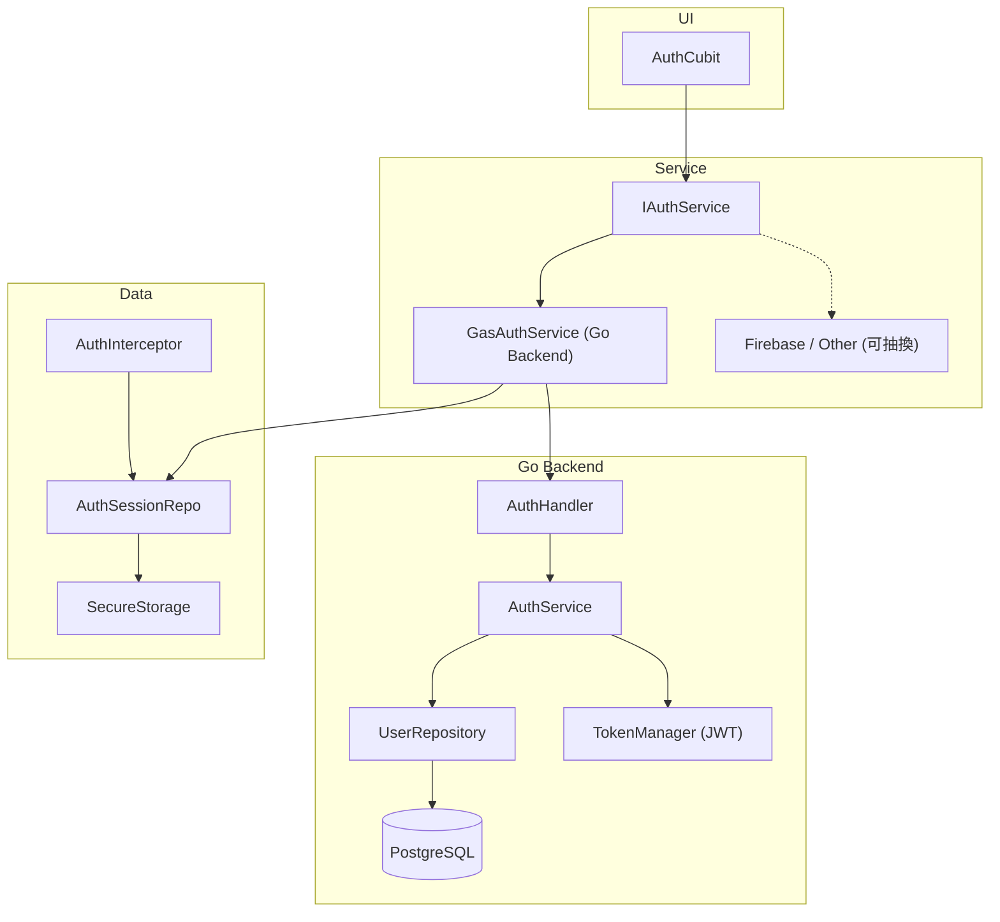
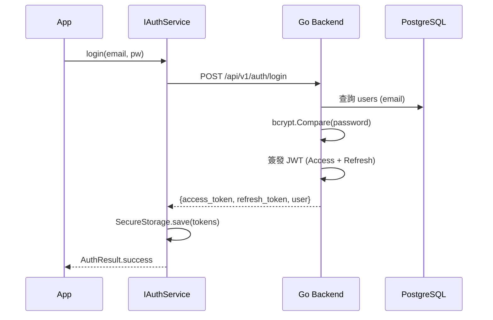
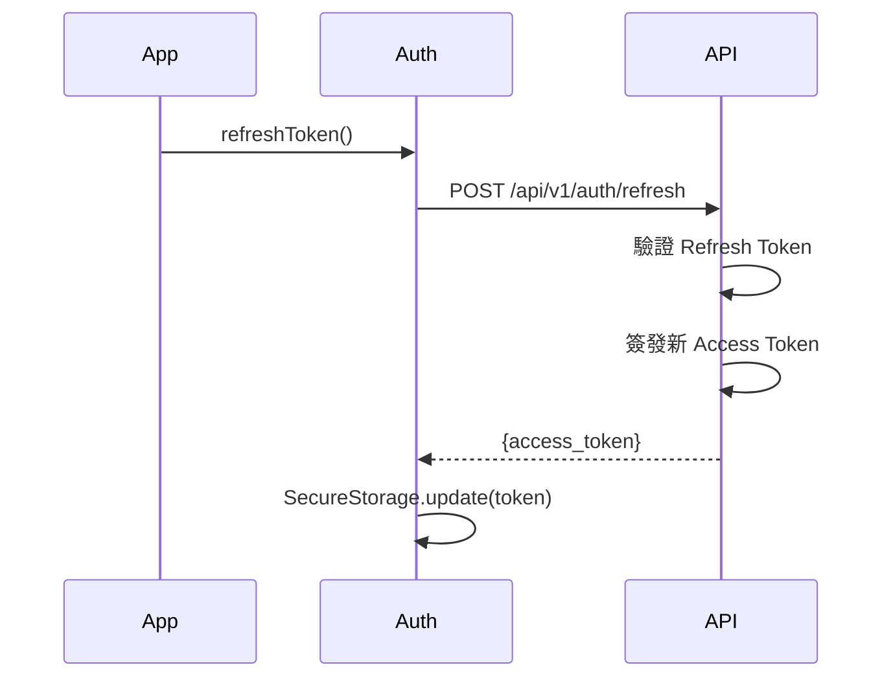
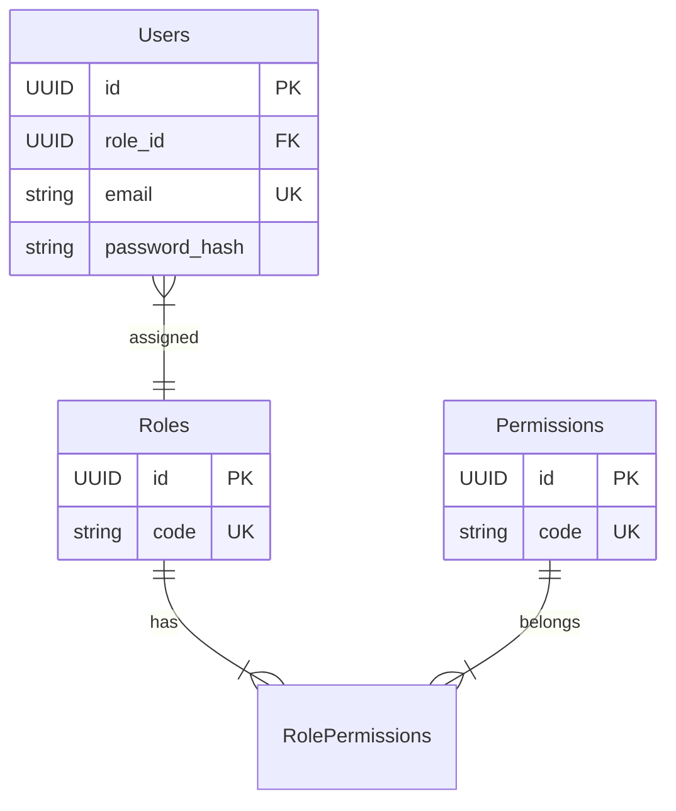
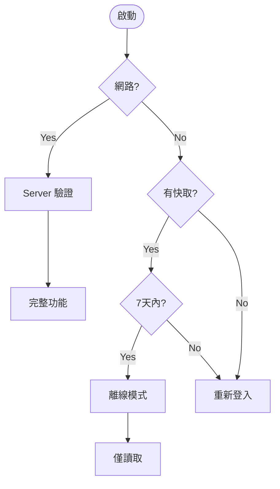

# 認證架構 (Authentication Architecture)

SummitMate 採用可抽換的身份驗證架構，後端使用 Go 實作 JWT 認證。

---

## 架構圖


```mermaid
graph TD
    subgraph UI
        AuthCubit
    end
    subgraph Service
        IAuthService --> GasAuthService["GasAuthService (Go Backend)"]
        IAuthService -.-> FutureImpl["Firebase / Other (可抽換)"]
    end
    subgraph Data
        AuthSessionRepo --> SecureStorage
        AuthInterceptor --> AuthSessionRepo
    end
    subgraph GoBackend["Go Backend"]
        AuthHandler --> AuthService
        AuthService --> UserRepo["UserRepository"]
        AuthService --> TokenManager["TokenManager (JWT)"]
        UserRepo --> PG[(PostgreSQL)]
    end

    AuthCubit --> IAuthService
    GasAuthService --> AuthSessionRepo
    GasAuthService --> AuthHandler
```

---

## 認證流程


```mermaid
sequenceDiagram
    participant App
    participant Auth as IAuthService
    participant API as Go Backend
    participant DB as PostgreSQL

    App->>Auth: login(email, pw)
    Auth->>API: POST /api/v1/auth/login
    API->>DB: 查詢 users (email)
    API->>API: bcrypt.Compare(password)
    API->>API: 簽發 JWT (Access + Refresh)
    API-->>Auth: {access_token, refresh_token, user}
    Auth->>Auth: SecureStorage.save(tokens)
    Auth-->>App: AuthResult.success
```

### Token 刷新


```mermaid
sequenceDiagram
    App->>Auth: refreshToken()
    Auth->>API: POST /api/v1/auth/refresh
    API->>API: 驗證 Refresh Token
    API->>API: 簽發新 Access Token
    API-->>Auth: {access_token}
    Auth->>Auth: SecureStorage.update(token)
```

---

## Token 設計

| Token         | 有效期 | 用途                     | 儲存位置      |
| :------------ | :----: | :----------------------- | :------------ |
| Access Token  | 1 小時 | API 授權 (Bearer Header) | SecureStorage |
| Refresh Token | 30 天  | 換取新 Access Token      | SecureStorage |
| 離線寬限      |  7 天  | 離線模式存取             | App 快取判斷  |

### JWT 結構

```go
// backend/internal/auth/jwt.go
type Claims struct {
    UserID string `json:"user_id"`
    Email  string `json:"email"`
    jwt.RegisteredClaims
}
```

---

## 角色權限系統 (RBAC)

### `roleId` vs `roleCode`

| 欄位                  | 用途      | 範例                       |
| :-------------------- | :-------- | :------------------------- |
| `roleId` (UUID)       | 資料庫 FK | `d290f1ee-6c54-...`        |
| `roleCode` (Constant) | 程式判斷  | `ADMIN`, `LEADER`, `GUIDE` |

### ERD


```mermaid
erDiagram
    Users }|--|| Roles : "assigned"
    Roles ||--|{ RolePermissions : "has"
    Permissions ||--|{ RolePermissions : "belongs"

    Users {
        UUID id PK
        UUID role_id FK
        string email UK
        string password_hash
    }
    Roles {
        UUID id PK
        string code UK
    }
    Permissions {
        UUID id PK
        string code UK
    }
```

---

## 離線認證


```mermaid
flowchart TD
    Start([啟動]) --> Net{網路?}
    Net -->|Yes| Online[Server 驗證]
    Net -->|No| Cache{有快取?}
    Cache -->|Yes| Grace{7天內?}
    Grace -->|Yes| Offline[離線模式]
    Grace -->|No| Login[重新登入]
    Cache -->|No| Login
    Online --> Full[完整功能]
    Offline --> Limited[僅讀取]
```

---

## Email 驗證流程

1. 註冊 → 後端生成 6 位數驗證碼 (30 分鐘有效)
2. 發送驗證信至使用者信箱
3. `VerificationScreen` 輸入驗證碼
4. `POST /auth/verify-email` 驗證
5. `is_verified = true`

---

## 後端實作對照

| Go Backend 元件      | 檔案                               | 職責                         |
| :------------------- | :--------------------------------- | :--------------------------- |
| `TokenManager`       | `internal/auth/jwt.go`             | JWT 簽發與驗證               |
| `Password`           | `internal/auth/password.go`        | bcrypt 雜湊與比對            |
| `AuthService`        | `internal/service/auth_service.go` | 註冊/登入/刷新/驗證/帳號管理 |
| `AuthHandler`        | `internal/handler/auth_handler.go` | HTTP 請求處理                |
| `JWTAuth Middleware` | `internal/middleware/jwt_auth.go`  | 請求級 JWT 驗證              |

---

## 核心介面 (Frontend)

```dart
abstract class IAuthService {
  Future<AuthResult> login({required String email, required String password});
  Future<AuthResult> register({required String email, required String password, required String displayName});
  Future<AuthResult> validateSession();
  Future<void> logout();
  Future<String?> getAccessToken();
}
```

抽換作法：修改 `lib/core/di.dart` 中的 `IAuthService` 註冊即可替換認證後端。
