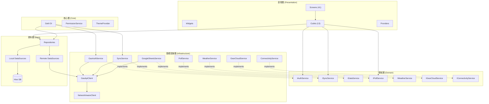
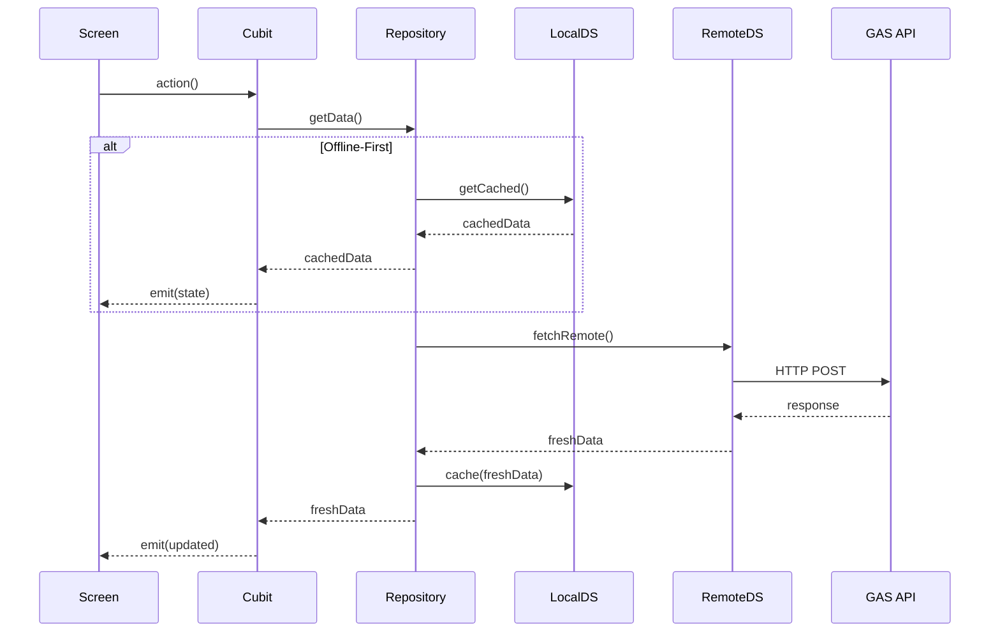

# 模組關聯圖 (Module Dependency Diagram)

## 架構層級關聯

---

## Cubit 模組清單

| Cubit              | 職責      | 依賴                  |
| :----------------- | :-------- | :-------------------- |
| `AuthCubit`        | 認證狀態  | IAuthService          |
| `SyncCubit`        | 同步狀態  | ISyncService          |
| `TripCubit`        | 行程 CRUD | TripRepository        |
| `ItineraryCubit`   | 行程節點  | ItineraryRepository   |
| `GearCubit`        | 個人裝備  | GearRepository        |
| `GearLibraryCubit` | 裝備庫    | GearLibraryRepository |
| `MessageCubit`     | 留言板    | MessageRepository     |
| `PollCubit`        | 投票      | IPollService          |
| `MealCubit`        | 餐點規劃  | 記憶體                |
| `GroupEventCubit`  | 揪團      | GroupEventRepository  |
| `FavoritesCubit`   | 最愛      | FavoritesRepository   |
| `SettingsCubit`    | 設定      | SettingsRepository    |
| `MapCubit`         | 地圖      | GeolocatorService     |

---

## 資料流概覽

