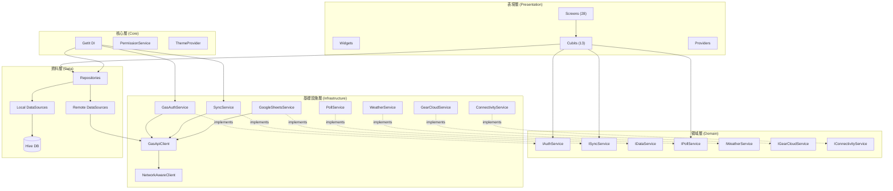
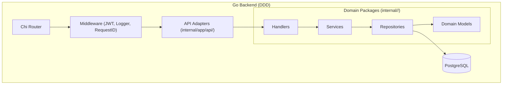
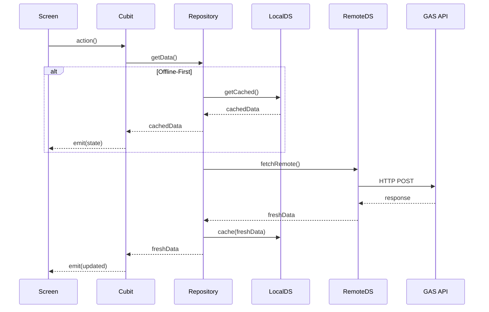

# 模組關聯圖 (Module Dependency Diagram)

## 架構層級關聯

```mermaid
graph TB
    subgraph Presentation["表現層 (Presentation)"]
        Screens["Screens (28)"]
        Widgets["Widgets"]
        Cubits["Cubits (13)"]
        Providers["Providers"]
    end

    subgraph Domain["領域層 (Domain)"]
        IAuth["IAuthService"]
        ISync["ISyncService"]
        IData["IDataService"]
        IPoll["IPollService"]
        IWeather["IWeatherService"]
        IGear["IGearCloudService"]
        IConn["IConnectivityService"]
    end

    subgraph Infrastructure["基礎設施層 (Infrastructure)"]
        AuthSvc["GasAuthService"]
        SyncSvc["SyncService"]
        DataSvc["GoogleSheetsService"]
        PollSvc["PollService"]
        WeatherSvc["WeatherService"]
        GearSvc["GearCloudService"]
        ConnSvc["ConnectivityService"]

        GasClient["GasApiClient"]
        NetClient["NetworkAwareClient"]
    end

    subgraph Data["資料層 (Data)"]
        Repos["Repositories"]
        LocalDS["Local DataSources"]
        RemoteDS["Remote DataSources"]
        Hive[(Hive DB)]
    end

    subgraph Core["核心層 (Core)"]
        DI["GetIt DI"]
        PermSvc["PermissionService"]
        Theme["ThemeProvider"]
    end

    %% Presentation -> Domain
    Screens --> Cubits
    Cubits --> IAuth & ISync & IPoll
    Cubits --> Repos

    %% Infrastructure implements Domain
    AuthSvc -.->|implements| IAuth
    SyncSvc -.->|implements| ISync
    DataSvc -.->|implements| IData
    PollSvc -.->|implements| IPoll
    WeatherSvc -.->|implements| IWeather
    GearSvc -.->|implements| IGear
    ConnSvc -.->|implements| IConn

    %% Infrastructure -> Clients
    AuthSvc --> GasClient
    SyncSvc --> GasClient
    DataSvc --> GasClient
    GasClient --> NetClient

    %% Data flow
    Repos --> LocalDS & RemoteDS
    LocalDS --> Hive
    RemoteDS --> GasClient

    %% Core provides
    DI --> AuthSvc & SyncSvc & Repos
```

---

## Go Backend 分層架構

```mermaid
graph TB
    subgraph Backend["Go Backend (DDD)"]
        Router["Chi Router"]
        MW["Middleware (JWT, Logger, RequestID)"]

        subgraph DomainPkg["Domain Packages (internal/<domain>/)"]
            Handlers["Handlers"]
            Services["Services"]
            Models["Domain Models"]
            Repos["Repositories"]
        end

        Adapters["API Adapters (internal/app/api/)"]
        PG[(PostgreSQL)]
    end

    Router --> MW --> Adapters
    Adapters --> Handlers
    Handlers --> Services
    Services --> Repos
    Repos --> Models
    Repos --> PG
```

### Backend Service 清單

| Service              | 職責                        | Handler              |
| :------------------- | :-------------------------- | :------------------- |
| `AuthService`        | 註冊/登入/JWT/帳號管理      | `AuthHandler`        |
| `TripService`        | 行程 CRUD + 成員 + 行程節點 | `TripHandler`        |
| `GearLibraryService` | 個人裝備庫                  | `GearLibraryHandler` |
| `MealLibraryService` | 個人食物庫                  | `MealLibraryHandler` |
| `TripGearService`    | 行程裝備                    | `TripGearHandler`    |
| `TripMealService`    | 行程食物                    | `TripMealHandler`    |
| `MessageService`     | 行程留言板                  | `MessageHandler`     |
| `PollService`        | 投票機制                    | `PollHandler`        |
| `FavoriteService`    | 收藏                        | `FavoriteHandler`    |
| `GroupEventService`  | 揪團活動                    | `GroupEventHandler`  |
| `WeatherService`     | 氣象 ETL + 查詢             | `WeatherHandler`     |
| `LogService`         | App 日誌上傳                | `LogHandler`         |
| `HeartbeatService`   | 心跳追蹤                    | `HeartbeatHandler`   |

---

## Cubit 模組清單

| Cubit              | 職責      | 依賴                  |
| :----------------- | :-------- | :-------------------- |
| `AuthCubit`        | 認證狀態  | IAuthService          |
| `SyncCubit`        | 同步狀態  | ISyncService          |
| `TripCubit`        | 行程 CRUD | TripRepository        |
| `ItineraryCubit`   | 行程節點  | ItineraryRepository   |
| `GearCubit`        | 個人裝備  | GearRepository        |
| `GearLibraryCubit` | 裝備庫    | GearLibraryRepository |
| `MessageCubit`     | 留言板    | MessageRepository     |
| `PollCubit`        | 投票      | IPollService          |
| `MealCubit`        | 餐點規劃  | 記憶體                |
| `GroupEventCubit`  | 揪團      | GroupEventRepository  |
| `FavoritesCubit`   | 最愛      | FavoritesRepository   |
| `SettingsCubit`    | 設定      | SettingsRepository    |
| `MapCubit`         | 地圖      | GeolocatorService     |

---

## 資料流概覽

```mermaid
sequenceDiagram
    participant UI as Screen
    participant C as Cubit
    participant R as Repository
    participant L as LocalDS
    participant R2 as RemoteDS
    participant API as GAS API

    UI->>C: action()
    C->>R: getData()

    alt Offline-First
        R->>L: getCached()
        L-->>R: cachedData
        R-->>C: cachedData
        C-->>UI: emit(state)
    end

    R->>R2: fetchRemote()
    R2->>API: HTTP POST
    API-->>R2: response
    R2-->>R: freshData
    R->>L: cache(freshData)
    R-->>C: freshData
    C-->>UI: emit(updated)
```
