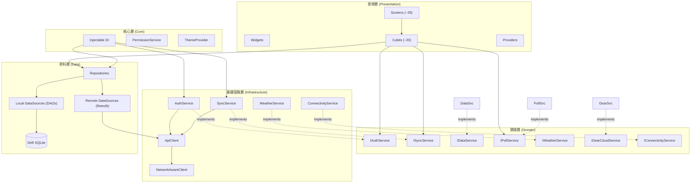
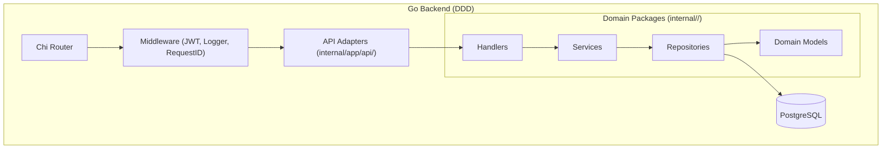
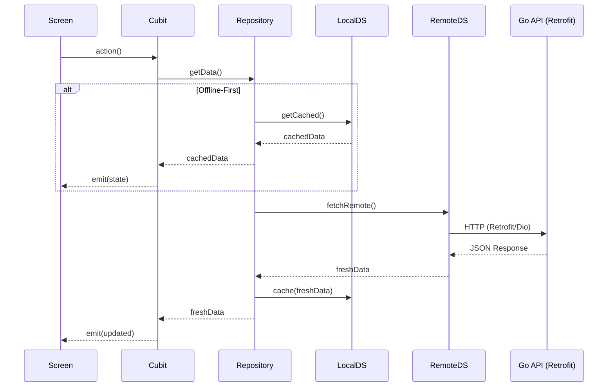

# 模組關聯圖 (Module Dependency Diagram)

## 架構層級關聯

```mermaid
graph TB
    subgraph Presentation["表現層 (Presentation)"]
        Screens["Screens (~29)"]
        Widgets["Widgets"]
        Cubits["Cubits (~20)"]
        Providers["Providers"]
    end

    subgraph Domain["領域層 (Domain)"]
        IAuth["IAuthService"]
        ISync["ISyncService"]
        IData["IDataService"]
        IPoll["IPollService"]
        IWeather["IWeatherService"]
        IGear["IGearCloudService"]
        IConn["IConnectivityService"]
    end

    subgraph Infrastructure["基礎設施層 (Infrastructure)"]
        AuthSvc["AuthService"]
        SyncSvc["SyncService"]
        WeatherSvc["WeatherService"]
        ConnSvc["ConnectivityService"]

        ApiClient["ApiClient"]
        NetClient["NetworkAwareClient"]
    end

    subgraph Data["資料層 (Data)"]
        Repos["Repositories"]
        LocalDS["Local DataSources (DAOs)"]
        RemoteDS["Remote DataSources (Retrofit)"]
        Drift[(Drift SQLite)]
    end

    subgraph Core["核心層 (Core)"]
        DI["Injectable DI"]
        PermSvc["PermissionService"]
        Theme["ThemeProvider"]
    end

    %% Presentation -> Domain
    Screens --> Cubits
    Cubits --> IAuth & ISync & IPoll
    Cubits --> Repos

    %% Infrastructure implements Domain
    AuthSvc -.->|implements| IAuth
    SyncSvc -.->|implements| ISync
    DataSvc -.->|implements| IData
    PollSvc -.->|implements| IPoll
    WeatherSvc -.->|implements| IWeather
    GearSvc -.->|implements| IGear
    ConnSvc -.->|implements| IConn

    %% Infrastructure -> Clients
    AuthSvc --> ApiClient
    SyncSvc --> ApiClient
    ApiClient --> NetClient

    %% Data flow
    Repos --> LocalDS & RemoteDS
    LocalDS --> Drift
    RemoteDS --> ApiClient

    %% Core provides
    DI --> AuthSvc & SyncSvc & Repos
```

---

## Go Backend 分層架構

```mermaid
graph TB
    subgraph Backend["Go Backend (DDD)"]
        Router["Chi Router"]
        MW["Middleware (JWT, Logger, RequestID)"]

        subgraph DomainPkg["Domain Packages (internal/<domain>/)"]
            Handlers["Handlers"]
            Services["Services"]
            Models["Domain Models"]
            Repos["Repositories"]
        end

        Adapters["API Adapters (internal/app/api/)"]
        PG[(PostgreSQL)]
    end

    Router --> MW --> Adapters
    Adapters --> Handlers
    Handlers --> Services
    Services --> Repos
    Repos --> Models
    Repos --> PG
```

### Backend Service / Handler 清單

> Handler 為各領域的 HTTP 層；`internal/app/api/Server` 聚合所有 Handler 以實作 OpenAPI 產生的 `ServerInterface`。

| 領域 (package) | Service                              | 職責                            | Handler              |
| :------------- | :----------------------------------- | :------------------------------ | :------------------- |
| `auth`         | `AuthService`                        | 註冊/登入/刷新/驗證/帳號管理    | `AuthHandler`        |
| `trip`         | `TripService`                        | 行程 CRUD + 成員 + 節點 + 移交  | `TripHandler`        |
| `trip`         | `TripGearService`                    | 行程裝備                        | `TripGearHandler`    |
| `trip`         | `TripMealService`                    | 行程食物 + 糧食計畫天數         | `TripMealHandler`    |
| `library`      | `LibraryService`                     | 個人裝備庫 / 食物庫             | `LibraryHandler`     |
| `gearset`      | `GearSetService`                     | 雲端裝備組合 (Gear Cloud)       | `GearSetHandler`     |
| `interaction`  | `PollService` + `MessageService`     | 投票機制 / 行程留言板           | `InteractionHandler` |
| `favorite`     | `FavoriteService`                    | 收藏                            | `FavoriteHandler`    |
| `groupevent`   | `GroupEventService`                  | 揪團活動 + 報名 + 留言 + 按讚   | `GroupEventHandler`  |
| `weather`      | `WeatherService`                     | 氣象 ETL + 查詢                 | `WeatherHandler`     |
| `flag`         | `FlagService`                        | 系統旗標 (Feature Flags)        | `FlagHandler`        |
| `log`          | `LogService`                         | App 日誌上傳                    | `LogHandler`         |
| `heartbeat`    | `HeartbeatService`                   | 心跳追蹤                        | `HeartbeatHandler`   |

---

## Cubit 模組清單

| Cubit                      | 職責             | 依賴                         |
| :------------------------- | :--------------- | :--------------------------- |
| `AuthCubit`                | 認證狀態         | IAuthService                 |
| `SyncCubit`                | 同步狀態         | ISyncService                 |
| `ConnectivityCubit`        | 離線狀態廣播     | ConnectivityService          |
| `TripCubit`                | 行程 CRUD        | TripRepository               |
| `ItineraryCubit`           | 行程節點         | ItineraryRepository          |
| `GearCubit`                | 行程裝備         | GearRepository               |
| `GearLibraryCubit`         | 個人裝備庫       | GearLibraryRepository        |
| `MessageCubit`             | 留言板           | MessageRepository            |
| `PollCubit`                | 投票             | PollRepository               |
| `MealCubit`                | 餐點規劃         | MealRepository / 記憶體      |
| `GroupEventCubit`          | 揪團             | GroupEventRepository         |
| `GroupEventCommentCubit`   | 揪團留言         | GroupEventRepository         |
| `GroupEventReviewCubit`    | 揪團報名審核     | GroupEventRepository         |
| `MountainFavoritesCubit`   | 百岳收藏         | FavoritesRepository          |
| `GroupEventFavoritesCubit` | 揪團收藏         | FavoritesRepository          |
| `SettingsCubit`            | 設定             | SettingsRepository           |
| `MapCubit`                 | 地圖             | GeolocatorService            |
| `OfflineMapCubit`          | 離線圖資管理     | TileCaching                  |
| `TutorialCubit`            | 教學流程 + Mock  | 記憶體                       |
| `AppErrorCubit`            | 全域錯誤提示     | AppErrorHandler              |

---

## 資料流概覽

```mermaid
sequenceDiagram
    participant UI as Screen
    participant C as Cubit
    participant R as Repository
    participant L as LocalDS
    participant R2 as RemoteDS
    participant API as Go API (Retrofit)

    UI->>C: action()
    C->>R: getData()

    alt Offline-First
        R->>L: getCached()
        L-->>R: cachedData
        R-->>C: cachedData
        C-->>UI: emit(state)
    end

    R->>R2: fetchRemote()
    R2->>API: HTTP (Retrofit/Dio)
    API-->>R2: JSON Response
    R2-->>R: freshData
    R->>L: cache(freshData)
    R-->>C: freshData
    C-->>UI: emit(updated)
```
