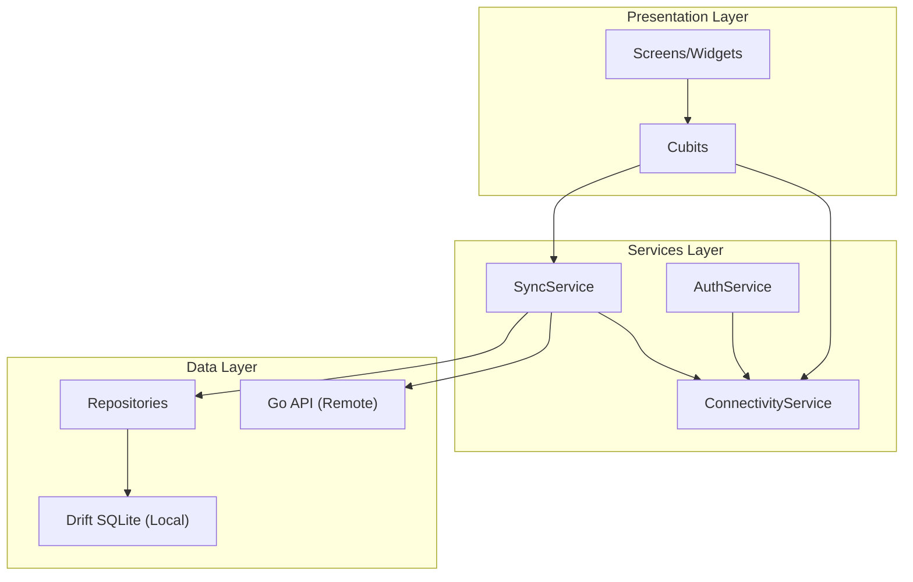
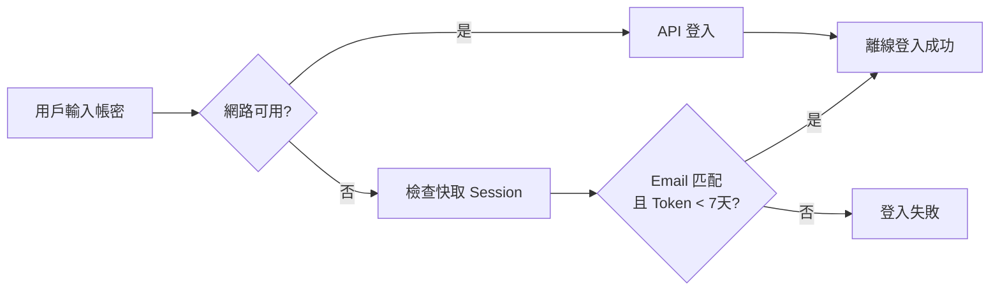

# 離線優先架構 (Offline-First Architecture)

本文件說明 SummitMate 的離線優先架構設計與實作細節。

---

## 架構概覽



---

## 離線模式判斷

### ConnectivityService

統一的離線判斷服務，作為離線狀態的單一可信源（Source of Truth），整合：

- **網路狀態**: `InternetConnectionChecker`（配有 2 秒的 Debounce 防抖動機制）
- **App 離線設定**: `settings.isOfflineMode`（儲存於 SQLite 本地資料庫）

在服務層中，離線狀態定義如下：

```dart
// lib/infrastructure/services/connectivity_service.dart
bool get isOffline => !_isNetworkConnected || _isOfflineMode;
```

### UI 層訂閱機制：ConnectivityCubit

為確保 UI 狀態與業務邏輯一致，UI 層**統一**不直接讀取 `SettingsCubit.isOfflineMode`，而是透過 [ConnectivityCubit](../../app/lib/presentation/cubits/connectivity/connectivity_cubit.dart) 監聽 `ConnectivityService.onConnectivityChanged` 的廣播流：

```dart
// 在 Widget 內監聽
final isOffline = context.watch<ConnectivityCubit>().state.isOffline;
```

不論是實體網路中斷，還是手動切換離線模式，UI 介面均能即時同步響應。

---

## 登出資料策略

### 登出時

| 資料類型         | 行為                       |
| ---------------- | -------------------------- |
| Cubit 記憶體狀態 | **清除** (發送 ResetState) |
| Session Token    | **清除**                   |
| Drift 本地資料   | **保留** (供離線登入使用)  |

### 手動清除

透過開發選項的「清除本地資料」功能，完整清除所有 Drift (SQLite) 資料。

---

## 離線登入

### 流程



### 7 天寬限期

離線登入時，Token 必須在發行後 7 天內才有效。此常數定義於 `OfflineConfig`：

```dart
// lib/core/offline_config.dart
class OfflineConfig {
  static const int offlineGracePeriodDays = 7;
  static const Duration offlineGracePeriod = Duration(days: offlineGracePeriodDays);
}
```

判斷邏輯：

```dart
final tokenAge = DateTime.now().difference(validationResult.payload!.issuedAt);
if (tokenAge < OfflineConfig.offlineGracePeriod) {
  // 離線登入成功
}
```

---

## 資料同步策略

| 情境     | 策略                         |
| -------- | ---------------------------- |
| 線上模式 | 先讀本地快取，背景同步遠端   |
| 離線模式 | 只讀本地 Drift，禁用寫入操作 |
| 恢復連線 | 自動觸發同步 (有 5 分鐘節流) |

### 同步節流

同步節流間隔也定義於 `OfflineConfig`：

```dart
static const int syncThrottleMinutes = 5;
static const Duration syncThrottleDuration = Duration(minutes: syncThrottleMinutes);
```

---

## 離線邏輯功能一覽表

UI 層全面統一以 `ConnectivityCubit.isOffline` 作為防呆與狀態顯示依據。以下為各功能在離線時的 UI 行為與提示設計：

| 功能 / 畫面                                                            | 離線狀態來源                  | 遇到離線時的 UI 處理行為                                                                                                                 | 提示與訊息反饋 (Toast / SnackBar)                                                                | 業務邏輯防呆                   |
| :--------------------------------------------------------------------- | :---------------------------- | :--------------------------------------------------------------------------------------------------------------------------------------- | :----------------------------------------------------------------------------------------------- | :----------------------------- |
| **網路警示橫幅**<br>`OfflineStatusBanner`                              | `ConnectivityCubit.isOffline` | 全域頂部顯示紅底警示橫幅。                                                                                                               | `無網環境 (離線模式)，編輯將在連線後自動同步`                                                    | 純 UI 提示                     |
| **登入畫面**<br>`LoginScreen`                                          | `ConnectivityCubit.isOffline` | 顯示橘色離線警告，登入按鈕保持可用，改行本機憑證驗證。                                                                                   | - 手動離線：`已使用離線模式登入...`<br>- 自動斷線：`無法連線，已自動切換至離線登入`              | 本地密碼驗證                   |
| **登出按鈕**<br>`AppDrawerContent`                                     | `ConnectivityCubit.isOffline` | 點擊時強制彈出對話框警告。                                                                                                               | `您目前處於離線狀態。如果現在登出...確定要登出嗎？`                                              | 經確認後才調用登出             |
| **協作防護頁**<br>`CloudGuard`                                         | `ConnectivityCubit.isOffline` | 鎖定未同步行程的協作頁，隱藏「上傳」按鈕，改顯示「目前為離線模式，無法上傳」。                                                           | 無額外彈出訊息，僅引導文案。                                                                     | 阻擋 API 發送                  |
| **日程/打卡**<br>`ItineraryTab` & `InfoTab`                            | `ConnectivityCubit.isOffline` | 允許查看快取數據與本機 CRUD 操作，連線後自動背景同步。                                                                                   | 點擊「手動更新天氣」時跳出 Toast 警告：`離線模式無法更新天氣資料`。                              | 阻擋背景 Sync 與 天氣 API 請求 |
| **建立揪團 / 發起投票**<br>`GroupEventsListScreen`<br>`PollListScreen` | `ConnectivityCubit.isOffline` | 右下角新增 FAB 按鈕套用 `OfflineGate` 置灰並阻擋互動。                                                                                   | 點擊時彈出警告：<br>- 建立揪團：`離線模式無法建立揪團`<br>- 發起投票：`離線模式無法發起投票`     | 攔截 API 發送                  |
| **投票操作**<br>`PollDetailScreen`                                     | `ConnectivityCubit.isOffline` | 頂部顯示橘色警告條，所有投票選項、送出、刪除按鈕皆置灰且不可點擊。                                                                       | 警告條文字：`離線模式中，無法投票或編輯`。                                                       | `PollCubit` 自動攔截離線請求   |
| **留言板**<br>`MessageListScreen`<br>`GroupEventCommentSheet`          | `ConnectivityCubit.isOffline` | 1. 留言輸入框置灰、HintText 切換為「離線模式下無法留言」。<br>2. 新增按鈕 FAB、留言卡片之回覆按鈕、刪除按鈕套用 `OfflineGate` 置灰阻擋。 | 點擊 FAB 或刪除按鈕時彈出 SnackBar：<br>- `離線模式下無法新增留言`<br>- `離線模式下無法刪除留言` | `MessageCubit` 等阻擋 API 發送 |
| **成員管理**<br>`MemberManagementScreen`                               | `ConnectivityCubit.isOffline` | 「新增成員」FAB 隱藏，管理齒輪置灰不可點擊。                                                                                             | 直接以 UI 限制，無額外彈出訊息。                                                                 | `TripRepository` 拋出連線失敗  |
| **雲端裝備庫**<br>`GearCloudScreen`                                    | `ConnectivityCubit.isOffline` | 1. 頂部顯示「離線」標籤。<br>2. 工具列的「上傳」與「管理」按鈕、列表卡片套用 `OfflineGate` 全域置灰與攔截。                              | 點擊上傳、管理、下載時分別彈出 SnackBar 警告。                                                   | 阻擋 API 連線                  |

---

## 通用防呆元件：`OfflineGate`

為了落實 DRY 原則，專案中實作了通用離線保護元件 [OfflineGate](../../app/lib/presentation/widgets/common/offline_gate.dart)。

### 元件行為

當處於離線狀態時，`OfflineGate` 會自動執行：

1. 將其子元件設為 **50% 透明度**，呈現標準置灰視覺效果。
2. 使用 `IgnorePointer` 阻斷所有使用者操作與點擊事件。
3. 若有傳入 `onOfflineTap`，則會在使用者點擊該置灰區域時觸發 custom 警告（如 SnackBar 或 Toast）。
4. 可選設定 `hideWhenOffline: true` 來直接將元件從畫面中隱藏。

### 程式碼與使用範例

#### 範例 A：包裹 FloatingActionButton (點擊跳 SnackBar 提示)

```dart
floatingActionButton: OfflineGate(
  onOfflineTap: () {
    ScaffoldMessenger.of(context).showSnackBar(
      const SnackBar(content: Text('⚠️ 離線模式下無法新增留言')),
    );
  },
  child: FloatingActionButton(
    onPressed: () => _openAddDialog(context),
    child: const Icon(Icons.add),
  ),
),
```

#### 範例 B：包裹 Icon 動作按鈕 (列表項中的刪除)

```dart
trailing: OfflineGate(
  onOfflineTap: () => ToastService.warning('離線模式下無法刪除'),
  child: IconButton(
    icon: const Icon(Icons.delete_outline),
    onPressed: () => _deleteItem(item.id),
  ),
),
```

#### 範例 C：離線時直接隱藏元件

```dart
Widget build(BuildContext context) {
  return OfflineGate(
    hideWhenOffline: true, // 離線時此按鈕完全不渲染
    child: ElevatedButton(
      onPressed: _syncWithCloud,
      child: const Text('雲端同步'),
    ),
  );
}
```

---

## 離線處理策略 (Clean Architecture)

採用 **Infrastructure 層內部處理** 方式，各 Service Impl 自行決定離線行為：

```dart
class SyncService implements ISyncService {
  final ConnectivityService _connectivity;

  @override
  Future<SyncResult> syncAll({bool isAuto = false}) async {
    // 清楚的離線檢查，易於理解和除錯
    if (_connectivity.isOffline) {
      return SyncResult.skipped(reason: 'offline');
    }

    return await _doSync();
  }
}
```

**優點**：

- 不同 API 可有不同離線策略
- 邏輯清晰，易於除錯
- 避免 Mixin 隱含邏輯

---

## 相關檔案

| 功能        | 檔案                                                           |
| ----------- | -------------------------------------------------------------- |
| 離線常數    | `lib/core/offline_config.dart`                                 |
| 離線服務    | `lib/infrastructure/services/connectivity_service.dart`        |
| 離線 Cubit  | `lib/presentation/cubits/connectivity/connectivity_cubit.dart` |
| 防呆元件    | `lib/presentation/widgets/common/offline_gate.dart`            |
| 離線例外    | `lib/core/exceptions/offline_exception.dart`                   |
| 離線登入    | `lib/infrastructure/services/auth_service.dart`                |
| 同步服務    | `lib/infrastructure/services/sync_service.dart`                |
| Cubit Reset | `lib/presentation/cubits/*/`                                   |
| DI 註冊     | `lib/core/di/injection.dart`                                   |
