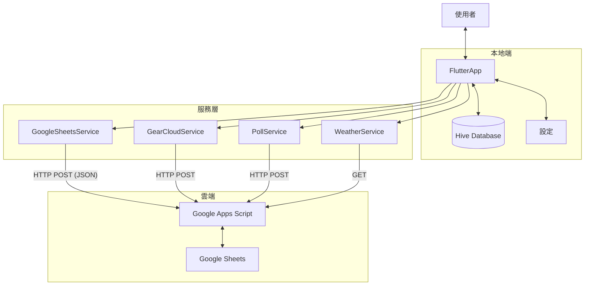
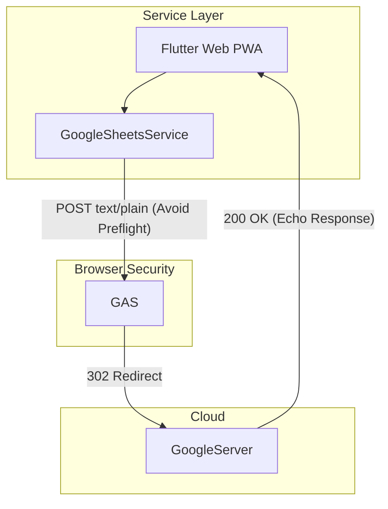

# 系統概覽 (System Overview)

SummitMate 是一款 **Offline-First** 登山行程管理應用，支援 iOS、Android 與 Web (PWA)。

---

## 資料流架構

### Mobile (iOS/Android)

### Web (PWA)

針對瀏覽器 CORS 限制，Web 版採用特殊的 Data Flow:

---

## 技術堆疊

| 類別         | 技術                               |
| :----------- | :--------------------------------- |
| Framework    | Flutter 3.x (Dart 3.x)             |
| Platforms    | iOS, Android, Web (CanvasKit)      |
| Local DB     | Hive (NoSQL)                       |
| State        | flutter_bloc (Cubit) + Provider    |
| Backend      | Google Sheets + Google Apps Script |
| Architecture | Clean Architecture                 |

---

## 相關文件

- [專案結構](./PROJECT_STRUCTURE.md)
- [模組關聯圖](./MODULE_DIAGRAM.md)
- [離線架構](./OFFLINE.md)
- [認證架構](./AUTH.md)
