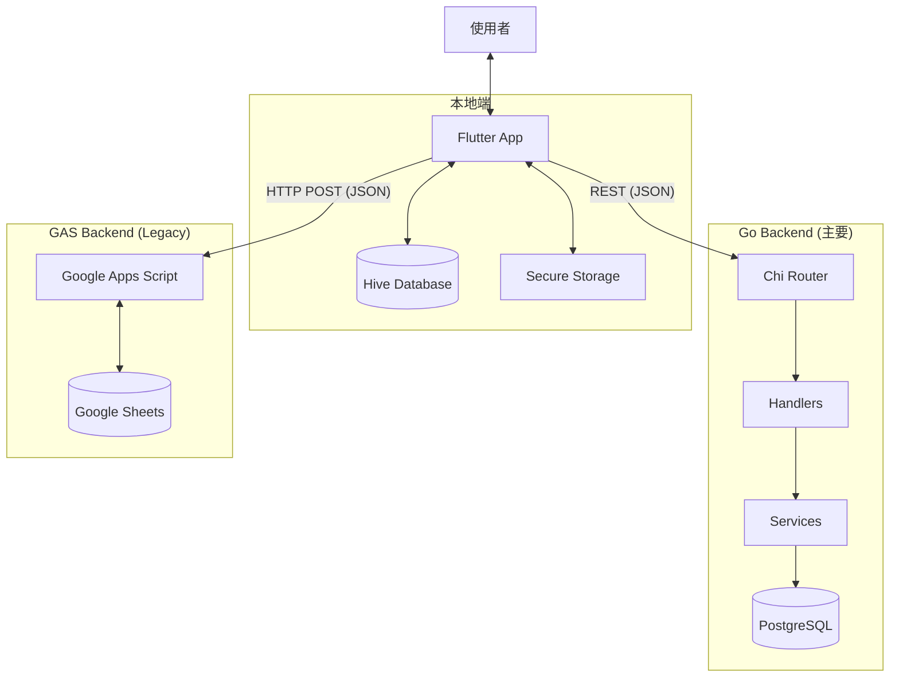
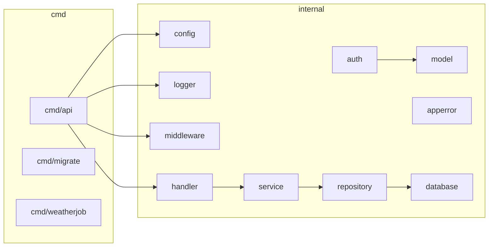

# 系統概覽 (System Overview)

SummitMate 是一款 **Offline-First** 登山行程管理應用，支援 iOS、Android 與 Web (PWA)。

---

## 系統架構

本專案採用前後端分離架構，後端正由 GAS 遷移至 Go。

```mermaid
graph TD
    User[使用者] <--> FlutterApp[Flutter App]

    subgraph Local ["本地端"]
        FlutterApp <--> Hive[(Hive Database)]
        FlutterApp <--> SecureStorage[Secure Storage]
    end

    subgraph GoBackend ["Go Backend (主要)"]
        FlutterApp -- "REST (JSON)" --> ChiRouter[Chi Router]
        ChiRouter --> Handlers[Handlers]
        Handlers --> Services[Services]
        Services --> PgPool[(PostgreSQL)]
    end

    subgraph GASBackend ["GAS Backend (Legacy)"]
        FlutterApp -- "HTTP POST (JSON)" --> GAS[Google Apps Script]
        GAS <--> GSheets[(Google Sheets)]
    end
```

### Go Backend 內部分層

```mermaid
graph LR
    subgraph cmd
        API[cmd/api]
        Migrate[cmd/migrate]
        WeatherJob[cmd/weatherjob]
    end

    subgraph internal
        Config[config]
        Logger[logger]
        MW[middleware]
        Auth[auth]
        Handler[handler]
        Service[service]
        Repo[repository]
        Model[model]
        AppError[apperror]
        DB[database]
    end

    API --> Config & Logger & MW & Handler
    Handler --> Service
    Service --> Repo
    Repo --> DB
    Auth --> Model
```

---

## 技術堆疊

| 類別               | 技術                                              |
| :----------------- | :------------------------------------------------ |
| Frontend Framework | Flutter 3.x (Dart 3.x)                            |
| Platforms          | iOS, Android, Web (CanvasKit)                     |
| Local DB           | Hive (NoSQL)                                      |
| State Management   | flutter_bloc (Cubit) + Provider                   |
| API Layer (FE)    | Retrofit + Dio + Freezed (Code-Gen)               |
| DI / Service Loc. | Injectable + GetIt                                |
| Backend (Primary)  | Go 1.26 + Chi v5 + PostgreSQL                     |
| Backend (Legacy)   | Google Apps Script + Google Sheets                |
| API Style          | OpenAPI 3.0 (Code-Gen via oapi-codegen)           |
| Authentication     | JWT (Access + Refresh Token)                      |
| Logging            | `log/slog` (JSON prod / Text dev)                 |
| Architecture       | Clean Architecture (Frontend) / Layered (Backend) |

---

## API 端點總覽

Go Backend 提供 `/api/v1` 前綴的 RESTful API，包含以下模組：

| 模組         | 端點範例                                                  | 認證       |
| :----------- | :-------------------------------------------------------- | :--------- |
| Health       | `GET /health`                                             | 無         |
| Auth         | `POST /auth/register`, `POST /auth/login`, `GET /auth/me` | 部分需 JWT |
| Trips        | `GET /trips`, `POST /trips`, `PUT /trips/{id}`            | JWT        |
| Trip Members | `GET /trips/{id}/members`, `POST /trips/{id}/members`     | JWT        |
| Itinerary    | `GET /trips/{id}/itinerary`, `POST /trips/{id}/itinerary` | JWT        |
| Trip Gear    | `GET /trips/{id}/gear`, `PUT /trips/{id}/gear/batch`      | JWT        |
| Trip Meals   | `GET /trips/{id}/meals`, `PUT /trips/{id}/meals/batch`    | JWT        |
| Messages     | `GET /trips/{id}/messages`, `POST /trips/{id}/messages`   | JWT        |
| Polls        | `GET /trips/{id}/polls`, `POST /trips/{id}/polls`         | JWT        |
| Gear Library | `GET /gear-library`, `PUT /gear-library/batch`            | JWT        |
| Meal Library | `GET /meal-library`, `PUT /meal-library/batch`            | JWT        |
| Favorites    | `GET /favorites`, `PUT /favorites/batch`                  | JWT        |
| Group Events | `GET /group-events`, `POST /group-events`                 | 部分需 JWT |
| Weather      | `GET /weather/hiking`, `GET /weather/hiking/{location}`   | 無         |
| Logs         | `POST /logs`                                              | 無         |
| Heartbeat    | `POST /heartbeat`                                         | JWT        |

完整 OpenAPI Spec 可透過 `GET /openapi.json` 取得，互動式文件位於 `GET /docs` (Scalar UI)。

---

## 相關文件

- [專案結構](./PROJECT_STRUCTURE.md)
- [模組關聯圖](./MODULE_DIAGRAM.md)
- [離線架構](./OFFLINE.md)
- [認證架構](./AUTH.md)
- [API Contract (Legacy GAS)](../api/CONTRACT.md)
