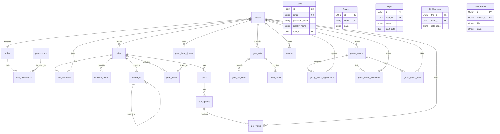

# Database Schema

## 1. 概述 (Overview)

本專案後端採用 **PostgreSQL** 作為正式資料庫 (Supabase Free Tier)。
前端 App 使用 **Hive** 作為本地快取庫 (Offline-First)。

> [!NOTE]
> 此文件為 PostgreSQL Schema 的最終規格設計 (Single Source of Truth)。
> 所有 SQL Migration 檔案應依此文件產生。

### 設計原則

| 原則              | 說明                                                                       |
| :---------------- | :------------------------------------------------------------------------- |
| **UUID PK**       | 所有主鍵使用 UUID，與 Flutter 端相容、支援離線產生 ID                      |
| **TIMESTAMPTZ**   | 所有時間欄位統一使用帶時區的時間戳                                         |
| **稽核欄位**      | 所有表預設包含 `created_at`, `created_by`, `updated_at`, `updated_by`      |
| **CASCADE 刪除**  | 父記錄刪除自動清理子記錄                                                   |
| **正規化**        | GAS 時期的 JSON 欄位 / Array 欄位改為正規關聯表                            |
| **JOIN 取代快照** | GAS 時期的 `user_name`, `user_avatar` 快照欄位，改為 JOIN `users` 即時取得 |

---

## 2. 實體關聯圖 (ER Diagram)



---

## 3. PostgreSQL Schema

### 3.1 會員與權限模組 (Auth & RBAC)

#### Table: `roles`

| Column      | Type        | Constraints | Description                          |
| :---------- | :---------- | :---------- | :----------------------------------- |
| **id**      | UUID        | **PK**      | `gen_random_uuid()`                  |
| code        | VARCHAR(20) | **UK**, NN  | `ADMIN`, `LEADER`, `GUIDE`, `MEMBER` |
| name        | VARCHAR(50) | NN          | 顯示名稱                             |
| description | TEXT        |             |                                      |
| created_at  | TIMESTAMPTZ | NN, Default |                                      |

```sql
CREATE TABLE roles (
    id          UUID PRIMARY KEY DEFAULT gen_random_uuid(),
    code        VARCHAR(20)  NOT NULL UNIQUE,
    name        VARCHAR(50)  NOT NULL,
    description TEXT,
    created_at  TIMESTAMPTZ  NOT NULL DEFAULT NOW()
);
```

#### Table: `permissions`

| Column      | Type        | Constraints | Description         |
| :---------- | :---------- | :---------- | :------------------ |
| **id**      | UUID        | **PK**      |                     |
| code        | VARCHAR(50) | **UK**, NN  | e.g. `trip.edit`    |
| category    | VARCHAR(50) |             | e.g. `trip`, `gear` |
| description | TEXT        |             |                     |

```sql
CREATE TABLE permissions (
    id          UUID PRIMARY KEY DEFAULT gen_random_uuid(),
    code        VARCHAR(50) NOT NULL UNIQUE,
    category    VARCHAR(50),
    description TEXT
);
```

#### Table: `role_permissions`

| Column            | Type | Constraints    | Description         |
| :---------------- | :--- | :------------- | :------------------ |
| **role_id**       | UUID | **PK**, **FK** | Ref: roles.id       |
| **permission_id** | UUID | **PK**, **FK** | Ref: permissions.id |

```sql
CREATE TABLE role_permissions (
    role_id       UUID NOT NULL REFERENCES roles(id) ON DELETE CASCADE,
    permission_id UUID NOT NULL REFERENCES permissions(id) ON DELETE CASCADE,
    PRIMARY KEY (role_id, permission_id)
);
```

#### Table: `users`

| Column              | Type         | Constraints | Description    |
| :------------------ | :----------- | :---------- | :------------- |
| **id**              | UUID         | **PK**      |                |
| email               | VARCHAR(255) | **UK**, NN  | 登入帳號       |
| password_hash       | TEXT         | NN          | bcrypt         |
| display_name        | VARCHAR(100) | NN          |                |
| avatar              | VARCHAR(10)  | NN, Default | Emoji 頭像     |
| **role_id**         | UUID         | **FK**      | Ref: roles.id  |
| is_active           | BOOLEAN      | NN, Default | 帳號啟用       |
| is_verified         | BOOLEAN      | NN, Default | Email 已驗證   |
| verification_code   | VARCHAR(10)  |             | 驗證碼         |
| verification_expiry | TIMESTAMPTZ  |             | 驗證碼過期時間 |
| last_login_at       | TIMESTAMPTZ  |             |                |
| created_at          | TIMESTAMPTZ  | NN, Default |                |
| updated_at          | TIMESTAMPTZ  | NN, Default |                |

```sql
CREATE TABLE users (
    id                  UUID PRIMARY KEY DEFAULT gen_random_uuid(),
    email               VARCHAR(255) NOT NULL UNIQUE,
    password_hash       TEXT         NOT NULL,
    display_name        VARCHAR(100) NOT NULL,
    avatar              VARCHAR(10)  NOT NULL DEFAULT '🐻',
    role_id             UUID REFERENCES roles(id),
    is_active           BOOLEAN      NOT NULL DEFAULT TRUE,
    is_verified         BOOLEAN      NOT NULL DEFAULT FALSE,
    verification_code   VARCHAR(10),
    verification_expiry TIMESTAMPTZ,
    last_login_at       TIMESTAMPTZ,
    created_at          TIMESTAMPTZ  NOT NULL DEFAULT NOW(),
    updated_at          TIMESTAMPTZ  NOT NULL DEFAULT NOW()
);
```

---

### 3.2 核心模組 (Core)

#### Table: `trips`

| Column      | Type         | Constraints | Description                 |
| :---------- | :----------- | :---------- | :-------------------------- |
| **id**      | UUID         | **PK**      |                             |
| **user_id** | UUID         | **FK**, NN  | 行程擁有者 (Leader)         |
| name        | VARCHAR(200) | NN          |                             |
| description | TEXT         |             |                             |
| start_date  | DATE         | NN          |                             |
| end_date    | DATE         |             |                             |
| cover_image | TEXT         |             | URL                         |
| is_active   | BOOLEAN      | NN, Default |                             |
| day_names   | TEXT[]       | NN, Default | `{"D1前進營地","D2嘉明湖"}` |
| created_at  | TIMESTAMPTZ  | NN, Default |                             |
| created_by  | UUID         | **FK**, NN  |                             |
| updated_at  | TIMESTAMPTZ  | NN, Default |                             |
| updated_by  | UUID         | **FK**, NN  |                             |

```sql
CREATE TABLE trips (
    id          UUID PRIMARY KEY DEFAULT gen_random_uuid(),
    user_id     UUID         NOT NULL REFERENCES users(id),
    name        VARCHAR(200) NOT NULL,
    description TEXT,
    start_date  DATE         NOT NULL,
    end_date    DATE,
    cover_image TEXT,
    is_active   BOOLEAN      NOT NULL DEFAULT FALSE,
    day_names   TEXT[]       NOT NULL DEFAULT '{}',
    created_at  TIMESTAMPTZ  NOT NULL DEFAULT NOW(),
    created_by  UUID         NOT NULL REFERENCES users(id),
    updated_at  TIMESTAMPTZ  NOT NULL DEFAULT NOW(),
    updated_by  UUID         NOT NULL REFERENCES users(id)
);
```

#### Table: `trip_members`

| Column      | Type        | Constraints    | Description                 |
| :---------- | :---------- | :------------- | :-------------------------- |
| **trip_id** | UUID        | **PK**, **FK** | Ref: trips.id               |
| **user_id** | UUID        | **PK**, **FK** | Ref: users.id               |
| role_code   | VARCHAR(20) | NN, Default    | `leader`, `guide`, `member` |
| joined_at   | TIMESTAMPTZ | NN, Default    |                             |

> [!NOTE]
> 行程建立時，自動新增一筆 `role_code = 'leader'` 的記錄。
> `trips.user_id` 代表行程擁有者，擁有完整控制權。

```sql
CREATE TABLE trip_members (
    trip_id   UUID        NOT NULL REFERENCES trips(id) ON DELETE CASCADE,
    user_id   UUID        NOT NULL REFERENCES users(id) ON DELETE CASCADE,
    role_code VARCHAR(20) NOT NULL DEFAULT 'member',
    joined_at TIMESTAMPTZ NOT NULL DEFAULT NOW(),
    PRIMARY KEY (trip_id, user_id)
);
```

#### Table: `itinerary_items`

| Column        | Type             | Constraints | Description   |
| :------------ | :--------------- | :---------- | :------------ |
| **id**        | UUID             | **PK**      |               |
| **trip_id**   | UUID             | **FK**, NN  | Ref: trips.id |
| day           | VARCHAR(10)      | NN, Default | `D0`, `D1`    |
| name          | VARCHAR(200)     | NN, Default | 節點名稱      |
| est_time      | VARCHAR(5)       | NN, Default | `HH:mm`       |
| actual_time   | TIMESTAMPTZ      |             |               |
| altitude      | INT              | NN, Default | 海拔 (m)      |
| distance      | DOUBLE PRECISION | NN, Default | 距離 (km)     |
| note          | TEXT             | NN, Default |               |
| image_asset   | VARCHAR(200)     |             |               |
| is_checked_in | BOOLEAN          | NN, Default |               |
| checked_in_at | TIMESTAMPTZ      |             |               |
| created_at    | TIMESTAMPTZ      | NN, Default |               |
| created_by    | UUID             | **FK**      |               |
| updated_at    | TIMESTAMPTZ      | NN, Default |               |
| updated_by    | UUID             | **FK**      |               |

```sql
CREATE TABLE itinerary_items (
    id            UUID PRIMARY KEY DEFAULT gen_random_uuid(),
    trip_id       UUID             NOT NULL REFERENCES trips(id) ON DELETE CASCADE,
    day           VARCHAR(10)      NOT NULL DEFAULT '',
    name          VARCHAR(200)     NOT NULL DEFAULT '',
    est_time      VARCHAR(5)       NOT NULL DEFAULT '',
    actual_time   TIMESTAMPTZ,
    altitude      INT              NOT NULL DEFAULT 0,
    distance      DOUBLE PRECISION NOT NULL DEFAULT 0,
    note          TEXT             NOT NULL DEFAULT '',
    image_asset   VARCHAR(200),
    is_checked_in BOOLEAN          NOT NULL DEFAULT FALSE,
    checked_in_at TIMESTAMPTZ,
    created_at    TIMESTAMPTZ      NOT NULL DEFAULT NOW(),
    created_by    UUID             REFERENCES users(id),
    updated_at    TIMESTAMPTZ      NOT NULL DEFAULT NOW(),
    updated_by    UUID             REFERENCES users(id)
);
```

#### Table: `messages`

| Column        | Type        | Constraints | Description              |
| :------------ | :---------- | :---------- | :----------------------- |
| **id**        | UUID        | **PK**      |                          |
| **trip_id**   | UUID        | **FK**      | Ref: trips.id (Nullable) |
| **parent_id** | UUID        | **FK**      | Ref: messages.id (巢狀)  |
| **user_id**   | UUID        | **FK**, NN  | 發文者                   |
| category      | VARCHAR(50) | NN, Default | `Gear`, `Plan`, `Misc`   |
| content       | TEXT        | NN, Default |                          |
| timestamp     | TIMESTAMPTZ | NN, Default |                          |
| created_at    | TIMESTAMPTZ | NN, Default |                          |
| created_by    | UUID        | **FK**, NN  |                          |
| updated_at    | TIMESTAMPTZ | NN, Default |                          |
| updated_by    | UUID        | **FK**, NN  |                          |

> [!IMPORTANT]
> GAS 版本有 `user` (名稱快照) 和 `avatar` (頭像快照) 欄位。
> PostgreSQL 改為 JOIN `users` 表即時取得 `display_name` 和 `avatar`。

```sql
CREATE TABLE messages (
    id         UUID PRIMARY KEY DEFAULT gen_random_uuid(),
    trip_id    UUID        REFERENCES trips(id) ON DELETE CASCADE,
    parent_id  UUID        REFERENCES messages(id) ON DELETE CASCADE,
    user_id    UUID        NOT NULL REFERENCES users(id),
    category   VARCHAR(50) NOT NULL DEFAULT '',
    content    TEXT        NOT NULL DEFAULT '',
    timestamp  TIMESTAMPTZ NOT NULL DEFAULT NOW(),
    created_at TIMESTAMPTZ NOT NULL DEFAULT NOW(),
    created_by UUID        NOT NULL REFERENCES users(id),
    updated_at TIMESTAMPTZ NOT NULL DEFAULT NOW(),
    updated_by UUID        NOT NULL REFERENCES users(id)
);
```

---

### 3.3 裝備模組 (Gear)

#### Table: `gear_library_items`

| Column      | Type             | Constraints | Description                   |
| :---------- | :--------------- | :---------- | :---------------------------- |
| **id**      | UUID             | **PK**      |                               |
| **user_id** | UUID             | **FK**, NN  | 擁有者                        |
| name        | VARCHAR(200)     | NN          |                               |
| weight      | DOUBLE PRECISION | NN, Default | 重量 (公克)                   |
| category    | VARCHAR(50)      | NN, Default | `Sleep`/`Cook`/`Wear`/`Other` |
| notes       | TEXT             |             |                               |
| is_archived | BOOLEAN          | NN, Default | Soft Delete                   |
| created_at  | TIMESTAMPTZ      | NN, Default |                               |
| created_by  | UUID             | **FK**, NN  |                               |
| updated_at  | TIMESTAMPTZ      | NN, Default |                               |
| updated_by  | UUID             | **FK**, NN  |                               |

```sql
CREATE TABLE gear_library_items (
    id          UUID PRIMARY KEY DEFAULT gen_random_uuid(),
    user_id     UUID             NOT NULL REFERENCES users(id) ON DELETE CASCADE,
    name        VARCHAR(200)     NOT NULL,
    weight      DOUBLE PRECISION NOT NULL DEFAULT 0,
    category    VARCHAR(50)      NOT NULL DEFAULT 'Other',
    notes       TEXT,
    is_archived BOOLEAN          NOT NULL DEFAULT FALSE,
    created_at  TIMESTAMPTZ      NOT NULL DEFAULT NOW(),
    created_by  UUID             NOT NULL REFERENCES users(id),
    updated_at  TIMESTAMPTZ      NOT NULL DEFAULT NOW(),
    updated_by  UUID             NOT NULL REFERENCES users(id)
);
```

#### Table: `gear_items`

| Column              | Type             | Constraints | Description                     |
| :------------------ | :--------------- | :---------- | :------------------------------ |
| **id**              | UUID             | **PK**      |                                 |
| **trip_id**         | UUID             | **FK**      | Ref: trips.id                   |
| **library_item_id** | UUID             | **FK**      | 連結裝備庫 (SET NULL on delete) |
| name                | VARCHAR(200)     | NN, Default |                                 |
| weight              | DOUBLE PRECISION | NN, Default | 重量 (公克)                     |
| category            | VARCHAR(50)      | NN, Default |                                 |
| is_checked          | BOOLEAN          | NN, Default | 打包狀態                        |
| order_index         | INT              |             | 排序                            |
| quantity            | INT              | NN, Default | 數量                            |
| created_at          | TIMESTAMPTZ      | NN, Default |                                 |
| created_by          | UUID             | **FK**      |                                 |
| updated_at          | TIMESTAMPTZ      | NN, Default |                                 |
| updated_by          | UUID             | **FK**      |                                 |

> [!NOTE]
> `library_item_id` 連結裝備庫時，`name`/`weight`/`category` 為快取，由應用層從 `gear_library_items` 同步。
> `ON DELETE SET NULL` 確保裝備庫項目刪除後，行程裝備轉為獨立模式。

```sql
CREATE TABLE gear_items (
    id              UUID PRIMARY KEY DEFAULT gen_random_uuid(),
    trip_id         UUID             REFERENCES trips(id) ON DELETE CASCADE,
    library_item_id UUID             REFERENCES gear_library_items(id) ON DELETE SET NULL,
    name            VARCHAR(200)     NOT NULL DEFAULT '',
    weight          DOUBLE PRECISION NOT NULL DEFAULT 0,
    category        VARCHAR(50)      NOT NULL DEFAULT 'Other',
    is_checked      BOOLEAN          NOT NULL DEFAULT FALSE,
    order_index     INT,
    quantity        INT              NOT NULL DEFAULT 1,
    created_at      TIMESTAMPTZ      NOT NULL DEFAULT NOW(),
    created_by      UUID             REFERENCES users(id),
    updated_at      TIMESTAMPTZ      NOT NULL DEFAULT NOW(),
    updated_by      UUID             REFERENCES users(id)
);
```

#### Table: `gear_sets`

| Column       | Type             | Constraints | Description                    |
| :----------- | :--------------- | :---------- | :----------------------------- |
| **id**       | UUID             | **PK**      |                                |
| title        | VARCHAR(200)     | NN          |                                |
| author       | VARCHAR(100)     | NN          | 上傳者暱稱                     |
| total_weight | DOUBLE PRECISION | NN, Default | 總重 (g)                       |
| item_count   | INT              | NN, Default |                                |
| visibility   | VARCHAR(20)      | NN, Default | `public`/`protected`/`private` |
| access_key   | VARCHAR(100)     |             | protected/private 用           |
| uploaded_at  | TIMESTAMPTZ      | NN, Default |                                |
| created_at   | TIMESTAMPTZ      | NN, Default |                                |
| created_by   | UUID             | **FK**, NN  |                                |
| updated_at   | TIMESTAMPTZ      | NN, Default |                                |
| updated_by   | UUID             | **FK**, NN  |                                |

> [!IMPORTANT]
> GAS 版本使用 `items_json` / `meals_json` 儲存裝備和糧食 JSON。
> PostgreSQL 正規化為 `gear_set_items` 和 `meal_items` 子表。

```sql
CREATE TABLE gear_sets (
    id           UUID PRIMARY KEY DEFAULT gen_random_uuid(),
    title        VARCHAR(200)     NOT NULL,
    author       VARCHAR(100)     NOT NULL,
    total_weight DOUBLE PRECISION NOT NULL DEFAULT 0,
    item_count   INT              NOT NULL DEFAULT 0,
    visibility   VARCHAR(20)      NOT NULL DEFAULT 'public',
    access_key   VARCHAR(100),
    uploaded_at  TIMESTAMPTZ      NOT NULL DEFAULT NOW(),
    created_at   TIMESTAMPTZ      NOT NULL DEFAULT NOW(),
    created_by   UUID             NOT NULL REFERENCES users(id),
    updated_at   TIMESTAMPTZ      NOT NULL DEFAULT NOW(),
    updated_by   UUID             NOT NULL REFERENCES users(id)
);
```

#### Table: `gear_set_items`

| Column          | Type             | Constraints | Description |
| :-------------- | :--------------- | :---------- | :---------- |
| **id**          | UUID             | **PK**      |             |
| **gear_set_id** | UUID             | **FK**, NN  |             |
| name            | VARCHAR(200)     | NN          |             |
| weight          | DOUBLE PRECISION | NN, Default |             |
| category        | VARCHAR(50)      | NN, Default |             |
| quantity        | INT              | NN, Default |             |
| order_index     | INT              |             |             |

```sql
CREATE TABLE gear_set_items (
    id          UUID PRIMARY KEY DEFAULT gen_random_uuid(),
    gear_set_id UUID             NOT NULL REFERENCES gear_sets(id) ON DELETE CASCADE,
    name        VARCHAR(200)     NOT NULL,
    weight      DOUBLE PRECISION NOT NULL DEFAULT 0,
    category    VARCHAR(50)      NOT NULL DEFAULT 'Other',
    quantity    INT              NOT NULL DEFAULT 1,
    order_index INT
);
```

#### Table: `meal_items`

| Column          | Type             | Constraints | Description                           |
| :-------------- | :--------------- | :---------- | :------------------------------------ |
| **id**          | UUID             | **PK**      |                                       |
| **gear_set_id** | UUID             | **FK**      | 屬於裝備組合                          |
| **trip_id**     | UUID             | **FK**      | 或屬於行程                            |
| day             | VARCHAR(10)      | NN          | `D0`, `D1`                            |
| meal_type       | VARCHAR(20)      | NN          | `breakfast`/`lunch`/`dinner`/`action` |
| name            | VARCHAR(200)     | NN          |                                       |
| weight          | DOUBLE PRECISION | NN, Default | 重量 (公克)                           |
| calories        | DOUBLE PRECISION | NN, Default | 熱量 (Kcal)                           |
| quantity        | INT              | NN, Default |                                       |
| note            | TEXT             |             |                                       |

```sql
CREATE TABLE meal_items (
    id          UUID PRIMARY KEY DEFAULT gen_random_uuid(),
    gear_set_id UUID             REFERENCES gear_sets(id) ON DELETE CASCADE,
    trip_id     UUID             REFERENCES trips(id) ON DELETE CASCADE,
    day         VARCHAR(10)      NOT NULL,
    meal_type   VARCHAR(20)      NOT NULL,
    name        VARCHAR(200)     NOT NULL,
    weight      DOUBLE PRECISION NOT NULL DEFAULT 0,
    calories    DOUBLE PRECISION NOT NULL DEFAULT 0,
    quantity    INT              NOT NULL DEFAULT 1,
    note        TEXT,
    CHECK (gear_set_id IS NOT NULL OR trip_id IS NOT NULL)
);
```

---

### 3.4 互動模組 (Polls)

#### Table: `polls`

| Column               | Type         | Constraints | Description        |
| :------------------- | :----------- | :---------- | :----------------- |
| **id**               | UUID         | **PK**      |                    |
| **trip_id**          | UUID         | **FK**      | 所屬行程           |
| title                | VARCHAR(200) | NN          |                    |
| description          | TEXT         | NN, Default |                    |
| **creator_id**       | UUID         | **FK**, NN  |                    |
| deadline             | TIMESTAMPTZ  |             |                    |
| is_allow_add_option  | BOOLEAN      | NN, Default |                    |
| max_option_limit     | INT          | NN, Default |                    |
| allow_multiple_votes | BOOLEAN      | NN, Default |                    |
| result_display_type  | VARCHAR(20)  | NN, Default | `realtime`/`blind` |
| status               | VARCHAR(20)  | NN, Default | `active`/`ended`   |
| created_at           | TIMESTAMPTZ  | NN, Default |                    |
| created_by           | UUID         | **FK**, NN  |                    |
| updated_at           | TIMESTAMPTZ  | NN, Default |                    |
| updated_by           | UUID         | **FK**, NN  |                    |

```sql
CREATE TABLE polls (
    id                   UUID PRIMARY KEY DEFAULT gen_random_uuid(),
    trip_id              UUID         REFERENCES trips(id) ON DELETE CASCADE,
    title                VARCHAR(200) NOT NULL,
    description          TEXT         NOT NULL DEFAULT '',
    creator_id           UUID         NOT NULL REFERENCES users(id),
    deadline             TIMESTAMPTZ,
    is_allow_add_option  BOOLEAN      NOT NULL DEFAULT FALSE,
    max_option_limit     INT          NOT NULL DEFAULT 20,
    allow_multiple_votes BOOLEAN      NOT NULL DEFAULT FALSE,
    result_display_type  VARCHAR(20)  NOT NULL DEFAULT 'realtime',
    status               VARCHAR(20)  NOT NULL DEFAULT 'active',
    created_at           TIMESTAMPTZ  NOT NULL DEFAULT NOW(),
    created_by           UUID         NOT NULL REFERENCES users(id),
    updated_at           TIMESTAMPTZ  NOT NULL DEFAULT NOW(),
    updated_by           UUID         NOT NULL REFERENCES users(id)
);
```

#### Table: `poll_options`

```sql
CREATE TABLE poll_options (
    id         UUID PRIMARY KEY DEFAULT gen_random_uuid(),
    poll_id    UUID         NOT NULL REFERENCES polls(id) ON DELETE CASCADE,
    text       VARCHAR(500) NOT NULL,
    creator_id UUID         NOT NULL REFERENCES users(id),
    created_at TIMESTAMPTZ  NOT NULL DEFAULT NOW(),
    created_by UUID         NOT NULL REFERENCES users(id),
    updated_at TIMESTAMPTZ  NOT NULL DEFAULT NOW(),
    updated_by UUID         NOT NULL REFERENCES users(id)
);
```

#### Table: `poll_votes`

> [!NOTE]
> GAS 版本有 `user_name` 快照欄位。PostgreSQL 改為 JOIN `users`。
> 複合主鍵 `(poll_option_id, user_id)` 確保每人每選項只能投一票。

```sql
CREATE TABLE poll_votes (
    poll_option_id UUID NOT NULL REFERENCES poll_options(id) ON DELETE CASCADE,
    user_id        UUID NOT NULL REFERENCES users(id) ON DELETE CASCADE,
    created_at     TIMESTAMPTZ NOT NULL DEFAULT NOW(),
    PRIMARY KEY (poll_option_id, user_id)
);
```

---

### 3.5 揪團模組 (Group Events)

#### Table: `group_events`

| Column             | Type         | Constraints | Description                 |
| :----------------- | :----------- | :---------- | :-------------------------- |
| **id**             | UUID         | **PK**      |                             |
| **creator_id**     | UUID         | **FK**, NN  |                             |
| title              | VARCHAR(200) | NN          |                             |
| description        | TEXT         | NN, Default |                             |
| location           | VARCHAR(200) | NN, Default |                             |
| start_date         | DATE         | NN          |                             |
| end_date           | DATE         |             |                             |
| status             | VARCHAR(20)  | NN, Default | `open`/`closed`/`cancelled` |
| max_members        | INT          | NN, Default |                             |
| approval_required  | BOOLEAN      | NN, Default |                             |
| private_message    | TEXT         | NN, Default | 審核通過後顯示              |
| **linked_trip_id** | UUID         | **FK**      | Ref: trips.id               |
| like_count         | INT          | NN, Default | 快取計數 (Trigger 維護)     |
| comment_count      | INT          | NN, Default | 快取計數 (Trigger 維護)     |
| created_at         | TIMESTAMPTZ  | NN, Default |                             |
| created_by         | UUID         | **FK**, NN  |                             |
| updated_at         | TIMESTAMPTZ  | NN, Default |                             |
| updated_by         | UUID         | **FK**, NN  |                             |

> [!NOTE]
> `like_count` 和 `comment_count` 為非正規快取欄位，由 DB Trigger 或應用層維護。
> GAS 版本的 `creator_name`/`creator_avatar` 快照改為 JOIN `users`。

```sql
CREATE TABLE group_events (
    id                UUID PRIMARY KEY DEFAULT gen_random_uuid(),
    creator_id        UUID         NOT NULL REFERENCES users(id),
    title             VARCHAR(200) NOT NULL,
    description       TEXT         NOT NULL DEFAULT '',
    location          VARCHAR(200) NOT NULL DEFAULT '',
    start_date        DATE         NOT NULL,
    end_date          DATE,
    status            VARCHAR(20)  NOT NULL DEFAULT 'open',
    max_members       INT          NOT NULL DEFAULT 10,
    approval_required BOOLEAN      NOT NULL DEFAULT FALSE,
    private_message   TEXT         NOT NULL DEFAULT '',
    linked_trip_id    UUID         REFERENCES trips(id),
    like_count        INT          NOT NULL DEFAULT 0,
    comment_count     INT          NOT NULL DEFAULT 0,
    created_at        TIMESTAMPTZ  NOT NULL DEFAULT NOW(),
    created_by        UUID         NOT NULL REFERENCES users(id),
    updated_at        TIMESTAMPTZ  NOT NULL DEFAULT NOW(),
    updated_by        UUID         NOT NULL REFERENCES users(id)
);
```

#### Table: `group_event_applications`

```sql
CREATE TABLE group_event_applications (
    id         UUID PRIMARY KEY DEFAULT gen_random_uuid(),
    event_id   UUID        NOT NULL REFERENCES group_events(id) ON DELETE CASCADE,
    user_id    UUID        NOT NULL REFERENCES users(id),
    status     VARCHAR(20) NOT NULL DEFAULT 'pending',
    message    TEXT        NOT NULL DEFAULT '',
    created_at TIMESTAMPTZ NOT NULL DEFAULT NOW(),
    updated_at TIMESTAMPTZ NOT NULL DEFAULT NOW(),
    updated_by UUID        NOT NULL REFERENCES users(id),
    UNIQUE (event_id, user_id)
);
```

#### Table: `group_event_comments`

```sql
CREATE TABLE group_event_comments (
    id         UUID PRIMARY KEY DEFAULT gen_random_uuid(),
    event_id   UUID        NOT NULL REFERENCES group_events(id) ON DELETE CASCADE,
    user_id    UUID        NOT NULL REFERENCES users(id),
    content    TEXT        NOT NULL,
    created_at TIMESTAMPTZ NOT NULL DEFAULT NOW(),
    updated_at TIMESTAMPTZ NOT NULL DEFAULT NOW()
);
```

#### Table: `group_event_likes`

```sql
CREATE TABLE group_event_likes (
    event_id   UUID NOT NULL REFERENCES group_events(id) ON DELETE CASCADE,
    user_id    UUID NOT NULL REFERENCES users(id) ON DELETE CASCADE,
    created_at TIMESTAMPTZ NOT NULL DEFAULT NOW(),
    PRIMARY KEY (event_id, user_id)
);
```

---

### 3.6 收藏模組 (Favorites)

```sql
CREATE TABLE favorites (
    id         UUID PRIMARY KEY DEFAULT gen_random_uuid(),
    user_id    UUID        NOT NULL REFERENCES users(id) ON DELETE CASCADE,
    target_id  UUID        NOT NULL,
    type       VARCHAR(30) NOT NULL,
    created_at TIMESTAMPTZ NOT NULL DEFAULT NOW(),
    created_by UUID        NOT NULL REFERENCES users(id),
    updated_at TIMESTAMPTZ,
    updated_by UUID        REFERENCES users(id),
    UNIQUE (user_id, target_id, type)
);
```

---

### 3.7 系統監控 (System)

#### Table: `logs`

```sql
CREATE TABLE logs (
    id          UUID PRIMARY KEY DEFAULT gen_random_uuid(),
    upload_time TIMESTAMPTZ NOT NULL DEFAULT NOW(),
    device_id   TEXT,
    device_name TEXT,
    timestamp   TIMESTAMPTZ NOT NULL,
    level       VARCHAR(10) NOT NULL,
    source      TEXT,
    message     TEXT
);
```

#### Table: `heartbeats`

```sql
CREATE TABLE heartbeats (
    user_id   UUID PRIMARY KEY REFERENCES users(id),
    user_type VARCHAR(20),
    last_seen TIMESTAMPTZ NOT NULL DEFAULT NOW(),
    view      VARCHAR(100),
    platform  VARCHAR(20)
);
```

---

## 4. GAS → PostgreSQL 遷移對照

| GAS Sheet 名稱         | PostgreSQL Table           | 變更重點                                     |
| :--------------------- | :------------------------- | :------------------------------------------- |
| Trips                  | `trips`                    | `day_names` TEXT → TEXT[]                    |
| TripMembers            | `trip_members`             | 改為複合主鍵 (trip_id, user_id)              |
| Itinerary              | `itinerary_items`          | 無重大變更                                   |
| Messages               | `messages`                 | 移除 `user`/`avatar` 快照, 新增 `user_id` FK |
| GearSets               | `gear_sets`                | `items_json`/`meals_json` → 正規化子表       |
| TripGear               | `gear_items`               | 新增 `library_item_id` FK                    |
| GearLibrary            | `gear_library_items`       | 新增 `is_archived`                           |
| Polls                  | `polls`                    | 新增 `trip_id` FK                            |
| PollOptions            | `poll_options`             | 移除 `votes` (改為 `poll_votes` 表)          |
| PollVotes              | `poll_votes`               | 複合主鍵, 移除 `user_name` 快照              |
| GroupEvents            | `group_events`             | 移除 `creator_name`/`avatar` 快照            |
| GroupEventApplications | `group_event_applications` | 移除 `user_name`/`avatar` 快照, 加 UNIQUE    |
| GroupEventComments     | `group_event_comments`     | 移除 `user_name`/`avatar` 快照               |
| GroupEventLikes        | `group_event_likes`        | 複合主鍵                                     |
| Favorites              | `favorites`                | `created_by` → `user_id`                     |
| Users                  | `users`                    | `password_hash` 改用 bcrypt                  |
| Roles                  | `roles`                    | 無重大變更                                   |
| Permissions            | `permissions`              | 無重大變更                                   |
| RolePermissions        | `role_permissions`         | 複合主鍵                                     |
| Logs                   | `logs`                     | 新增 UUID PK                                 |
| Heartbeat              | `heartbeats`               | 移除 `user_name`/`avatar` 快照               |

---

## 5. App Local Cache Schema (Hive)

Hive Box 結構與 Backend Schema 對應，可包含本地專用欄位 (e.g. `syncStatus`)。

| Hive Box       | 對應 PostgreSQL Table | 備註            |
| :------------- | :-------------------- | :-------------- |
| `trips`        | trips                 | 含 `syncStatus` |
| `itinerary`    | itinerary_items       |                 |
| `messages`     | messages              |                 |
| `user_profile` | users                 | 本地快取        |
| `gear_items`   | gear_items            | 含 `syncStatus` |
| `gear_library` | gear_library_items    | 含 `syncStatus` |
| `polls`        | polls + poll_options  | 合併快取        |
| `group_events` | group_events          |                 |
| `favorites`    | favorites             |                 |
| `settings`     | (Local Only)          | 不同步到後端    |
