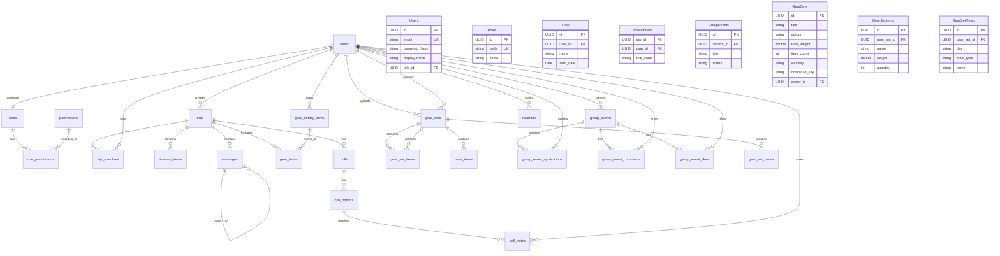

# Database Schema

## 1. 概述 (Overview)

本專案後端採用 **PostgreSQL 18** 作為正式資料庫。
前端 App 使用 **Drift (SQLite)** 作為本地快取庫 (Offline-First)。

> [!NOTE]
> 此文件為 PostgreSQL Schema 的最終規格設計 (Single Source of Truth)。
> 所有 SQL Migration 檔案應依此文件產生。

### 設計原則

| 原則              | 說明                                                                       |
| :---------------- | :------------------------------------------------------------------------- |
| **UUID PK**       | 所有主鍵使用 **UUID v7** (時間排序)，提升索引效能並支援離線產生 ID          |
| **TIMESTAMPTZ**   | 所有時間欄位統一使用帶時區的時間戳                                         |
| **稽核欄位**      | 所有表預設包含 `created_at`, `created_by`, `updated_at`, `updated_by`      |
| **CASCADE 刪除**  | 父記錄刪除自動清理子記錄                                                   |
| **正規化**        | GAS 時期的 JSON 欄位 / Array 欄位改為正規關聯表                            |
| **JOIN 取代快照** | GAS 時期的 `user_name`, `user_avatar` 快照欄位，改為 JOIN `users` 即時取得 |

---

## 2. 實體關聯圖 (ER Diagram)



---

## 3. PostgreSQL Schema

### 3.1 會員與權限模組 (Auth & RBAC)

#### Table: `roles`

| Column      | Type        | Constraints | Description                          |
| :---------- | :---------- | :---------- | :----------------------------------- |
| **id**      | UUID        | **PK**      | `uuidv7()`                  |
| code        | VARCHAR(20) | **UK**, NN  | `ADMIN`, `LEADER`, `GUIDE`, `MEMBER` |
| name        | VARCHAR(50) | NN          | 顯示名稱                             |
| description | TEXT        |             |                                      |
| created_at  | TIMESTAMPTZ | NN, Default |                                      |

```sql
CREATE TABLE roles (
    id          UUID PRIMARY KEY DEFAULT uuidv7(),
    code        VARCHAR(20)  NOT NULL UNIQUE,
    name        VARCHAR(50)  NOT NULL,
    description TEXT,
    created_at  TIMESTAMPTZ  NOT NULL DEFAULT NOW()
);
```

#### Table: `permissions`

| Column      | Type        | Constraints | Description         |
| :---------- | :---------- | :---------- | :------------------ |
| **id**      | UUID        | **PK**      |                     |
| code        | VARCHAR(50) | **UK**, NN  | e.g. `trip.edit`    |
| category    | VARCHAR(50) |             | e.g. `trip`, `gear` |
| description | TEXT        |             |                     |

```sql
CREATE TABLE permissions (
    id          UUID PRIMARY KEY DEFAULT uuidv7(),
    code        VARCHAR(50) NOT NULL UNIQUE,
    category    VARCHAR(50),
    description TEXT
);
```

#### Table: `role_permissions`

| Column            | Type | Constraints    | Description         |
| :---------------- | :--- | :------------- | :------------------ |
| **role_id**       | UUID | **PK**, **FK** | Ref: roles.id       |
| **permission_id** | UUID | **PK**, **FK** | Ref: permissions.id |

```sql
CREATE TABLE role_permissions (
    role_id       UUID NOT NULL REFERENCES roles(id) ON DELETE CASCADE,
    permission_id UUID NOT NULL REFERENCES permissions(id) ON DELETE CASCADE,
    PRIMARY KEY (role_id, permission_id)
);
```

#### Table: `users`

| Column        | Type         | Constraints | Description   |
| :------------ | :----------- | :---------- | :------------ |
| **id**        | UUID         | **PK**      |               |
| email         | VARCHAR(255) | **UK**, NN  | 登入帳號      |
| password_hash | TEXT         | NN          | bcrypt        |
| display_name  | VARCHAR(100) | NN          |               |
| avatar        | VARCHAR(255) | NN, Default | Emoji 頭像    |
| **role_id**   | UUID         | **FK**      | Ref: roles.id |
| is_active     | BOOLEAN      | NN, Default | 帳號啟用      |
| is_verified   | BOOLEAN      | NN, Default | Email 已驗證  |
| last_login_at | TIMESTAMPTZ  |             |               |
| created_at    | TIMESTAMPTZ  | NN, Default |               |
| created_by    | UUID         |             | 建立者        |
| updated_at    | TIMESTAMPTZ  | NN, Default |               |
| updated_by    | UUID         |             | 更新者        |

```sql
CREATE TABLE users (
    id                  UUID PRIMARY KEY DEFAULT uuidv7(),
    email               VARCHAR(255) NOT NULL UNIQUE,
    password_hash       TEXT         NOT NULL,
    display_name        VARCHAR(100) NOT NULL,
    avatar              VARCHAR(255) NOT NULL DEFAULT '🐻',
    role_id             UUID REFERENCES roles(id),
    is_active           BOOLEAN      NOT NULL DEFAULT TRUE,
    is_verified         BOOLEAN      NOT NULL DEFAULT FALSE,
    last_login_at       TIMESTAMPTZ,
    created_at          TIMESTAMPTZ  NOT NULL DEFAULT NOW(),
    created_by          UUID,
    updated_at          TIMESTAMPTZ  NOT NULL DEFAULT NOW(),
    updated_by          UUID
);
```

---

### 3.2 核心模組 (Core)

#### Table: `trips`

| Column      | Type         | Constraints | Description                 |
| :---------- | :----------- | :---------- | :-------------------------- |
| **id**      | UUID         | **PK**      |                             |
| **user_id** | UUID         | **FK**, NN  | 行程擁有者 (Leader)         |
| name        | VARCHAR(200) | NN          |                             |
| description | TEXT         |             |                             |
| start_date  | DATE         | NN          |                             |
| end_date    | DATE         |             |                             |
| cover_image | TEXT         |             | URL                         |
| is_active   | BOOLEAN      | NN, Default |                             |
| day_names   | TEXT[]       | NN, Default | `{"D1前進營地","D2嘉明湖"}` |
| created_at  | TIMESTAMPTZ  | NN, Default |                             |
| created_by  | UUID         | **FK**, NN  |                             |
| updated_at  | TIMESTAMPTZ  | NN, Default |                             |
| updated_by  | UUID         | **FK**, NN  |                             |

```sql
CREATE TABLE trips (
    id          UUID PRIMARY KEY DEFAULT uuidv7(),
    user_id     UUID         NOT NULL REFERENCES users(id),
    name        VARCHAR(200) NOT NULL,
    description TEXT,
    start_date  DATE         NOT NULL,
    end_date    DATE,
    cover_image TEXT,
    is_active   BOOLEAN      NOT NULL DEFAULT FALSE,
    day_names   TEXT[]       NOT NULL DEFAULT '{}',
    created_at  TIMESTAMPTZ  NOT NULL DEFAULT NOW(),
    created_by  UUID         NOT NULL REFERENCES users(id),
    updated_at  TIMESTAMPTZ  NOT NULL DEFAULT NOW(),
    updated_by  UUID         NOT NULL REFERENCES users(id)
);
```

#### Table: `trip_meal_plan_days`

| Column | Type | Constraints | Description |
| :--- | :--- | :--- | :--- |
| **id** | UUID | **PK** | `uuidv7()` |
| **trip_id** | UUID | **FK**, NN | Ref: trips.id (ON DELETE CASCADE) |
| name | VARCHAR(50) | NN | 天數名稱 (e.g. `D1`, `D2`) |
| linked_itinerary_day | VARCHAR(50) | | 連結行程天數名稱 (e.g. `D1前進營地`) |
| created_at | TIMESTAMPTZ | Default | |
| updated_at | TIMESTAMPTZ | Default | |

```sql
CREATE TABLE trip_meal_plan_days (
    id UUID PRIMARY KEY DEFAULT uuidv7(),
    trip_id UUID NOT NULL REFERENCES trips(id) ON DELETE CASCADE,
    name VARCHAR(50) NOT NULL,
    linked_itinerary_day VARCHAR(50),
    created_at TIMESTAMP WITH TIME ZONE DEFAULT CURRENT_TIMESTAMP,
    updated_at TIMESTAMP WITH TIME ZONE DEFAULT CURRENT_TIMESTAMP
);
CREATE INDEX idx_trip_meal_plan_days_trip_id ON trip_meal_plan_days(trip_id);
```

#### Table: `trip_members`

| Column      | Type        | Constraints    | Description                 |
| :---------- | :---------- | :------------- | :-------------------------- |
| **trip_id** | UUID        | **PK**, **FK** | Ref: trips.id               |
| **user_id** | UUID        | **PK**, **FK** | Ref: users.id               |
| role_code   | VARCHAR(20) | NN, Default    | `leader`, `guide`, `member` |
| joined_at   | TIMESTAMPTZ | NN, Default    |                             |

> [!NOTE]
> 行程建立時，自動新增一筆 `role_code = 'leader'` 的記錄。
> `trips.user_id` 代表行程擁有者，擁有完整控制權。

```sql
CREATE TABLE trip_members (
    trip_id   UUID        NOT NULL REFERENCES trips(id) ON DELETE CASCADE,
    user_id   UUID        NOT NULL REFERENCES users(id) ON DELETE CASCADE,
    role_code VARCHAR(20) NOT NULL DEFAULT 'member',
    joined_at TIMESTAMPTZ NOT NULL DEFAULT NOW(),
    PRIMARY KEY (trip_id, user_id)
);
```

#### Table: `itinerary_items`

| Column        | Type             | Constraints | Description   |
| :------------ | :--------------- | :---------- | :------------ |
| **id**        | UUID             | **PK**      |               |
| **trip_id**   | UUID             | **FK**, NN  | Ref: trips.id |
| day           | VARCHAR(10)      | NN, Default | `D0`, `D1`    |
| name          | VARCHAR(200)     | NN, Default | 節點名稱      |
| est_time      | VARCHAR(5)       | NN, Default | `HH:mm`       |
| actual_time   | TIMESTAMPTZ      |             |               |
| altitude      | INT              | NN, Default | 海拔 (m)      |
| distance      | DOUBLE PRECISION | NN, Default | 距離 (km)     |
| note          | TEXT             | NN, Default |               |
| image_asset   | VARCHAR(200)     |             |               |
| is_checked_in | BOOLEAN          | NN, Default |               |
| checked_in_at | TIMESTAMPTZ      |             |               |
| created_at    | TIMESTAMPTZ      | NN, Default |               |
| created_by    | UUID             | **FK**      |               |
| updated_at    | TIMESTAMPTZ      | NN, Default |               |
| updated_by    | UUID             | **FK**      |               |

```sql
CREATE TABLE itinerary_items (
    id            UUID PRIMARY KEY DEFAULT uuidv7(),
    trip_id       UUID             NOT NULL REFERENCES trips(id) ON DELETE CASCADE,
    day           VARCHAR(10)      NOT NULL DEFAULT '',
    name          VARCHAR(200)     NOT NULL DEFAULT '',
    est_time      VARCHAR(5)       NOT NULL DEFAULT '',
    actual_time   TIMESTAMPTZ,
    altitude      INT              NOT NULL DEFAULT 0,
    distance      DOUBLE PRECISION NOT NULL DEFAULT 0,
    note          TEXT             NOT NULL DEFAULT '',
    image_asset   VARCHAR(200),
    is_checked_in BOOLEAN          NOT NULL DEFAULT FALSE,
    checked_in_at TIMESTAMPTZ,
    created_at    TIMESTAMPTZ      NOT NULL DEFAULT NOW(),
    created_by    UUID             REFERENCES users(id),
    updated_at    TIMESTAMPTZ      NOT NULL DEFAULT NOW(),
    updated_by    UUID             REFERENCES users(id)
);
```

#### Table: `messages`

| Column        | Type        | Constraints | Description              |
| :------------ | :---------- | :---------- | :----------------------- |
| **id**        | UUID        | **PK**      |                          |
| **trip_id**   | UUID        | **FK**      | Ref: trips.id (Nullable) |
| **parent_id** | UUID        | **FK**      | Ref: messages.id (巢狀)  |
| **user_id**   | UUID        | **FK**, NN  | 發文者                   |
| category      | VARCHAR(50) | NN, Default | `Gear`, `Plan`, `Misc`   |
| content       | TEXT        | NN, Default |                          |
| timestamp     | TIMESTAMPTZ | NN, Default |                          |
| created_at    | TIMESTAMPTZ | NN, Default |                          |
| created_by    | UUID        | **FK**, NN  |                          |
| updated_at    | TIMESTAMPTZ | NN, Default |                          |
| updated_by    | UUID        | **FK**, NN  |                          |

> [!IMPORTANT]
> GAS 版本有 `user` (名稱快照) 和 `avatar` (頭像快照) 欄位。
> PostgreSQL 改為 JOIN `users` 表即時取得 `display_name` 和 `avatar`。

```sql
CREATE TABLE messages (
    id         UUID PRIMARY KEY DEFAULT uuidv7(),
    trip_id    UUID        REFERENCES trips(id) ON DELETE CASCADE,
    parent_id  UUID        REFERENCES messages(id) ON DELETE CASCADE,
    user_id    UUID        NOT NULL REFERENCES users(id),
    category   VARCHAR(50) NOT NULL DEFAULT '',
    content    TEXT        NOT NULL DEFAULT '',
    timestamp  TIMESTAMPTZ NOT NULL DEFAULT NOW(),
    created_at TIMESTAMPTZ NOT NULL DEFAULT NOW(),
    created_by UUID        NOT NULL REFERENCES users(id),
    updated_at TIMESTAMPTZ NOT NULL DEFAULT NOW(),
    updated_by UUID        NOT NULL REFERENCES users(id)
);
```

---

### 3.3 裝備模組 (Gear)

#### Table: `gear_library_items`

| Column      | Type             | Constraints | Description                   |
| :---------- | :--------------- | :---------- | :---------------------------- |
| **id**      | UUID             | **PK**      |                               |
| **user_id** | UUID             | **FK**, NN  | 擁有者                        |
| name        | VARCHAR(200)     | NN          |                               |
| weight      | DOUBLE PRECISION | NN, Default | 重量 (公克)                   |
| category    | VARCHAR(50)      | NN, Default | `Sleep`/`Cook`/`Wear`/`Other` |
| notes       | TEXT             |             |                               |
| is_archived | BOOLEAN          | NN, Default | Soft Delete                   |
| created_at  | TIMESTAMPTZ      | NN, Default |                               |
| created_by  | UUID             | **FK**, NN  |                               |
| updated_at  | TIMESTAMPTZ      | NN, Default |                               |
| updated_by  | UUID             | **FK**, NN  |                               |

```sql
CREATE TABLE gear_library_items (
    id          UUID PRIMARY KEY DEFAULT uuidv7(),
    user_id     UUID             NOT NULL REFERENCES users(id) ON DELETE CASCADE,
    name        VARCHAR(200)     NOT NULL,
    weight      DOUBLE PRECISION NOT NULL DEFAULT 0,
    category    VARCHAR(50)      NOT NULL DEFAULT 'Other',
    notes       TEXT,
    is_archived BOOLEAN          NOT NULL DEFAULT FALSE,
    created_at  TIMESTAMPTZ      NOT NULL DEFAULT NOW(),
    created_by  UUID             NOT NULL REFERENCES users(id),
    updated_at  TIMESTAMPTZ      NOT NULL DEFAULT NOW(),
    updated_by  UUID             NOT NULL REFERENCES users(id)
);
```

#### Table: `gear_items`

| Column              | Type             | Constraints | Description                     |
| :------------------ | :--------------- | :---------- | :------------------------------ |
| **id**              | UUID             | **PK**      |                                 |
| **trip_id**         | UUID             | **FK**      | Ref: trips.id                   |
| **library_item_id** | UUID             | **FK**      | 連結裝備庫 (SET NULL on delete) |
| name                | VARCHAR(200)     | NN, Default |                                 |
| weight              | DOUBLE PRECISION | NN, Default | 重量 (公克)                     |
| category            | VARCHAR(50)      | NN, Default |                                 |
| is_checked          | BOOLEAN          | NN, Default | 打包狀態                        |
| order_index         | INT              |             | 排序                            |
| quantity            | INT              | NN, Default | 數量                            |
| created_at          | TIMESTAMPTZ      | NN, Default |                                 |
| created_by          | UUID             | **FK**      |                                 |
| updated_at          | TIMESTAMPTZ      | NN, Default |                                 |
| updated_by          | UUID             | **FK**      |                                 |

> [!NOTE]
> `library_item_id` 連結裝備庫時，`name`/`weight`/`category` 為快取，由應用層從 `gear_library_items` 同步。
> `ON DELETE SET NULL` 確保裝備庫項目刪除後，行程裝備轉為獨立模式。

```sql
CREATE TABLE gear_items (
    id              UUID PRIMARY KEY DEFAULT uuidv7(),
    trip_id         UUID             REFERENCES trips(id) ON DELETE CASCADE,
    library_item_id UUID             REFERENCES gear_library_items(id) ON DELETE SET NULL,
    name            VARCHAR(200)     NOT NULL DEFAULT '',
    weight          DOUBLE PRECISION NOT NULL DEFAULT 0,
    category        VARCHAR(50)      NOT NULL DEFAULT 'Other',
    is_checked      BOOLEAN          NOT NULL DEFAULT FALSE,
    order_index     INT,
    quantity        INT              NOT NULL DEFAULT 1,
    created_at      TIMESTAMPTZ      NOT NULL DEFAULT NOW(),
    created_by      UUID             REFERENCES users(id),
    updated_at      TIMESTAMPTZ      NOT NULL DEFAULT NOW(),
    updated_by      UUID             REFERENCES users(id)
);
```

### 3.4 食物模組 (Meals)

#### Table: `meal_library_items`

| Column      | Type             | Constraints | Description |
| :---------- | :--------------- | :---------- | :---------- |
| **id**      | UUID             | **PK**      |             |
| **user_id** | UUID             | **FK**, NN  | 擁有者      |
| name        | VARCHAR(200)     | NN          |             |
| weight      | DOUBLE PRECISION | NN, Default | 重量 (公克) |
| calories    | DOUBLE PRECISION | NN, Default | 熱量 (Kcal) |
| notes       | TEXT             |             |             |
| is_archived | BOOLEAN          | NN, Default | Soft Delete |
| created_at  | TIMESTAMPTZ      | NN, Default |             |
| created_by  | UUID             | **FK**, NN  |             |
| updated_at  | TIMESTAMPTZ      | NN, Default |             |
| updated_by  | UUID             | **FK**, NN  |             |

```sql
CREATE TABLE meal_library_items (
    id          UUID PRIMARY KEY DEFAULT uuidv7(),
    user_id     UUID             NOT NULL REFERENCES users(id) ON DELETE CASCADE,
    name        VARCHAR(200)     NOT NULL,
    weight      DOUBLE PRECISION NOT NULL DEFAULT 0,
    calories    DOUBLE PRECISION NOT NULL DEFAULT 0,
    notes       TEXT,
    is_archived BOOLEAN          NOT NULL DEFAULT FALSE,
    created_at  TIMESTAMPTZ      NOT NULL DEFAULT NOW(),
    created_by  UUID             NOT NULL REFERENCES users(id),
    updated_at  TIMESTAMPTZ      NOT NULL DEFAULT NOW(),
    updated_by  UUID             NOT NULL REFERENCES users(id)
);
```

#### Table: `meal_items`

| Column              | Type             | Constraints | Description                           |
| :------------------ | :--------------- | :---------- | :------------------------------------ |
| **id**              | UUID             | **PK**      |                                       |
| **trip_id**         | UUID             | **FK**, NN  | 屬於特定行程                          |
| **library_item_id** | UUID             | **FK**      | 連結食物庫 (SET NULL on delete)       |
| **meal_plan_day_id** | UUID            | **FK**, NN  | 連結餐食天數計畫 (CASCADE on delete)  |
| meal_type           | VARCHAR(20)      | NN          | `breakfast`/`lunch`/`dinner`/`action` |
| name                | VARCHAR(200)     | NN          |                                       |
| weight              | DOUBLE PRECISION | NN, Default | 重量 (公克)                           |
| calories            | DOUBLE PRECISION | NN, Default | 熱量 (Kcal)                           |
| quantity            | INT              | NN, Default |                                       |
| note                | TEXT             |             |                                       |
| created_at          | TIMESTAMPTZ      | NN, Default |                                       |
| created_by          | UUID             | **FK**, NN  |                                       |
| updated_at          | TIMESTAMPTZ      | NN, Default |                                       |
| updated_by          | UUID             | **FK**, NN  |                                       |

```sql
CREATE TABLE meal_items (
    id              UUID PRIMARY KEY DEFAULT uuidv7(),
    trip_id         UUID             NOT NULL REFERENCES trips(id) ON DELETE CASCADE,
    library_item_id UUID             REFERENCES meal_library_items(id) ON DELETE SET NULL,
    meal_plan_day_id UUID            NOT NULL REFERENCES trip_meal_plan_days(id) ON DELETE CASCADE,
    meal_type       VARCHAR(20)      NOT NULL,
    name            VARCHAR(200)     NOT NULL,
    weight          DOUBLE PRECISION NOT NULL DEFAULT 0,
    calories        DOUBLE PRECISION NOT NULL DEFAULT 0,
    quantity        INT              NOT NULL DEFAULT 1,
    note            TEXT,
    created_at      TIMESTAMPTZ      NOT NULL DEFAULT NOW(),
    created_by      UUID             NOT NULL REFERENCES users(id),
    updated_at      TIMESTAMPTZ      NOT NULL DEFAULT NOW(),
    updated_by      UUID             NOT NULL REFERENCES users(id)
);
```

---

### 3.5 範本模組 (Templates)

#### Table: `templates`

| Column       | Type             | Constraints | Description                      |
| :----------- | :--------------- | :---------- | :------------------------------- |
| **id**       | UUID             | **PK**      |                                  |
| type         | VARCHAR(20)      | NN          | `GEAR_SET`, `MEAL_PLAN`, `PACK`  |
| title        | VARCHAR(200)     | NN          |                                  |
| author       | VARCHAR(100)     | NN          | 顯示名稱                         |
| total_weight | DOUBLE PRECISION | NN, Default | 總重 (公克)                      |
| item_count   | INT              | NN, Default |                                  |
| visibility   | VARCHAR(20)      | NN, Default | `public`, `protected`, `private` |
| access_key   | VARCHAR(100)     |             | 用於 protected/private 保護密碼  |
| created_at   | TIMESTAMPTZ      | NN, Default |                                  |
| created_by   | UUID             | **FK**, NN  |                                  |
| updated_at   | TIMESTAMPTZ      | NN, Default |                                  |
| updated_by   | UUID             | **FK**, NN  |                                  |

```sql
CREATE TABLE templates (
    id           UUID PRIMARY KEY DEFAULT uuidv7(),
    type         VARCHAR(20)      NOT NULL,
    title        VARCHAR(200)     NOT NULL,
    author       VARCHAR(100)     NOT NULL,
    total_weight DOUBLE PRECISION NOT NULL DEFAULT 0,
    item_count   INT              NOT NULL DEFAULT 0,
    visibility   VARCHAR(20)      NOT NULL DEFAULT 'public',
    access_key   VARCHAR(100),
    created_at   TIMESTAMPTZ      NOT NULL DEFAULT NOW(),
    created_by   UUID             NOT NULL REFERENCES users(id),
    updated_at   TIMESTAMPTZ      NOT NULL DEFAULT NOW(),
    updated_by   UUID             NOT NULL REFERENCES users(id)
);
```

#### Table: `template_gear_items`

| Column          | Type             | Constraints | Description |
| :-------------- | :--------------- | :---------- | :---------- |
| **id**          | UUID             | **PK**      |             |
| **template_id** | UUID             | **FK**, NN  |             |
| name            | VARCHAR(200)     | NN          |             |
| weight          | DOUBLE PRECISION | NN, Default | 重量 (公克) |
| category        | VARCHAR(50)      | NN, Default |             |
| quantity        | INT              | NN, Default |             |
| order_index     | INT              |             |             |

```sql
CREATE TABLE template_gear_items (
    id          UUID PRIMARY KEY DEFAULT uuidv7(),
    template_id UUID             NOT NULL REFERENCES templates(id) ON DELETE CASCADE,
    name        VARCHAR(200)     NOT NULL,
    weight      DOUBLE PRECISION NOT NULL DEFAULT 0,
    category    VARCHAR(50)      NOT NULL DEFAULT 'Other',
    quantity    INT              NOT NULL DEFAULT 1,
    order_index INT
);
```

#### Table: `template_meal_items`

| Column          | Type             | Constraints | Description                           |
| :-------------- | :--------------- | :---------- | :------------------------------------ |
| **id**          | UUID             | **PK**      |                                       |
| **template_id** | UUID             | **FK**, NN  |                                       |
| day             | VARCHAR(10)      | NN          | `D0`, `D1`                            |
| meal_type       | VARCHAR(20)      | NN          | `breakfast`/`lunch`/`dinner`/`action` |
| name            | VARCHAR(200)     | NN          |                                       |
| weight          | DOUBLE PRECISION | NN, Default | 重量 (公克)                           |
| calories        | DOUBLE PRECISION | NN, Default | 熱量 (Kcal)                           |
| quantity        | INT              | NN, Default |                                       |
| note            | TEXT             |             |                                       |

```sql
CREATE TABLE template_meal_items (
    id          UUID PRIMARY KEY DEFAULT uuidv7(),
    template_id UUID             NOT NULL REFERENCES templates(id) ON DELETE CASCADE,
    day         VARCHAR(10)      NOT NULL,
    meal_type   VARCHAR(20)      NOT NULL,
    name        VARCHAR(200)     NOT NULL,
    weight      DOUBLE PRECISION NOT NULL DEFAULT 0,
    calories    DOUBLE PRECISION NOT NULL DEFAULT 0,
    quantity    INT              NOT NULL DEFAULT 1,
    note        TEXT
);
```

---

### 3.6 互動模組 (Polls)

#### Table: `polls`

| Column               | Type         | Constraints | Description        |
| :------------------- | :----------- | :---------- | :----------------- |
| **id**               | UUID         | **PK**      |                    |
| **trip_id**          | UUID         | **FK**      | 所屬行程           |
| title                | VARCHAR(200) | NN          |                    |
| description          | TEXT         | NN, Default |                    |
| deadline             | TIMESTAMPTZ  |             |                    |
| is_allow_add_option  | BOOLEAN      | NN, Default |                    |
| max_option_limit     | INT          | NN, Default |                    |
| allow_multiple_votes | BOOLEAN      | NN, Default |                    |
| result_display_type  | VARCHAR(20)  | NN, Default | `realtime`/`blind` |
| status               | VARCHAR(20)  | NN, Default | `active`/`ended`   |
| created_at           | TIMESTAMPTZ  | NN, Default |                    |
| created_by           | UUID         | **FK**, NN  |                    |
| updated_at           | TIMESTAMPTZ  | NN, Default |                    |
| updated_by           | UUID         | **FK**, NN  |                    |

```sql
CREATE TABLE polls (
    id                   UUID PRIMARY KEY DEFAULT uuidv7(),
    trip_id              UUID         REFERENCES trips(id) ON DELETE CASCADE,
    title                VARCHAR(200) NOT NULL,
    description          TEXT         NOT NULL DEFAULT '',
    deadline             TIMESTAMPTZ,
    is_allow_add_option  BOOLEAN      NOT NULL DEFAULT FALSE,
    max_option_limit     INT          NOT NULL DEFAULT 20,
    allow_multiple_votes BOOLEAN      NOT NULL DEFAULT FALSE,
    result_display_type  VARCHAR(20)  NOT NULL DEFAULT 'realtime',
    status               VARCHAR(20)  NOT NULL DEFAULT 'active',
    created_at           TIMESTAMPTZ  NOT NULL DEFAULT NOW(),
    created_by           UUID         NOT NULL REFERENCES users(id),
    updated_at           TIMESTAMPTZ  NOT NULL DEFAULT NOW(),
    updated_by           UUID         NOT NULL REFERENCES users(id)
);
```

#### Table: `poll_options`

```sql
CREATE TABLE poll_options (
    id         UUID PRIMARY KEY DEFAULT uuidv7(),
    poll_id    UUID         NOT NULL REFERENCES polls(id) ON DELETE CASCADE,
    text       VARCHAR(500) NOT NULL,
    created_at TIMESTAMPTZ  NOT NULL DEFAULT NOW(),
    created_by UUID         NOT NULL REFERENCES users(id),
    updated_at TIMESTAMPTZ  NOT NULL DEFAULT NOW(),
    updated_by UUID         NOT NULL REFERENCES users(id)
);
```

#### Table: `poll_votes`

> [!NOTE]
> GAS 版本有 `user_name` 快照欄位。PostgreSQL 改為 JOIN `users`。
> 複合主鍵 `(poll_id, option_id, user_id)` 確保每人每選項只能投一票。

```sql
CREATE TABLE poll_votes (
    poll_id        UUID NOT NULL REFERENCES polls(id) ON DELETE CASCADE,
    option_id      UUID NOT NULL REFERENCES poll_options(id) ON DELETE CASCADE,
    user_id        UUID NOT NULL REFERENCES users(id) ON DELETE CASCADE,
    created_at     TIMESTAMPTZ NOT NULL DEFAULT NOW(),
    PRIMARY KEY (poll_id, option_id, user_id)
);
```

---

### 3.7 揪團模組 (Group Events)

#### Table: `group_events`

| Column              | Type         | Constraints | Description                 |
| :----------------- | :----------- | :---------- | :-------------------------- |
| **id**             | UUID         | **PK**      |                             |
| **host_id**        | UUID         | **FK**, NN  | 揪團發起人 (Host)           |
| host_name          | VARCHAR(100) | NN, Default | 發起人名稱                  |
| host_avatar        | VARCHAR(255) | NN, Default | 發起人頭像                  |
| title              | VARCHAR(200) | NN          |                             |
| description        | TEXT         | NN, Default |                             |
| category           | VARCHAR(50)  | NN, Default | 揪團分類 (Hiking, Camping, Bouldering, Other) |
| location           | VARCHAR(200) | NN, Default |                             |
| start_date         | DATE         | NN          |                             |
| end_date           | DATE         |             |                             |
| status             | VARCHAR(20)  | NN, Default | `open`/`closed`/`cancelled` |
| max_members        | INT          | NN, Default |                             |
| approval_required  | BOOLEAN      | NN, Default |                             |
| private_message    | TEXT         | NN, Default | 審核通過後顯示              |
| **linked_trip_id** | UUID         | **FK**      | Ref: trips.id               |
| trip_snapshot      | JSONB        |             | 關聯行程的快照              |
| snapshot_updated_at| TIMESTAMPTZ  |             | 行程快照更新時間            |
| like_count         | INT          | NN, Default | 快取計數 (Trigger 維護)     |
| comment_count      | INT          | NN, Default | 快取計數 (Trigger 維護)     |
| created_at         | TIMESTAMPTZ  | NN, Default |                             |
| created_by         | UUID         | **FK**, NN  |                             |
| updated_at         | TIMESTAMPTZ  | NN, Default |                             |
| updated_by         | UUID         | **FK**, NN  |                             |

> [!NOTE]
> `like_count` 和 `comment_count` 為非正規快取欄位，由 DB Trigger 或應用層維護。
> `trip_snapshot` 包含被關聯行程的細節，方便非成員預覽揪團內容。

```sql
CREATE TABLE group_events (
    id                UUID PRIMARY KEY DEFAULT uuidv7(),
    host_id           UUID         NOT NULL REFERENCES users(id),
    host_name         VARCHAR(100) NOT NULL DEFAULT '',
    host_avatar       VARCHAR(255) NOT NULL DEFAULT '🐻',
    title             VARCHAR(200) NOT NULL,
    description       TEXT         NOT NULL DEFAULT '',
    category          VARCHAR(50)  NOT NULL DEFAULT 'Other' CHECK (category IN ('Hiking', 'Camping', 'Bouldering', 'Other')),
    location          VARCHAR(200) NOT NULL DEFAULT '',
    start_date        DATE         NOT NULL,
    end_date          DATE,
    status            VARCHAR(20)  NOT NULL DEFAULT 'open',
    max_members       INT          NOT NULL DEFAULT 10,
    approval_required BOOLEAN      NOT NULL DEFAULT FALSE,
    private_message   TEXT         NOT NULL DEFAULT '',
    linked_trip_id    UUID         REFERENCES trips(id) ON DELETE SET NULL,
    trip_snapshot     JSONB,
    snapshot_updated_at TIMESTAMPTZ,
    like_count        INT          NOT NULL DEFAULT 0,
    comment_count     INT          NOT NULL DEFAULT 0,
    created_at        TIMESTAMPTZ  NOT NULL DEFAULT NOW(),
    created_by        UUID         NOT NULL REFERENCES users(id),
    updated_at        TIMESTAMPTZ  NOT NULL DEFAULT NOW(),
    updated_by        UUID         NOT NULL REFERENCES users(id)
);
```

#### Table: `group_event_applications`

```sql
CREATE TABLE group_event_applications (
    id               UUID PRIMARY KEY DEFAULT uuidv7(),
    event_id         UUID        NOT NULL REFERENCES group_events(id) ON DELETE CASCADE,
    user_id          UUID        NOT NULL REFERENCES users(id),
    status           VARCHAR(20) NOT NULL DEFAULT 'pending',
    message          TEXT        NOT NULL DEFAULT '',
    rejection_reason TEXT        NOT NULL DEFAULT '',
    created_at       TIMESTAMPTZ NOT NULL DEFAULT NOW(),
    created_by       UUID        NOT NULL REFERENCES users(id),
    updated_at       TIMESTAMPTZ NOT NULL DEFAULT NOW(),
    updated_by       UUID        NOT NULL REFERENCES users(id)
);
```

#### Table: `group_event_comments`

```sql
CREATE TABLE group_event_comments (
    id         UUID PRIMARY KEY DEFAULT uuidv7(),
    event_id   UUID        NOT NULL REFERENCES group_events(id) ON DELETE CASCADE,
    user_id    UUID        NOT NULL REFERENCES users(id),
    content    TEXT        NOT NULL,
    created_at TIMESTAMPTZ NOT NULL DEFAULT NOW(),
    created_by UUID        NOT NULL REFERENCES users(id),
    updated_at TIMESTAMPTZ NOT NULL DEFAULT NOW(),
    updated_by UUID        NOT NULL REFERENCES users(id)
);
```

#### Table: `group_event_likes`

```sql
CREATE TABLE group_event_likes (
    event_id   UUID NOT NULL REFERENCES group_events(id) ON DELETE CASCADE,
    user_id    UUID NOT NULL REFERENCES users(id) ON DELETE CASCADE,
    created_at TIMESTAMPTZ NOT NULL DEFAULT NOW(),
    created_by UUID NOT NULL REFERENCES users(id),
    PRIMARY KEY (event_id, user_id)
);
```

---

### 3.8 收藏模組 (Favorites)

```sql
CREATE TABLE favorites (
    id         UUID PRIMARY KEY DEFAULT uuidv7(),
    user_id    UUID        NOT NULL REFERENCES users(id) ON DELETE CASCADE,
    target_id  UUID        NOT NULL,
    type       VARCHAR(30) NOT NULL,
    created_at TIMESTAMPTZ NOT NULL DEFAULT NOW(),
    created_by UUID        NOT NULL REFERENCES users(id),
    updated_at TIMESTAMPTZ NOT NULL DEFAULT NOW(),
    updated_by UUID        NOT NULL REFERENCES users(id),
    UNIQUE (user_id, target_id, type)
);
```

---

### 3.9 系統監控 (System)

#### Table: `logs`

```sql
CREATE TABLE logs (
    id          UUID PRIMARY KEY DEFAULT uuidv7(),
    upload_time TIMESTAMPTZ NOT NULL DEFAULT NOW(),
    device_id   TEXT,
    device_name TEXT,
    timestamp   TIMESTAMPTZ NOT NULL,
    level       VARCHAR(10) NOT NULL,
    source      TEXT,
    message     TEXT
);
```

#### Table: `heartbeats`

```sql
CREATE TABLE heartbeats (
    user_id    UUID PRIMARY KEY REFERENCES users(id),
    user_type  VARCHAR(20),
    last_seen  TIMESTAMPTZ NOT NULL DEFAULT NOW(),
    view       VARCHAR(100),
    view_stats JSONB DEFAULT '{}',
    platform   VARCHAR(20)
);
```

---

### 3.10 雲端裝備組合 (Gear Cloud)

#### Table: `gear_sets`

| Column       | Type             | Constraints | Description                      |
| :----------- | :--------------- | :---------- | :------------------------------- |
| **id**       | UUID             | **PK**      |                                  |
| title        | VARCHAR(255)     | NN          | 組合名稱                         |
| author       | VARCHAR(255)     | NN          | 作者名稱                         |
| total_weight | NUMERIC(10,2)    | Default     | 總重 (公克)                      |
| item_count   | INTEGER          | Default     | 項目數量                         |
| visibility   | VARCHAR(20)      | NN, Default | `public`, `protected`, `private` (CHECK) |
| download_key | VARCHAR(255)     |             | 受保護組合的下載金鑰             |
| **user_id**  | UUID             | NN          | 擁有者 ID (Auth UserID)          |
| created_at   | TIMESTAMPTZ      | NN, Default |                                  |
| created_by   | UUID             | NN          |                                  |
| updated_at   | TIMESTAMPTZ      | NN, Default |                                  |
| updated_by   | UUID             | NN          |

```sql
CREATE TABLE IF NOT EXISTS gear_sets (
    id UUID PRIMARY KEY,
    title VARCHAR(255) NOT NULL,
    author VARCHAR(255) NOT NULL,
    total_weight NUMERIC(10,2) DEFAULT 0,
    item_count INTEGER DEFAULT 0,
    visibility VARCHAR(20) NOT NULL CHECK (visibility IN ('public', 'protected', 'private')),
    download_key VARCHAR(255),
    user_id UUID NOT NULL,
    created_at TIMESTAMPTZ NOT NULL DEFAULT CURRENT_TIMESTAMP,
    created_by UUID NOT NULL,
    updated_at TIMESTAMPTZ NOT NULL DEFAULT CURRENT_TIMESTAMP,
    updated_by UUID NOT NULL
);
CREATE INDEX IF NOT EXISTS idx_gear_sets_visibility ON gear_sets(visibility);
CREATE INDEX IF NOT EXISTS idx_gear_sets_user_id ON gear_sets(user_id);
```

#### Table: `gear_set_items`

| Column          | Type             | Constraints | Description |
| :-------------- | :--------------- | :---------- | :---------- |
| **id**          | UUID             | **PK**      |             |
| **gear_set_id** | UUID             | **FK**, NN  |             |
| name            | VARCHAR(255)     | NN          | 裝備名稱    |
| category        | VARCHAR(100)     | NN          | 裝備分類    |
| weight          | NUMERIC(10,2)    | NN, Default | 單件重量    |
| quantity        | INTEGER          | NN, Default | 數量        |
| order_index     | INTEGER          | Default     | 排序        |

```sql
CREATE TABLE IF NOT EXISTS gear_set_items (
    id UUID PRIMARY KEY,
    gear_set_id UUID NOT NULL REFERENCES gear_sets(id) ON DELETE CASCADE,
    name VARCHAR(255) NOT NULL,
    category VARCHAR(100) NOT NULL,
    weight NUMERIC(10,2) NOT NULL DEFAULT 0,
    quantity INTEGER NOT NULL DEFAULT 1,
    order_index INTEGER DEFAULT 0
);
CREATE INDEX IF NOT EXISTS idx_gear_set_items_set_id ON gear_set_items(gear_set_id);
```

#### Table: `gear_set_meals`

| Column          | Type             | Constraints | Description |
| :-------------- | :--------------- | :---------- | :---------- |
| **id**          | UUID             | **PK**      |             |
| **gear_set_id** | UUID             | **FK**, NN  |             |
| day             | VARCHAR(50)      | NN          | 天數        |
| meal_type       | VARCHAR(50)      | NN          | 餐別        |
| name            | VARCHAR(255)     | NN          | 名稱        |
| calories        | NUMERIC(10,2)    | Default     | 熱量        |
| note            | TEXT             |             | 備註        |

```sql
CREATE TABLE IF NOT EXISTS gear_set_meals (
    id UUID PRIMARY KEY,
    gear_set_id UUID NOT NULL REFERENCES gear_sets(id) ON DELETE CASCADE,
    day VARCHAR(50) NOT NULL,
    meal_type VARCHAR(50) NOT NULL,
    name VARCHAR(255) NOT NULL,
    calories NUMERIC(10,2) DEFAULT 0,
    note TEXT
);
CREATE INDEX IF NOT EXISTS idx_gear_set_meals_set_id ON gear_set_meals(gear_set_id);
```

---

### 3.11 天氣模組 (Weather)

由 `weatherjob` ETL 從中央氣象署 (CWA) API 拉取後寫入，供 App 與 Web 直接查詢，不參與 Offline 雙向同步。

#### Table: `weather_data`

| Column      | Type        | Constraints | Description                |
| :---------- | :---------- | :---------- | :------------------------- |
| **id**      | UUID        | **PK**      | `uuidv7()`                 |
| location    | TEXT        | NN          | 地點名稱                   |
| start_time  | TIMESTAMPTZ | NN          | 預報區間起                 |
| end_time    | TIMESTAMPTZ | NN          | 預報區間迄                 |
| wx          | TEXT        | Default     | 天氣現象描述               |
| temp        | REAL        | Default     | 溫度 (°C)                  |
| pop         | INT         | Default     | 降雨機率 (%)               |
| min_temp    | REAL        | Default     | 最低溫                     |
| max_temp    | REAL        | Default     | 最高溫                     |
| humidity    | REAL        | Default     | 相對濕度                   |
| wind_speed  | REAL        | Default     | 風速                       |
| min_at      | REAL        | Default     | 最低體感                   |
| max_at      | REAL        | Default     | 最高體感                   |
| issue_time  | TIMESTAMPTZ |             | 發布時間                   |
| fetched_at  | TIMESTAMPTZ | NN, Default | ETL 抓取時間               |

> [!NOTE]
> `UNIQUE (location, start_time, end_time)` 確保同地點同區間僅保留一筆，ETL 以 Upsert 更新。

```sql
CREATE TABLE IF NOT EXISTS weather_data (
    id          UUID PRIMARY KEY DEFAULT uuidv7(),
    location    TEXT NOT NULL,
    start_time  TIMESTAMPTZ NOT NULL,
    end_time    TIMESTAMPTZ NOT NULL,
    wx          TEXT DEFAULT '',
    temp        REAL DEFAULT 0,
    pop         INT  DEFAULT 0,
    min_temp    REAL DEFAULT 0,
    max_temp    REAL DEFAULT 0,
    humidity    REAL DEFAULT 0,
    wind_speed  REAL DEFAULT 0,
    min_at      REAL DEFAULT 0,
    max_at      REAL DEFAULT 0,
    issue_time  TIMESTAMPTZ,
    fetched_at  TIMESTAMPTZ NOT NULL DEFAULT NOW(),
    UNIQUE (location, start_time, end_time)
);
CREATE INDEX idx_weather_location   ON weather_data (location);
CREATE INDEX idx_weather_start_time ON weather_data (start_time);
```

---

### 3.12 系統旗標 (System Flags)

提供後端功能開關 (Feature Flags)，由 `flag` 領域管理 (`GET /system/flags`, `POST /system/flags`)。所有變更皆會透過 Trigger 寫入歷史表稽核。

#### Table: `system_flags`

| Column      | Type        | Constraints | Description                  |
| :---------- | :---------- | :---------- | :--------------------------- |
| **key**     | TEXT        | **PK**      | 旗標鍵                       |
| value       | BOOLEAN     | NN, Default | 開關值                       |
| description | TEXT        |             | 說明                         |
| updated_at  | TIMESTAMPTZ | Default     | 更新時間                     |

預設種子資料：

| Key                       | 預設值  | 說明                         |
| :------------------------ | :------ | :--------------------------- |
| `skip_verification_code`  | `FALSE` | 是否放行任意 Email 驗證碼    |
| `enable_email_sending`    | `TRUE`  | 是否實際寄送驗證信           |

```sql
CREATE TABLE IF NOT EXISTS system_flags (
    key         TEXT PRIMARY KEY,
    value       BOOLEAN NOT NULL DEFAULT FALSE,
    description TEXT,
    updated_at  TIMESTAMPTZ DEFAULT CURRENT_TIMESTAMP
);
```

#### Table: `system_flags_history`

記錄每次旗標 INSERT / UPDATE / DELETE 的前後值，由 Trigger `trg_system_flags_changes` 自動寫入。

```sql
CREATE TABLE IF NOT EXISTS system_flags_history (
    id          BIGSERIAL PRIMARY KEY,
    key         TEXT NOT NULL,
    old_value   BOOLEAN,
    new_value   BOOLEAN,
    changed_at  TIMESTAMPTZ NOT NULL DEFAULT CURRENT_TIMESTAMP,
    changed_by  TEXT
);
```

> [!NOTE]
> Trigger 會從 `current_setting('app.current_user_id')` 取得操作者 ID，若無則退回 `SESSION_USER`。

---

## 4. GAS → PostgreSQL 遷移對照

| GAS Sheet 名稱         | PostgreSQL Table           | 變更重點                                     |
| :--------------------- | :------------------------- | :------------------------------------------- |
| Trips                  | `trips`                    | `day_names` TEXT → TEXT[]                    |
| TripMembers            | `trip_members`             | 改為複合主鍵 (trip_id, user_id)              |
| Itinerary              | `itinerary_items`          | 無重大變更                                   |
| Messages               | `messages`                 | 移除 `user`/`avatar` 快照, 新增 `user_id` FK |
| Templates              | `templates`                | 整合裝備與食物組合範本                       |
| TripGear               | `gear_items`               | 新增 `library_item_id` FK                    |
| GearLibrary            | `gear_library_items`       | 新增 `is_archived`                           |
| Polls                  | `polls`                    | 新增 `trip_id` FK                            |
| PollOptions            | `poll_options`             | 移除 `votes` (改為 `poll_votes` 表)          |
| PollVotes              | `poll_votes`               | 複合主鍵, 移除 `user_name` 快照              |
| GroupEvents            | `group_events`             | 移除 `creator_name`/`avatar` 快照            |
| GroupEventApplications | `group_event_applications` | 移除 `user_name`/`avatar` 快照, 加 UNIQUE    |
| GroupEventComments     | `group_event_comments`     | 移除 `user_name`/`avatar` 快照               |
| GroupEventLikes        | `group_event_likes`        | 複合主鍵                                     |
| Favorites              | `favorites`                | `created_by` → `user_id`                     |
| Users                  | `users`                    | `password_hash` 改用 bcrypt                  |
| Roles                  | `roles`                    | 無重大變更                                   |
| Permissions            | `permissions`              | 無重大變更                                   |
| RolePermissions        | `role_permissions`         | 複合主鍵                                     |
| Logs                   | `logs`                     | 新增 UUID PK                                 |
| Heartbeat              | `heartbeats`               | 移除 `user_name`/`avatar` 快照               |
| (新增)                 | `weather_data`             | Go 時期新增，CWA 天氣 ETL 快取               |
| (新增)                 | `system_flags`             | Go 時期新增，後端功能開關                    |
| (新增)                 | `system_flags_history`     | Go 時期新增，旗標變更稽核 (Trigger 維護)     |

---

## 5. App Local Cache Schema (Drift SQLite)

Drift Table 結構與 Backend Schema 對應，可包含本地專用欄位 (e.g. `syncStatus`, `isPendingSync`)。

| Drift Table    | 對應 PostgreSQL Table | 備註            |
| :------------- | :-------------------- | :-------------- |
| `trips`        | trips                 | 含 `syncStatus` |
| `itinerary`    | itinerary_items       |                 |
| `messages`     | messages              |                 |
| `users`        | users                 | 本地快取        |
| `gear_items`   | gear_items            | 含 `syncStatus` |
| `gear_library` | gear_library_items    | 含 `syncStatus` |
| `meal_items`   | meal_items            | 含 `syncStatus` |
| `meal_library` | meal_library_items    | 含 `syncStatus` |
| `templates`    | templates             | 支援下載組合包  |
| `polls`        | polls + poll_options  | 合併/關聯快取   |
| `group_events` | group_events          |                 |
| `gear_sets`    | gear_sets             | 雲端裝備組合    |
| `favorites`    | favorites             |                 |
| `settings`     | (Local Only)          | 不同步到後端    |
