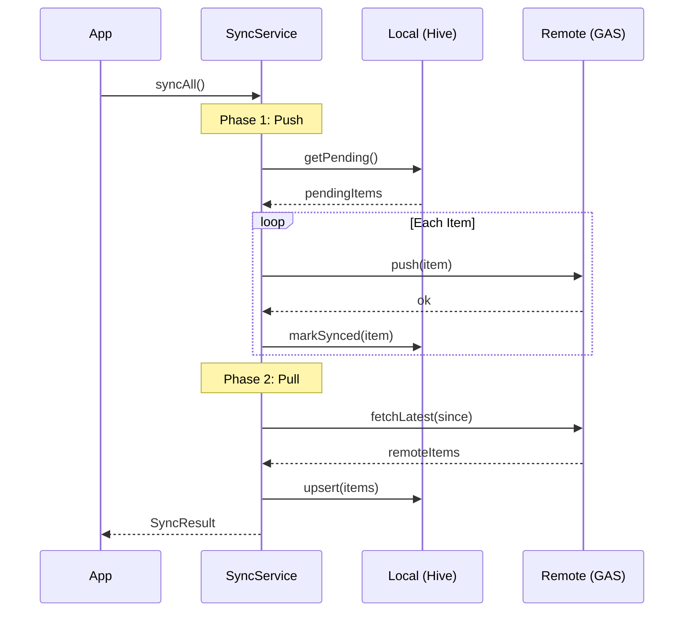
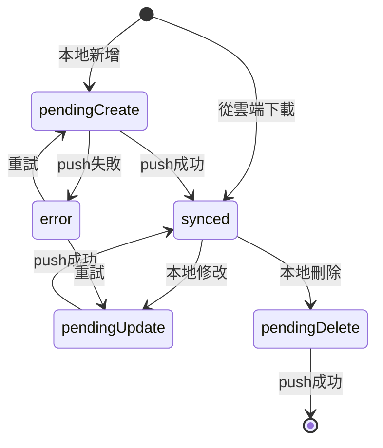

# 同步機制 (Sync Mechanism)

SummitMate 採用 **Offline-First** 策略，所有操作優先寫入本地 Hive，再背景同步至雲端。

---

## 同步流程

---

## SyncStatus 狀態機

---

## 同步策略

| 情境     | 策略                    |
| :------- | :---------------------- |
| 線上     | 先讀 cache，背景 fetch  |
| 離線     | 只讀 Hive，禁止寫入雲端 |
| 恢復連線 | 自動同步 (5分鐘節流)    |

---

## 衝突解決

採用 **Last-Write-Wins** 策略：

- 比較 `updatedAt` 時間戳
- 較新的資料覆蓋舊資料
- 若時間相同，以雲端為準

---

## 相關檔案

| 功能     | 檔案                                                |
| :------- | :-------------------------------------------------- |
| 同步服務 | `infrastructure/services/sync_service.dart`         |
| 連線判斷 | `infrastructure/services/connectivity_service.dart` |
| 離線配置 | `core/offline_config.dart`                          |
