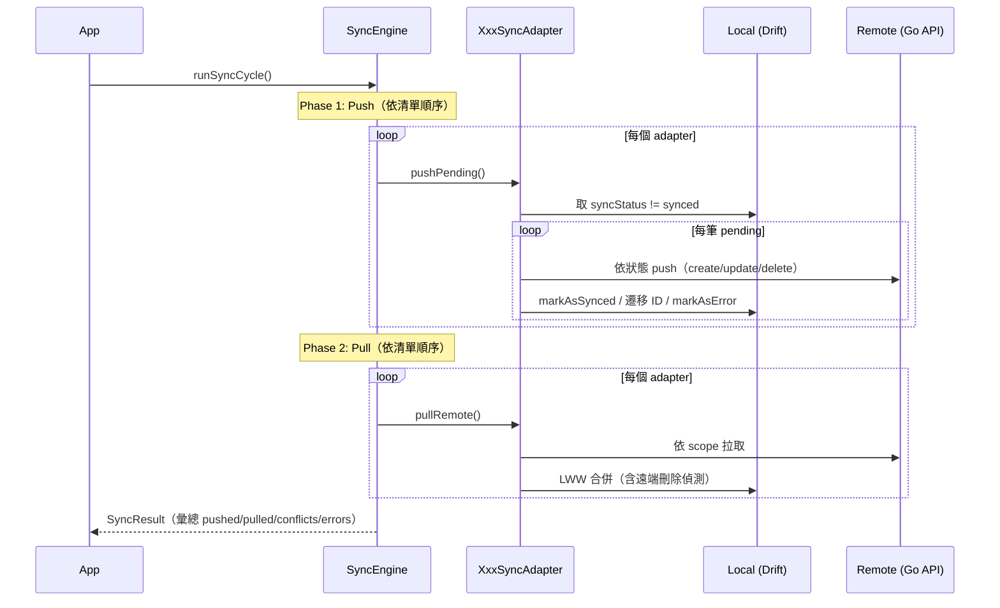
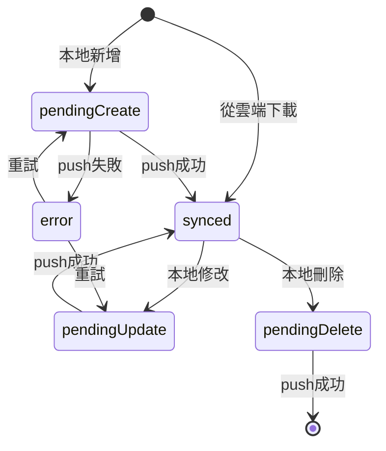

# 同步機制 (Sync Mechanism)

SummitMate 的資料存取採用 **以 Repository 為唯一入口的三模式架構**。其中需要離線可寫的資料（C 模式）優先寫入本地 Drift (SQLite)，再由 `SyncEngine` 背景同步至雲端。

> 架構總覽與選模式準則見 [`OFFLINE.md`](../architecture/OFFLINE.md)。本文聚焦 C 模式的背景同步機制。

---

## 三模式速覽

| 模式 | 讀 | 寫 | 遠端位置 |
| :--- | :--- | :--- | :--- |
| A. OnlineOnly | 遠端 | 遠端 | Repository（`online()` 守門） |
| B. CachedRead + OnlineWrite | 本地快取 | 遠端 + 更新快取 | Repository（`online()` 守門） |
| C. OfflineFirst | 本地 | 本地 + `syncStatus` | `SyncEngine` + `ISyncAdapter` |

---

## C 模式同步流程

`SyncEngine` 本身**不認識任何領域**，只依序編排所有註冊於 `SyncModule` 的 `ISyncAdapter`。

```mermaid
sequenceDiagram
    participant App
    participant Engine as SyncEngine
    participant Adapter as XxxSyncAdapter
    participant Local as Local (Drift)
    participant Remote as Remote (Go API)

    App->>Engine: runSyncCycle()

    Note over Engine: Phase 1: Push（依清單順序）
    loop 每個 adapter
        Engine->>Adapter: pushPending()
        Adapter->>Local: 取 syncStatus != synced
        loop 每筆 pending
            Adapter->>Remote: 依狀態 push（create/update/delete）
            Adapter->>Local: markAsSynced / 遷移 ID / markAsError
        end
    end

    Note over Engine: Phase 2: Pull（依清單順序）
    loop 每個 adapter
        Engine->>Adapter: pullRemote()
        Adapter->>Remote: 依 scope 拉取
        Adapter->>Local: LWW 合併（含遠端刪除偵測）
    end

    Engine-->>App: SyncResult（彙總 pushed/pulled/conflicts/errors）
```

`BaseSyncAdapter<T>` 已把上述 push 迴圈、ID 遷移 transaction、`markAsSynced`/`markAsError`、遠端刪除偵測與 LWW 合併通用化；各領域 adapter 只實作領域 hook。

---

## SyncStatus 狀態機

```mermaid
stateDiagram-v2
    [*] --> pendingCreate: 本地新增
    [*] --> synced: 從雲端下載

    pendingCreate --> synced: push成功
    pendingCreate --> error: push失敗

    synced --> pendingUpdate: 本地修改
    synced --> pendingDelete: 本地刪除

    pendingUpdate --> synced: push成功
    pendingDelete --> [*]: push成功

    error --> pendingCreate: 重試
    error --> pendingUpdate: 重試
```

---

## 同步策略

| 情境     | 策略                                            |
| :------- | :---------------------------------------------- |
| 線上     | A/B：先讀 cache 背景刷新；C：背景 push + pull    |
| 離線     | A/B 寫入回 `OfflineException`；C 寫本地排入 pending |
| 恢復連線 | 自動觸發 `runSyncCycle` (5 分鐘節流)            |

---

## 衝突解決

採用 **Last-Write-Wins** 策略（`SyncConflictResolver`）：

- 比較 `updatedAt` 時間戳（容忍閾值內視為同時）
- 較新的資料覆蓋舊資料
- 本地有 pending 變更且遠端較新 → 遠端勝出；否則標記 `conflict` 等待下次推送
- 遠端已刪除（本地曾同步過、遠端不存在）→ 刪除本地

---

## 新增一個 C 模式可同步領域

1. 實體 `implements SyncableEntity`（`id`/`syncStatus`/`updatedAt`）。
2. 建立 `XxxSyncAdapter extends BaseSyncAdapter<Xxx>`，實作領域 hook。
3. 在 `core/di/sync_module.dart` 的清單加入 adapter（順序＝優先級，父領域在前）。
4. `dart run build_runner build --delete-conflicting-outputs`。

---

## 相關檔案

| 功能       | 檔案                                                              |
| :--------- | :---------------------------------------------------------------- |
| 同步引擎   | `infrastructure/services/sync_engine.dart`                        |
| Adapter 基底 | `infrastructure/services/adapters/base_sync_adapter.dart`       |
| Adapter 介面 | `domain/interfaces/i_sync_adapter.dart`                         |
| 可同步實體 | `domain/interfaces/i_syncable_entity.dart`                        |
| Adapter 註冊 | `core/di/sync_module.dart`                                       |
| 衝突解決   | `infrastructure/services/sync_conflict_resolver.dart`             |
| A/B 守門 helper | `data/repositories/base/repository_remote_access.dart`       |
| 連線判斷   | `infrastructure/services/connectivity_service.dart`               |
| 離線配置   | `core/offline_config.dart`                                        |
