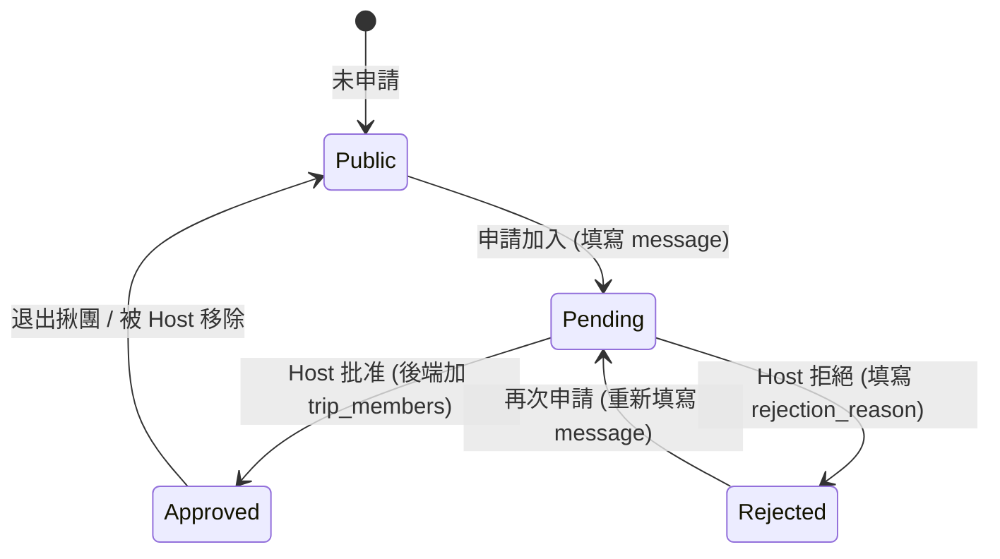

# 權限與成員管理規格

## 概述

SummitMate 採用 **Role-Based Access Control (RBAC)** 搭配 **Trip Membership (行程成員)** 的混合權限模型。
使用者必須同時滿足「系統角色權限」與「行程成員資格」才能執行特定操作。

## 系統角色定義

系統目前定義以下幾種全域角色 (儲存於 `UserProfile.roleCode` 與 `permissions` 欄位)：

| 角色代碼 (Role Code) | 角色名稱 | 描述                               | 預設權限                                                                    |
| :------------------- | :------- | :--------------------------------- | :-------------------------------------------------------------------------- |
| `admin`              | 管理員   | 系統超級使用者                     | 所有權限 (`*`)                                                              |
| `guide`              | 嚮導     | 可建立與管理行程的專業嚮導         | `trip.create`, `trip.edit`, `trip.delete`, `trip.transfer`, `member.manage` |
| `member`             | 隊員     | 一般參與者，僅能檢視或編輯自己資料 | `trip.view`                                                                 |

---

## 行程層級角色

除了系統角色外，每個行程 (Trip) 內的成員還有「行程層級角色」，儲存於 `TripMembers.role_code`：

| 角色代碼 | 顯示名稱 | 說明                               |
| :------- | :------- | :--------------------------------- |
| `leader` | 團長     | 行程擁有者 (Owner)，擁有完整控制權 |
| `guide`  | 嚮導     | 協助管理行程，可編輯與管理成員     |
| `member` | 隊員     | 一般成員，僅能檢視                 |

> [!IMPORTANT]
> `Trip.userId` 欄位代表該行程的 **團長 (Leader/Owner)**，此人絕對擁有編輯/刪除/移交權限，無需額外檢查成員資格。

---

## 行程成員資格

### 成員資料結構

**Trip Model (本地端)**

```dart
List<String> members; // 儲存 User ID 列表
```

**TripMembers Table (雲端)**
| Column | Type | Description |
| :-------- | :--- | :--------------------- |
| trip_id | UUID | 行程 ID |
| user_id | UUID | 使用者 ID |
| role_code | Text | `leader`, `guide`, `member` |

- **建立者 (Creator)**：建立行程時自動加入 `members` 並設為 `leader`。
- **加入成員**：擁有 `member.manage` 權限者可將其他 User ID 加入列表。

---

## 權限判斷矩陣

操作權限判斷邏輯：`Can(Action, User, Trip)`

| 操作 (Action)      | 系統角色 (Role) | 條件                          | 結果 (Result) | 備註                                     |
| :----------------- | :-------------- | :---------------------------- | :------------ | :--------------------------------------- |
| **View Trip**      | Admin           | N/A                           | ✅ Allow      | Admin 可見所有                           |
| **View Trip**      | Any             | `trip.members.contains(user)` | ✅ Allow      | 成員可見                                 |
| **View Trip**      | Any             | 非成員                        | ❌ Deny       | 非成員不可見                             |
| **Edit Trip**      | Admin           | N/A                           | ✅ Allow      |                                          |
| **Edit Trip**      | Any             | `trip.userId == user.id`      | ✅ Allow      | **團長 (Leader/Owner) 絕對擁有編輯權限** |
| **Edit Trip**      | Guide           | 是成員 + 有 `trip.edit`       | ✅ Allow      | 嚮導且在隊內                             |
| **Edit Trip**      | Member          | 是成員                        | ❌ Deny       | 一般隊員僅有檢視權限                     |
| **Delete Trip**    | Admin           | N/A                           | ✅ Allow      |                                          |
| **Delete Trip**    | Any             | `trip.userId == user.id`      | ✅ Allow      | **團長 (Leader/Owner) 絕對擁有刪除權限** |
| **Delete Trip**    | Guide           | 是成員 + 有 `trip.delete`     | ✅ Allow      |                                          |
| **Manage Members** | Guide           | 是成員 + 有 `member.manage`   | ✅ Allow      | 邀請/移除成員                            |

### 後端 API 操作權限對照表

後端 `tripService` 統一封裝的成員權限檢查機制：

| 功能模組 (Module)               | API 操作 (Operation)                  | 限制條件 (Constraint)                   | 允許角色 / 行為者 (Allowed Roles / Actor)                  | 後端檢查函式 (Backend Helper)                |
| :------------------------------ | :------------------------------------ | :-------------------------------------- | :--------------------------------------------------------- | :------------------------------------------- |
| **行程 (Trip)**                 | 建立行程 (CreateTrip)                 | 無限制                                  | 登入之全域使用者                                           | (無)                                         |
|                                 | 讀取行程 (GetTrip)                    | 必須為行程成員或擁有者                  | 擁有者 (Owner)、Leader、Guide、Member                      | `requireTripMember`                          |
|                                 | 更新行程 (UpdateTrip)                 | 行程管理權限                            | 擁有者 (Owner)、Leader、Guide                              | `requireTripRole(leader, guide)`             |
|                                 | 刪除行程 (DeleteTrip)                 | 必須為行程擁有者                        | 擁有者 (Owner)                                             | `requireTripOwner`                           |
| **成員 (Members)**              | 列出成員 (ListMembers)                | 必須為行程成員或擁有者                  | 擁有者 (Owner)、Leader、Guide、Member                      | `requireTripMember`                          |
|                                 | 透過 Email 邀請 (InviteMemberByEmail) | 必須為行程擁有者                        | 擁有者 (Owner)                                             | `requireTripOwner`                           |
|                                 | 新增成員 (AddMember)                  | 必須為行程擁有者                        | 擁有者 (Owner)                                             | `requireTripOwner`                           |
|                                 | 移除成員 (RemoveMember)               | 必須為行程擁有者或自行退出              | 擁有者 (Owner) 可移除他人；任何成員均可自行退出            | `requireTripOwner` (移除他人) / 自主退出免檢 |
|                                 | 批次新增成員 (BatchAddMembers)        | 必須為行程擁有者                        | 擁有者 (Owner)                                             | `requireTripOwner`                           |
|                                 | 批次移除成員 (BatchRemoveMembers)     | 必須為行程擁有者                        | 擁有者 (Owner)                                             | `requireTripOwner`                           |
| **行程表 (Itinerary)**          | 列出項目 (ListItinerary)              | 必須為行程成員或擁有者                  | 擁有者 (Owner)、Leader、Guide、Member                      | `requireTripMember`                          |
|                                 | 新增項目 (AddItineraryItem)           | 行程管理權限                            | 擁有者 (Owner)、Leader、Guide                              | `requireTripRole(leader, guide)`             |
|                                 | 更新項目 (UpdateItineraryItem)        | 行程管理權限                            | 擁有者 (Owner)、Leader、Guide                              | `requireTripRole(leader, guide)`             |
|                                 | 刪除項目 (DeleteItineraryItem)        | 行程管理權限                            | 擁有者 (Owner)、Leader、Guide                              | `requireTripRole(leader, guide)`             |
| **糧食計畫天數 (MealPlanDays)** | 列出天數 (ListMealPlanDays)           | 必須為行程成員或擁有者                  | 擁有者 (Owner)、Leader、Guide、Member                      | `requireTripMember`                          |
|                                 | 新增天數 (AddMealPlanDay)             | 必須為行程成員或擁有者                  | 擁有者 (Owner)、Leader、Guide、Member                      | `requireTripMember`                          |
|                                 | 更新天數 (UpdateMealPlanDay)          | 必須為行程成員或擁有者                  | 擁有者 (Owner)、Leader、Guide、Member                      | `requireTripMember`                          |
|                                 | 刪除天數 (DeleteMealPlanDay)          | 必須為行程成員或擁有者 + 未綁定行程天數 | 擁有者 (Owner)、Leader、Guide、Member (已綁定天數禁止刪除) | `requireTripMember`                          |

---

## 實作細節

### PermissionService 程式碼

```dart
bool canEditTripSync(UserProfile? user, Trip trip) {
  if (user == null) return false;
  if (user.roleCode == RoleConstants.admin) return true;

  // 0. 團長 (Leader/Owner) 絕對擁有編輯權限
  if (trip.userId == user.id) return true;

  // 1. 必須是行程成員 (基本門檻)
  if (!trip.members.contains(user.id)) return false;

  // 2. 必須擁有 'trip.edit' 權限 (角色賦予)
  return user.permissions.contains('trip.edit');
}

bool canDeleteTripSync(UserProfile? user, Trip trip) {
  if (user == null) return false;
  if (user.roleCode == RoleConstants.admin) return true;

  // 0. 團長 (Leader/Owner) 絕對擁有刪除權限
  if (trip.userId == user.id) return true;

  // 1. 必須是行程成員
  if (!trip.members.contains(user.id)) return false;

  return user.permissions.contains('trip.delete');
}
```

### 本地行程處理 (Pending Create)

未同步至雲端的行程 (`SyncStatus.pendingCreate`) 無法從 API 取得成員資料。
`MemberManagementScreen` 會使用本地快取的使用者資料顯示創建者為團長。

---

## 未來擴充

- **權限群組 (Permission Groups)**: 針對單一行程設定 Admin/Editor/Viewer (目前暫不實作)
- **公開行程 (Public Trips)**: 開放非成員檢視 (目前預設均為 Private)
- **行程轉移 (Transfer)**: 允許團長將 Leader 角色轉移給他人

---

## 揪團與共享行程

當行程連結至揪團時，權限邏輯將會動態連動：

### 1. 行程預覽 (Snapshot)

- **非成員**：透過 `group_events.trip_snapshot` 檢視行程概況 (名稱、日期、路線摘要)，無法存取實體行程 ID 的詳細內容 (如聊天、投票)。
- **目的**：保護隱私並避免過期揪團洩漏即時資訊。

### 2. 成員權限獲取

- **流程**：使用者報名揪團 -> 團長批准 -> 後端自動在 `trip_members` 新增該使用者 (Role: `member`)。
- **存取範圍**：一旦成為成員，使用者可透過 `trip_id` 存取：
  - 行程詳細節點 (Itinerary Items) - **唯讀**。
  - 聊天室 (Messages) - 可讀寫。
  - 投票 (Polls) - 可參與。
- **排除範圍**：
  - 個人裝備 (Gear Items) 與糧食 (Meal Items) 屬於個人隱私，不進行共享。

### 3. 權限取消與清理

- **觸發點**：取消揪團連結、刪除揪團、或成員退出揪團。
- **動作**：後端移除對應的 `trip_members` 記錄。
- **客戶端響應**：前端 Sync 時若回傳 403 Forbidden，應立即刪除本地對應的行程緩存及共享資訊 (聊天/投票)。

### 4. 揪團權限與角色狀態矩陣

揪團內的使用者角色狀態分為以下五類，對應不同的操作權限：

| 使用者狀態 (Status)       | 可看公開內容/快照 | 可看私密留言 | 可讀寫留言/投票          | 動作 (Actions)                        |
| :------------------------ | :---------------- | :----------- | :----------------------- | :------------------------------------ |
| **團長/主辦人 (Host)**    | ✅ (擁有者)       | ✅ (擁有者)  | ✅ (可管理)              | 編輯/刪除揪團、審核申請、移除成員     |
| **已加入成員 (Approved)** | ✅                | ✅           | ✅ (透過 `trip_members`) | 退出揪團、瀏覽共享行程細節            |
| **審核中 (Pending)**      | ✅                | ❌           | ❌                       | 取消申請、等待審核                    |
| **再次申請 (Rejected)**   | ✅                | ❌           | ❌                       | 查看 `rejection_reason`、再次發送申請 |
| **一般非成員 (Public)**   | ✅                | ❌           | ❌                       | 申請加入                              |

#### 申請與審核狀態流轉



### 5. 私密留言 (Private Message) 存取安全控制

- **安全過濾 (Security Filtering)**:
  - 私密留言 (e.g. 集合地點、詳細通訊群組連結等) 儲存於 `group_events.private_message` 欄位。
  - **後端安全防護**：後端在回傳 `GetGroupEventDetail` 的 API 響應時，**必須**進行權限過濾。若 `request.user_id` 不是該揪團的 `host_id`，且未存在於批准的申請人名單中，該欄位必須被過濾為空字串 `""` 或不回傳。
  - **前端 UI 防護**：前端 APP 會依據目前的使用者狀態動態顯示私密留言卡片，若未被批准，私密卡片應顯示「審核通過後方可查看」並呈現鎖定狀態。
