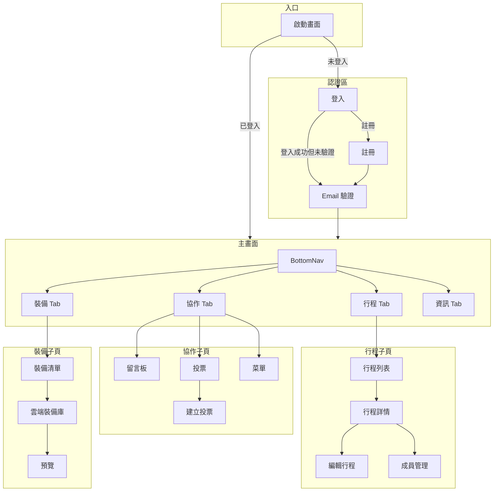
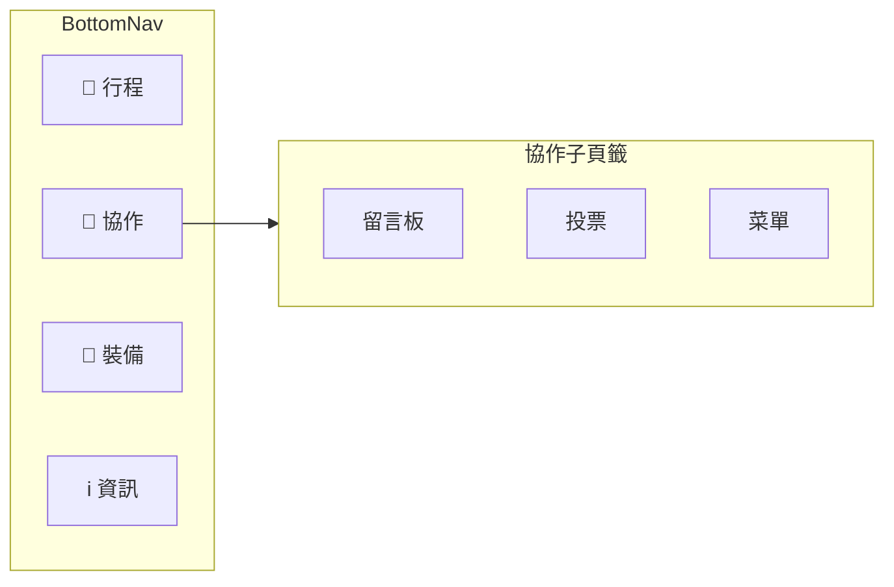

# 導航流程 (Navigation Flow)

## 主要導航架構

---

## Tab 導航結構

---

## Drawer 導航

| 項目       | 目的地             | 條件   |
| :--------- | :----------------- | :----- |
| 管理行程   | TripListScreen     | 已登入 |
| 揪團活動   | GroupEventScreen   | -      |
| 雲端裝備庫 | GearCloudScreen    | -      |
| 離線地圖   | MapViewerScreen    | -      |
| 設定       | SettingsScreen     | -      |
| 登入/登出  | LoginScreen / 登出 | 依狀態 |

---

## 畫面清單

| 畫面       | 檔案                            | 說明               |
| :--------- | :------------------------------ | :----------------- |
| 主導航     | `main_navigation_screen.dart`   | BottomNav + 4 Tabs |
| 行程列表   | `trip_list_screen.dart`         | 使用者的行程       |
| 行程詳情   | `trip_detail_screen.dart`       | 行程節點時間軸     |
| 成員管理   | `member_management_screen.dart` | 團長/嚮導/隊員     |
| 留言板     | `message_board_screen.dart`     | 巢狀留言           |
| 投票       | `poll_list_screen.dart`         | 投票列表           |
| 裝備       | `gear_tab.dart`                 | 個人裝備清單       |
| 雲端裝備庫 | `gear_cloud_screen.dart`        | 分享裝備組合       |
| 地圖       | `map_viewer_screen.dart`        | GPX + 離線         |
| 登入       | `auth/login_screen.dart`        | Email 登入         |
| 註冊       | `auth/register_screen.dart`     | 新用戶註冊         |
| 驗證       | `auth/verification_screen.dart` | 6 位數驗證碼       |
