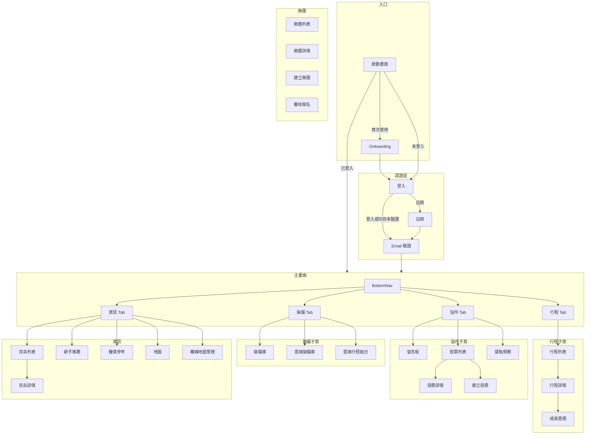
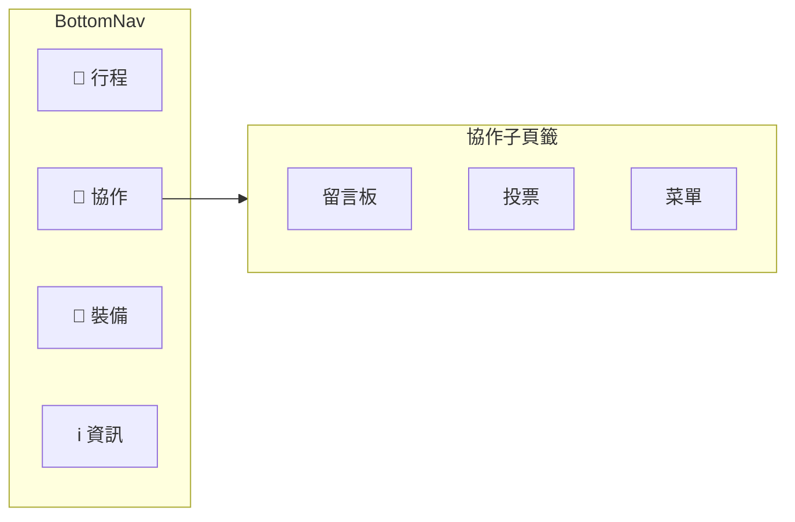

# 導航流程

## 主要導航架構

```mermaid
flowchart TB
    subgraph Entry[入口]
        Splash[啟動畫面]
        Onboard[Onboarding]
    end

    subgraph Auth[認證區]
        Login[登入]
        Register[註冊]
        Verify[Email 驗證]
    end

    subgraph Main[主畫面]
        Nav[BottomNav]
        Trip[行程 Tab]
        Collab[協作 Tab]
        Gear[裝備 Tab]
        Info[資訊 Tab]
    end

    subgraph Trip_Sub[行程子頁]
        TripList[行程列表]
        TripDetail[行程詳情]
        Members[成員管理]
    end

    subgraph Collab_Sub[協作子頁]
        Messages[留言板]
        Polls[投票列表]
        PollDetail[投票詳情]
        CreatePoll[建立投票]
        MealPlanner[餐點規劃]
    end

    subgraph Gear_Sub[裝備子頁]
        GearLibrary[裝備庫]
        GearCloud[雲端裝備庫]
        TripCloud[雲端行程組合]
    end

    subgraph Social[揪團]
        GroupList[揪團列表]
        GroupDetail[揪團詳情]
        GroupCreate[建立揪團]
        GroupReview[審核報名]
    end

    subgraph Explore[資訊]
        MountainList[百岳列表]
        MountainDetail[百岳詳情]
        BeginnerPeaks[新手推薦]
        FoodRef[糧食參考]
        MapViewer[地圖]
        OfflineMap[離線地圖管理]
    end

    Splash -->|首次使用| Onboard --> Login
    Splash -->|已登入| Main
    Splash -->|未登入| Login
    Login -->|註冊| Register
    Login -->|登入成功但未驗證| Verify
    Register --> Verify --> Main

    Nav --> Trip & Collab & Gear & Info

    Trip --> TripList --> TripDetail --> Members
    Collab --> Messages & Polls & MealPlanner
    Polls --> PollDetail & CreatePoll

    Gear --> GearLibrary & GearCloud & TripCloud

    Info --> MountainList --> MountainDetail
    Info --> BeginnerPeaks & FoodRef & MapViewer & OfflineMap
```

---

## Tab 導航結構

```mermaid
flowchart LR
    subgraph BottomNav
        T1[🗻 行程]
        T2[💬 協作]
        T3[🎒 裝備]
        T4[ℹ️ 資訊]
    end

    subgraph T2_Sub[協作子頁籤]
        留言板
        投票
        菜單
    end

    T2 --> T2_Sub
```

---

## Drawer 導航

| 項目         | 目標畫面                | 條件   |
| :----------- | :---------------------- | :----- |
| 管理行程     | `TripListScreen`        | 已登入 |
| 揪團活動     | `GroupEventsListScreen` | -      |
| 雲端裝備庫   | `GearCloudScreen`       | -      |
| 雲端行程組合 | `TripCloudScreen`       | -      |
| 百岳資訊     | `MountainListScreen`    | -      |
| 新手推薦百岳 | `BeginnerPeaksScreen`   | -      |
| 糧食參考     | `FoodReferenceScreen`   | -      |
| 離線地圖     | `MapViewerScreen`       | -      |
| 設定         | Settings (Cubit)        | -      |
| 登入/登出    | `LoginScreen` / 登出    | 依狀態 |

---

## 畫面清單 (28 screens)

| 分類 | 畫面               | 檔案                                          |
| :--- | :----------------- | :-------------------------------------------- |
| 認證 | 登入               | `auth/login_screen.dart`                      |
| 認證 | 註冊               | `auth/register_screen.dart`                   |
| 認證 | Email 驗證         | `auth/verification_screen.dart`               |
| 導航 | 主導航 (BottomNav) | `main_navigation/main_navigation_screen.dart` |
| 導航 | Onboarding         | `onboarding_screen.dart`                      |
| 行程 | 行程列表           | `trip_list_screen.dart`                       |
| 行程 | 首頁 (行程時間軸)  | `home_screen.dart`                            |
| 行程 | 成員管理           | `member_management_screen.dart`               |
| 協作 | 留言板             | `message_list_screen.dart`                    |
| 協作 | 投票列表           | `poll_list_screen.dart`                       |
| 協作 | 投票詳情           | `poll_detail_screen.dart`                     |
| 協作 | 建立投票           | `create_poll_screen.dart`                     |
| 協作 | 餐點規劃           | `meal_planner_screen.dart`                    |
| 裝備 | 裝備庫             | `gear_library_screen.dart`                    |
| 裝備 | 雲端裝備庫         | `gear_cloud_screen.dart`                      |
| 裝備 | 雲端行程組合       | `trip_cloud_screen.dart`                      |
| 揪團 | 揪團列表           | `group_events_list_screen.dart`               |
| 揪團 | 揪團詳情           | `group_event_detail_screen.dart`              |
| 揪團 | 建立揪團           | `create_group_event_screen.dart`              |
| 揪團 | 審核報名           | `group_event_review_screen.dart`              |
| 資訊 | 百岳列表           | `info/mountain_list_screen.dart`              |
| 資訊 | 百岳詳情           | `info/mountain_detail_screen.dart`            |
| 資訊 | 新手推薦百岳       | `beginner_peaks/beginner_peaks_screen.dart`   |
| 資訊 | 糧食參考           | `food_reference_screen.dart`                  |
| 地圖 | 地圖瀏覽           | `map_viewer_screen.dart`                      |
| 地圖 | 地圖畫面           | `map/map_screen.dart`                         |
| 地圖 | 離線地圖管理       | `map/offline_map_manager_screen.dart`         |
| 錯誤 | 錯誤頁面           | `error_screen.dart`                           |
